# SnapData: AI-Powered Intelligent Document Processing & Data Extraction System

## System Architecture Document

**Project:** SnapData  
**Document:** System Architecture Document  
**Version:** 1.0  
**Status:** Draft / Architecture Baseline  
**Date:** 30 August 2026  
**Implementation Target:** Android application using Google AI Studio's **"Build an Android app"** workflow

---

## Document Control

| Item | Value |
|---|---|
| Project | SnapData |
| Document | System Architecture Document |
| Version | 1.0 |
| Status | Draft / Architecture Baseline |
| Date | 30 August 2026 |
| Primary Sources | `SnapData_PRD_v1.0.md`, `SnapData_SRS_v1.0.md`, `SnapData_TRD_v1.0.md` |
| Supporting Sources | Original SnapData project specification; SnapData workflow diagram |
| Architecture Rule | No unverified implementation choice is represented as confirmed |
| Technology Statuses | CONFIRMED / PROPOSED / TBD / REQUIRES TECHNICAL VALIDATION / REJECTED |
| Detailed Database Schema | `DATABASE.md` / equivalent data-schema artifact |
| Detailed UI/UX | `UI_UX.md`, `FRONTEND.md` |
| AI/OCR Implementation | `AI_OCR.md` |
| Test Cases | `TESTING.md` |
| Release/Build Details | `BUILD_RELEASE.md` |

### Source hierarchy

```text
PRD
 ↓
SRS
 ↓
TRD
 ↓
SYSTEM ARCHITECTURE
```

This architecture document refines the approved product/software/technical baseline without silently replacing unresolved decisions.

### Decision-status vocabulary

- **CONFIRMED** — Established by source material or directly verified in the actual implementation.
- **PROPOSED** — Recommended architecture direction, not yet baselined as implemented.
- **TBD** — Decision not yet made.
- **REQUIRES TECHNICAL VALIDATION** — Intent is established, but feasibility, compatibility, performance or integration must be verified.
- **REJECTED** — Explicitly not selected for the current baseline.

> **Implementation verification rule:** The exact Android language, UI framework, Android architecture pattern, module structure, dependency versions, AI model, AI runtime, OCR integration and file-storage implementation must be verified from the actual Google AI Studio-generated Android project before they are promoted to CONFIRMED.

---

# 1. Purpose

This document defines the high-level and detailed logical architecture of SnapData.

The architecture provides a single blueprint for:

- system components and boundaries;
- architectural layers;
- module responsibilities;
- document and processing data flow;
- pipeline stage interactions;
- storage and persistence boundaries;
- OCR and AI integration boundaries;
- export architecture;
- state management;
- error propagation;
- cancellation and recovery;
- privacy/security boundaries;
- offline operation;
- dependency direction;
- concurrency/resource management;
- testability and extensibility.

The document is intentionally implementation-aware but does not invent a concrete Android stack where the source documents leave that decision open.

---

# 2. Architectural Scope

SnapData is an Android/mobile, offline-first document-processing application that transforms camera captures, images and PDF documents into structured, editable information through OCR and AI.

The logical workflow is:

```text
Document Input
    ↓
Document Acquisition
    ↓
Validation
    ↓
Image / Document Pre-processing
    ↓
OCR Processing
    ↓
Offline AI Processing
    ↓
Document Type / Field / Table Detection
    ↓
Confidence / Validation
    ↓
Structured Data Generation
    ↓
User Review & Editing
    ↓
Local Persistence
    ↓
Export
    ↓
Document History
```

The core processing path is local/offline after the required AI model setup. Network access is therefore an optional setup dependency, not a core-processing dependency.

---

# 3. Architectural Goals

| Goal | Architectural implication | Status |
|---|---|---|
| Android deployment | Architecture must run inside an Android application boundary | **CONFIRMED** |
| Offline-first operation | Core OCR/AI/document flow must not require remote document upload after setup | **CONFIRMED** |
| Local processing | Document content remains on-device for the core workflow | **CONFIRMED** |
| OCR | OCR is a dedicated stage behind an adapter boundary | **PROPOSED** |
| Offline AI | AI inference is isolated behind an adapter/runtime boundary | **PROPOSED** |
| Structured extraction | Stable domain/data contract separates extraction from UI/storage | **PROPOSED** |
| User review/editing | Human-corrected result becomes authoritative for save/export | **CONFIRMED** |
| Local persistence | SQLite-backed persistence is used for application data | **CONFIRMED source-backed; integration TBD** |
| History | Saved processed records can be reopened locally | **CONFIRMED** |
| Export | Excel/CSV/JSON/PDF outputs are supported | **CONFIRMED** |
| Failure safety | Failed/cancelled operations must not be reported as completed | **CONFIRMED requirement / PROPOSED implementation** |
| Cancellation | Long-running stages expose cancellable boundaries where supported | **CONFIRMED requirement / implementation TBD** |
| Testability | Major modules have explicit boundaries | **PROPOSED** |
| Extensibility | OCR, AI, exporters and preprocessing can be replaced/extended without UI rewrite | **PROPOSED** |
| Minimal dependencies | Avoid technology choices that do not serve the local MVP | **CONFIRMED principle** |

---

# 4. Architectural Principles

| Principle | Meaning in SnapData | Status |
|---|---|---|
| Offline-first | Design the core document workflow around local capabilities first | **CONFIRMED** |
| Local-first data processing | Documents and extracted data should not require cloud processing | **CONFIRMED** |
| Privacy by design | Avoid unnecessary transmission/logging of sensitive content | **CONFIRMED principle** |
| Separation of concerns | UI, orchestration, domain, processing, infrastructure and storage remain distinct | **PROPOSED** |
| Dependency inversion | Stable interfaces separate domain/application logic from platform/provider implementations | **PROPOSED** |
| Testability | Components should be replaceable/mocked at boundaries | **PROPOSED** |
| Replaceable OCR provider | OCR engine is not exposed directly to presentation code | **PROPOSED** |
| Replaceable AI runtime/model | AI implementation is an infrastructure concern | **PROPOSED** |
| Replaceable export providers | Each output format is isolated | **PROPOSED** |
| Stable structured-data contract | Extraction, review, storage and export communicate through shared concepts | **PROPOSED** |
| Failure-safe processing | A failed stage cannot silently create a success state | **CONFIRMED** |
| Explicit processing states | User-visible and internal state transitions are controlled | **CONFIRMED requirement** |
| Minimal unnecessary dependencies | Keep MVP architecture simple enough for the project scope | **CONFIRMED principle** |
| Android platform alignment | Concrete implementation must follow the actual generated Android project | **CONFIRMED** |

---

# 5. System Context

## 5.1 Context diagram

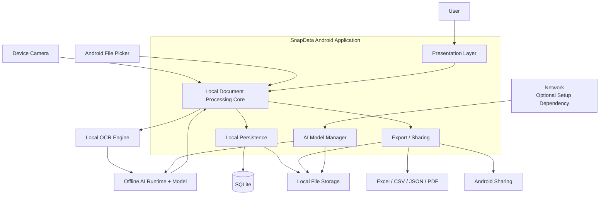

### Context interpretation

- **User** is the primary actor.
- **SnapData Android Application** owns the end-to-end workflow.
- **Device Camera** supplies captured document images.
- **Android File Picker** supplies PDF/image documents.
- **Local File Storage** contains source documents, temporary artifacts, exports and potentially model files.
- **SQLite** stores application metadata, structured data, processing metadata and history.
- **OCR Engine** performs local OCR.
- **Offline AI Runtime + Model** performs document understanding and extraction.
- **Android Sharing** provides optional distribution of generated files.
- **Network** appears only on the model setup/download path; it is not part of the core processing path.

---

# 6. High-Level Architecture

## 6.1 Logical component view

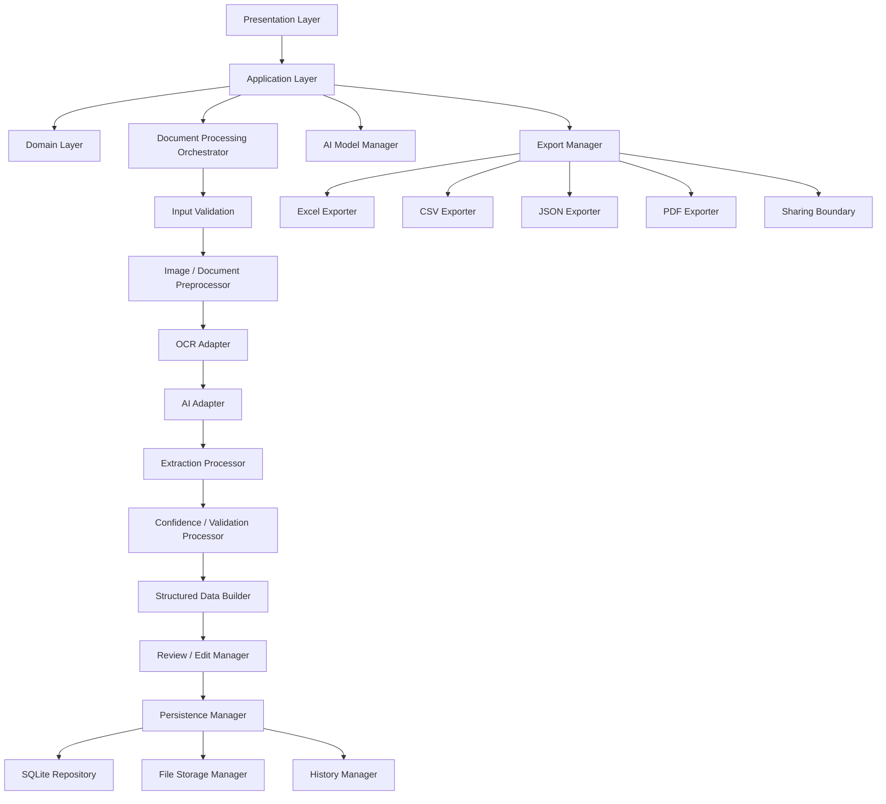

## 6.2 Architectural interpretation

The system is organized around a modular local processing core rather than a client/server request-response architecture.

The principal runtime path is:

```text
Presentation
    ↓
Application / Domain
    ↓
Processing Orchestrator
    ↓
Processing Pipeline
    ↓
Review / Edit
    ↓
Persistence
    ↓
Export / History
```

Provider-specific implementations sit behind stable boundaries.

---

# 7. Architectural Layers

## 7.1 Presentation Layer

### Responsibilities

- screens and UI components;
- navigation;
- user actions;
- loading/progress display;
- processing status;
- errors and recovery affordances;
- review/edit interface;
- model-readiness presentation.

### Must not directly

- execute SQL;
- run OCR;
- execute AI inference;
- implement export mapping;
- manage low-level files;
- contain domain rules that should be reusable/testable outside UI.

**Status: PROPOSED boundary.**

---

## 7.2 Application Layer

### Responsibilities

- use cases;
- workflow orchestration;
- commands;
- state transitions;
- progress/event propagation;
- save/export commands;
- translation of infrastructure failures into application-level errors;
- coordination of model readiness and processing prerequisites.

Example conceptual operations:

```text
startDocumentProcessing
cancelProcessing
getProcessingStatus
getProcessingResult
saveEditedResult
exportResult
openHistoryItem
deleteHistoryItem
checkModelReadiness
```

These are conceptual internal application interfaces, not REST APIs.

**Status: PROPOSED.**

---

## 7.3 Domain Layer

### Responsibilities

Core concepts independent of Android UI or persistence implementation:

- Document;
- Document Type;
- Extracted Field;
- Key-Value Pair;
- Table;
- Column;
- Row;
- Confidence;
- Processing Status;
- Processing Result;
- User Correction;
- Export Request.

The domain layer must not depend directly on Android UI, SQLite classes, OCR engine classes or AI runtime classes.

**Status: PROPOSED.**

---

## 7.4 Processing Layer

### Responsibilities

- pipeline execution;
- stage ordering;
- progress reporting;
- cancellation propagation;
- failure handling;
- intermediate result coordination;
- resource-aware sequencing.

**Status: PROPOSED.**

---

## 7.5 OCR Layer

### Responsibilities

- prepare OCR input;
- invoke OCR engine;
- normalize OCR output;
- preserve available OCR confidence/location information;
- expose OCR results through a stable contract.

Tesseract OCR is source-backed; exact Android integration remains **REQUIRES TECHNICAL VALIDATION**.

**Status: CONFIRMED requirement / adapter boundary PROPOSED.**

---

## 7.6 AI Layer

### Responsibilities

- model readiness;
- input preparation;
- local inference;
- document understanding;
- document type detection;
- field extraction;
- table extraction;
- confidence information where provided;
- structured output validation.

The exact AI model and runtime are **TBD / REQUIRES TECHNICAL VALIDATION**.

**Status: CONFIRMED capability / concrete implementation TBD.**

---

## 7.7 Persistence Layer

### Responsibilities

- persist document metadata;
- persist structured data;
- persist processing metadata;
- persist history records;
- persist user corrections;
- reopen saved records;
- coordinate database/file consistency.

SQLite is the source-backed local database choice; exact integration remains validation work.

**Status: CONFIRMED source-backed / integration TBD.**

---

## 7.8 File Storage Layer

### Responsibilities

- original documents;
- captured images;
- PDF files;
- temporary processing artifacts;
- exports;
- AI model files, where applicable.

Exact Android storage APIs, paths and retention rules remain **TBD / REQUIRES TECHNICAL VALIDATION**.

---

## 7.9 Export Layer

### Responsibilities

- convert current structured data to selected output format;
- validate export input;
- create output file;
- store output where required;
- return an export result;
- integrate with Android sharing where supported.

Each exporter remains independent.

---

# 8. Component Architecture

| ID | Component | Responsibility | Inputs | Outputs | Dependencies | Failure Modes | Status |
|---|---|---|---|---|---|---|---|
| CMP-001 | UI | Render user-facing state and capture actions | View state, user events | UI events | Presentation platform | Rendering/state error | **PROPOSED** |
| CMP-002 | Navigation | Route between screens/workflows | Navigation commands | Screen state | UI framework | Invalid route | **PROPOSED** |
| CMP-003 | Application Coordinator | Coordinate use cases and workflow | Commands, domain inputs | Results/events | Domain + interfaces | Use-case failure | **PROPOSED** |
| CMP-004 | Document Acquisition | Obtain camera/file source | Camera/file input | ProcessingInput | Android acquisition boundary | Permission, file access, cancel | **CONFIRMED requirement / implementation TBD** |
| CMP-005 | Input Validator | Validate supported/correct input | ProcessingInput | ValidatedInput | Platform/file metadata | Unsupported/corrupt input | **PROPOSED** |
| CMP-006 | Image Preprocessor | Prepare input for OCR | Images/pages | ProcessedDocument | Preprocessing implementation | Decode/process failure | **CONFIRMED requirement / algorithm TBD** |
| CMP-007 | OCR Adapter | Convert image/document content to OCR result | ProcessedDocument | OCRResult | OCR provider | OCR failure/empty result | **PROPOSED** |
| CMP-008 | AI Adapter | Perform local AI inference | AIInput | AIExtractionResult | AI runtime/model | Model unavailable/inference failure | **PROPOSED** |
| CMP-009 | Extraction Processor | Normalize document/field/table extraction | AIExtractionResult | ExtractionResult | Domain rules | Partial/invalid extraction | **PROPOSED** |
| CMP-010 | Confidence Processor | Attach/interpret confidence where available | OCR/AI output | Confidence-enriched result | Provider metadata | Missing confidence | **PROPOSED** |
| CMP-011 | Structured Data Builder | Build canonical structured document | ExtractionResult | StructuredDocument | Domain contract | Structuring failure | **PROPOSED** |
| CMP-012 | Review/Edit Manager | Apply user corrections | StructuredDocument, edit commands | EditedStructuredDocument | Presentation/application | Invalid edit/save failure | **PROPOSED** |
| CMP-013 | Persistence Manager | Coordinate durable save/reopen | StructuredDocument, metadata | SavedDocument | Repository + file store | Partial/failed save | **PROPOSED** |
| CMP-014 | SQLite Repository | Persist metadata/data/history | Domain persistence model | Stored records | SQLite integration | DB failure | **CONFIRMED source-backed / integration TBD** |
| CMP-015 | File Storage Manager | Persist document/file artifacts | File operations | Local file references | Android storage | Read/write/space failure | **REQUIRES TECHNICAL VALIDATION** |
| CMP-016 | Export Manager | Route export requests | StructuredDocument, ExportRequest | ExportFile | Exporters | Invalid request/format failure | **PROPOSED** |
| CMP-017 | Excel Exporter | Generate `.xlsx` output | StructuredDocument | Excel file | TBD library/provider | Mapping/file failure | **PROPOSED** |
| CMP-018 | CSV Exporter | Generate `.csv` output | StructuredDocument | CSV file | Serializer logic | Encoding/mapping failure | **PROPOSED** |
| CMP-019 | JSON Exporter | Generate `.json` output | StructuredDocument | JSON file | Canonical schema | Serialization/schema failure | **PROPOSED** |
| CMP-020 | PDF Exporter | Generate readable `.pdf` output | StructuredDocument / render model | PDF file | TBD PDF implementation | Layout/generation failure | **PROPOSED** |
| CMP-021 | History Manager | List/reopen/delete saved records | History commands | History results | Persistence | Orphan/corrupt record | **PROPOSED** |
| CMP-022 | AI Model Manager | Setup/readiness/load model | Model commands | Readiness/model state | Network/setup + file store + runtime | Download/corrupt/load/resource failure | **PROPOSED** |
| CMP-023 | Error Manager | Normalize and route errors | Low-level/component errors | Application error | All adapters/services | Unknown/unmapped error | **PROPOSED** |
| CMP-024 | Processing State Manager | Maintain valid processing states | Stage events, commands | Current state | Application/pipeline | Invalid transition | **PROPOSED** |

---

# 9. Document Processing Architecture

## 9.1 Detailed pipeline

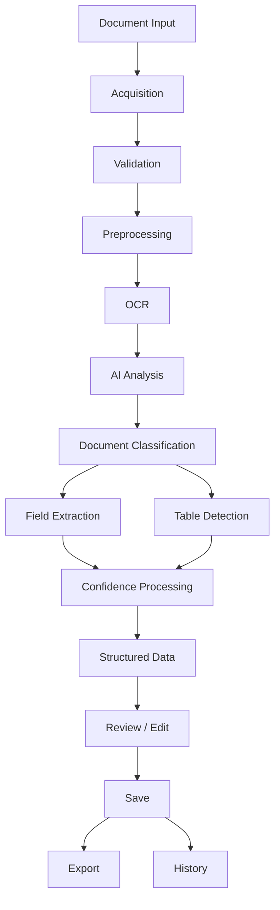

## 9.2 Stage contract

| Stage | Input | Processing | Output | Failure | Recovery | Cancellation | Next stage |
|---|---|---|---|---|---|---|---|
| Acquisition | Camera/file request | Obtain source | ProcessingInput | Camera/file/permission failure | Retry or choose another source | Safe cancel | Validation |
| Validation | ProcessingInput | Check format/access/resource feasibility | ValidatedInput | Unsupported/corrupt input | Select another file or retry | Safe cancel | Preprocessing |
| Preprocessing | ValidatedInput | Crop/rotate/perspective/noise/brightness enhancement as supported | ProcessedDocument | Decode/process failure | Retry or return to source | Stop stage if supported | OCR |
| OCR | ProcessedDocument | Run local OCR | OCRResult | OCR failure/empty usable output | Retry/improve input where practical | Cancel processing | AI |
| AI | OCR/document context | Local inference | AIExtractionResult | Model missing, load/inference failure | Setup/retry/exit | Cancel inference if supported | Classification/extraction |
| Classification | AI result | Determine document type | DocumentType | Unknown/unsupported type | Continue with generic handling when supported | Stop | Field/table extraction |
| Field extraction | AI result | Identify key/value fields | Field candidates | Extraction failure | Retry/preserve raw context | Stop | Confidence |
| Table detection | AI result | Identify rows/columns | Table candidates | Partial/failed table extraction | Preserve valid non-table data; retry | Stop | Confidence |
| Confidence | Extraction result | Attach/interpet available confidence | Validated extraction | Missing confidence | Continue without fabrication | Stop | Structuring |
| Structuring | Extraction result | Normalize to domain contract | StructuredDocument | Contract/normalization failure | Preserve prior valid data where safe | Stop | Review |
| Review/Edit | StructuredDocument | User review/corrections | EditedStructuredDocument | Edit/save problem | Retry/preserve current data where safe | Cancel editing | Save |
| Persistence | EditedStructuredDocument | Durable local save | SavedDocument | Storage/DB failure | Retry/repair path | Cancel where safe | Export/history |
| Export | Saved data + request | Generate requested format | ExportFile | Mapping/generation/storage failure | Retry/another format | User cancel | Share/history |
| History | Saved records | List/reopen/delete | History result | Orphan/corrupt record | Report/repair/delete safely | N/A | End |

### Stage invariants

1. A stage must not claim success when its required output is unavailable.
2. A later stage must not consume an invalid output object.
3. Cancellation must propagate to active cancellable work.
4. Valid intermediate data should be retained in memory or temporary storage where safe.
5. User-edited data supersedes machine-generated values for save/export.
6. Missing confidence must not be replaced with fabricated confidence.

---

# 10. Data Flow Architecture

## 10.1 End-to-end data flow

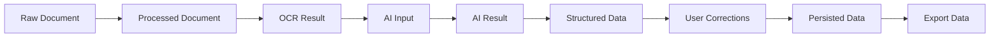

## 10.2 Authoritative-data rule

The authoritative result for persistence and export is the **latest user-reviewed/edited structured result**.

```text
Machine Extraction
      ↓
Structured Result
      ↓
User Review
      ↓
User Corrections
      ↓
Authoritative Working Result
      ↓
Save
      ↓
Export
```

This prevents re-exporting stale AI/OCR values after user corrections.

---

# 11. OCR Data Flow

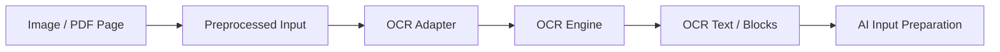

## OCR adapter boundary

The rest of the application sees an abstract OCR operation:

```text
OCRInput
    ↓
OCRAdapter
    ↓
OCRResult
```

The presentation layer never receives or invokes provider-specific OCR APIs directly.

Tesseract OCR is source-backed context. The exact Android integration, native bindings, packaging and performance characteristics are **REQUIRES TECHNICAL VALIDATION**.

---

# 12. AI Data Flow

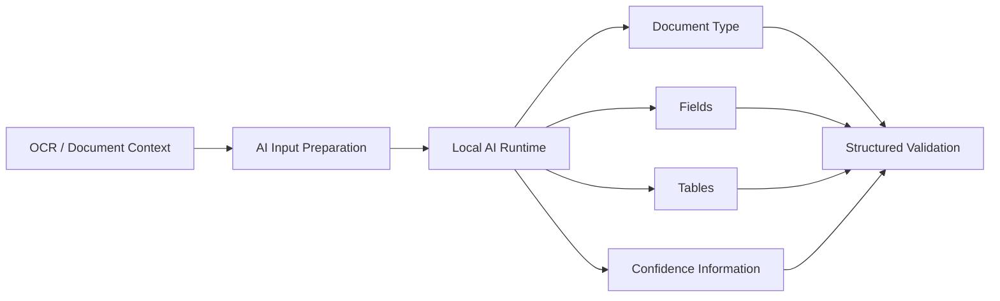

## AI boundary contract

```text
AIInput
  - document context
  - OCR context
  - page/reference context where supported

AIAdapter
  ↓

AIExtractionResult
  - document type
  - extracted fields
  - extracted tables
  - confidence information where available
  - provider/model metadata where approved
  - errors/status
```

The implementation must permit replacement of the underlying model/runtime without rewriting the presentation or persistence layers.

Exact AI model/runtime: **TBD / REQUIRES TECHNICAL VALIDATION**.

---

# 13. Offline Architecture

## 13.1 Model setup path

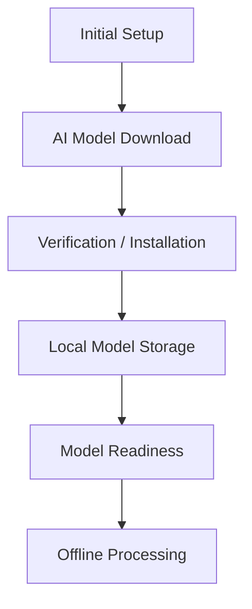

Network access is allowed only as a setup dependency if required by the selected model lifecycle.

## 13.2 Core offline path

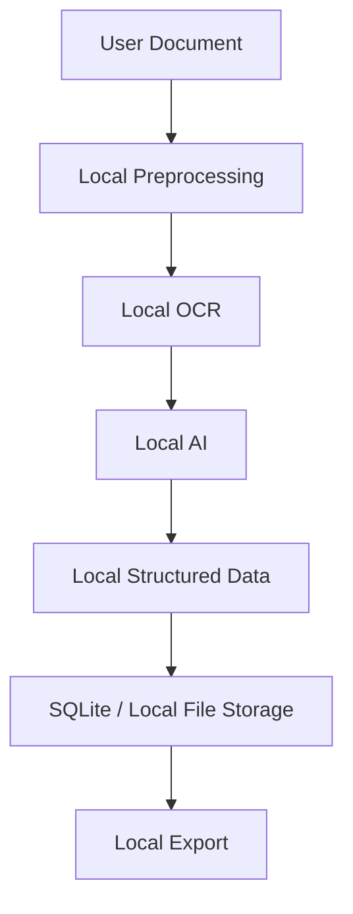

### Offline architectural rule

Network access must not be inserted into the core processing path for remote OCR, remote inference, cloud synchronization or document upload without formal scope change.

## 13.3 Offline failure behavior

| Condition | Required architecture behavior | Status |
|---|---|---|
| Model missing | Do not process as successful; show readiness/setup state | **CONFIRMED** |
| Model corrupt | Mark model unusable; preserve saved records; require repair/setup | **CONFIRMED requirement** |
| Model not ready | Block AI processing and route to readiness/setup | **CONFIRMED** |
| Device offline | Core processing continues when local requirements are satisfied | **CONFIRMED** |
| Required local capability unavailable | Explain limitation without false success | **CONFIRMED** |
| Device resource shortage | Fail safely with resource error; do not corrupt saved data | **CONFIRMED requirement / exact behavior TBD** |

---

# 14. AI Model Manager

## 14.1 Responsibilities

- model discovery/selection where approved;
- download/setup;
- integrity/readiness verification;
- local installation;
- model loading;
- model unloading;
- readiness reporting;
- version information where applicable.

## 14.2 Model lifecycle

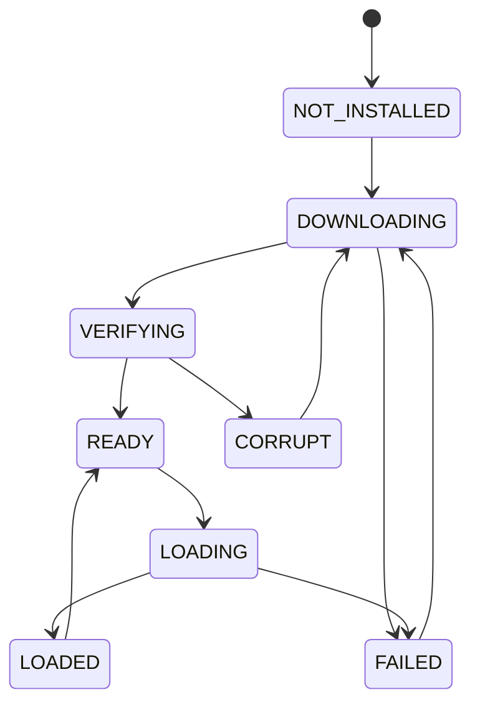

Model update/delete/rollback behavior is **TBD** unless formally approved.

### Model management status

| Capability | Status |
|---|---|
| Readiness state | **CONFIRMED** |
| Initial setup/download | **CONFIRMED** |
| Download progress | **CONFIRMED** |
| Local installation | **CONFIRMED concept** |
| Integrity verification | **PROPOSED / REQUIRES TECHNICAL VALIDATION** |
| Version metadata | **PROPOSED / TBD** |
| Update | **TBD** |
| Delete | **TBD** |
| Rollback | **TBD** |
| Multiple models | **TBD** |

---

# 15. Processing State Machine

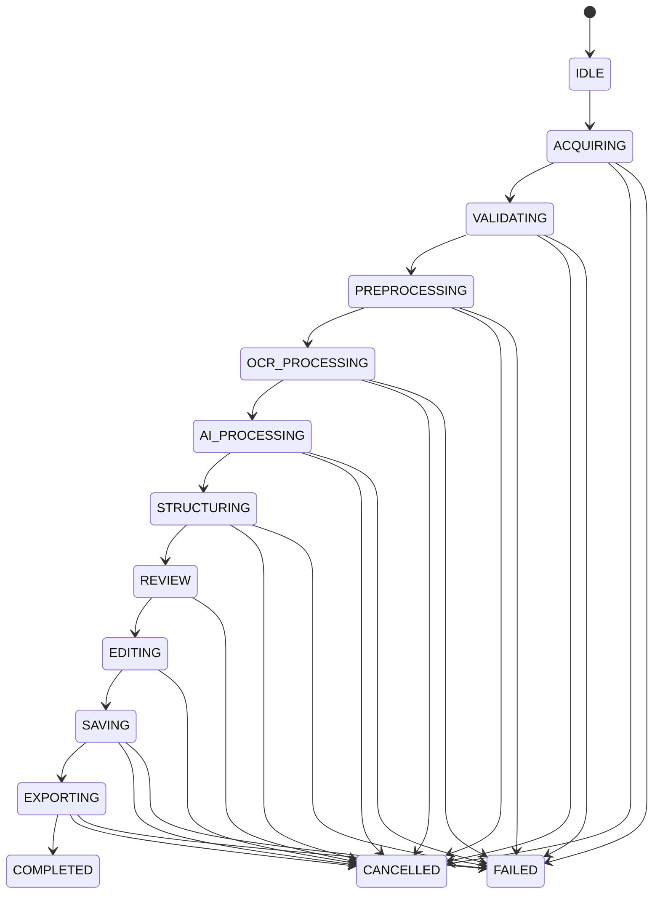

## 15.1 State definitions

| State | Meaning |
|---|---|
| IDLE | No active processing |
| ACQUIRING | Obtaining the source document |
| VALIDATING | Checking input suitability |
| PREPROCESSING | Preparing document/image content |
| OCR_PROCESSING | Running OCR |
| AI_PROCESSING | Running offline AI inference |
| STRUCTURING | Converting extraction into canonical structured data |
| REVIEW | Showing machine-generated result for user review |
| EDITING | User is changing extracted fields/tables |
| SAVING | Writing current authoritative result locally |
| EXPORTING | Generating selected output file |
| COMPLETED | Workflow completed successfully |
| FAILED | An unrecoverable error occurred in the current operation |
| CANCELLED | User/system cancellation stopped the current operation |

## 15.2 Invalid transitions

Examples of invalid transitions include:

- IDLE → SAVING
- IDLE → EXPORTING
- OCR_PROCESSING → COMPLETED
- AI_PROCESSING → EXPORTING
- FAILED → COMPLETED without a new processing attempt
- CANCELLED → COMPLETED without a new processing attempt
- EXPORTING → REVIEW

State validation is an application/pipeline responsibility; exact implementation is **PROPOSED**.

---

# 16. Error Architecture

## 16.1 Error propagation model

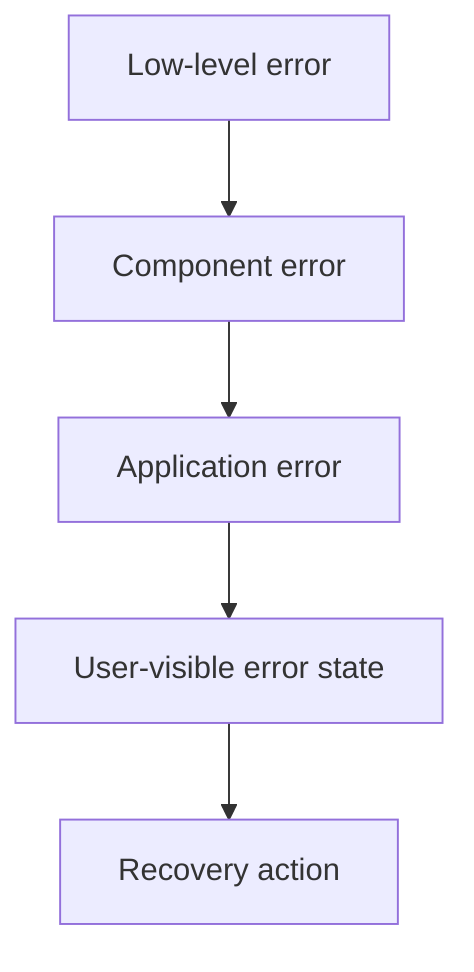

Low-level exceptions, provider-specific error codes and platform failures must be normalized before they reach the UI.

## 16.2 Error taxonomy

| Code | Category | Examples |
|---|---|---|
| INPUT_ERROR | Invalid input | Unsupported format, invalid content |
| CAMERA_ERROR | Capture failure | Camera unavailable, permission failure |
| FILE_ERROR | File access | Read/write failure, missing file |
| PREPROCESSING_ERROR | Preprocessing failure | Decode/crop/transform failure |
| OCR_ERROR | OCR failure | Engine failure, unusable OCR output |
| AI_MODEL_ERROR | Model capability failure | Missing, corrupt, unavailable model |
| AI_PROCESSING_ERROR | Inference failure | Runtime failure, inference error |
| EXTRACTION_ERROR | Structuring/extraction | Invalid result, partial extraction |
| STORAGE_ERROR | Persistence failure | SQLite/file write/read failure |
| EXPORT_ERROR | Output failure | Format mapping/generation/storage failure |
| SHARING_ERROR | Share failure | No compatible target/share error |
| RESOURCE_ERROR | Device resource issue | Low memory/storage, model load failure |
| CANCELLATION | User/system cancellation | Explicit cancel/interruption |

## 16.3 User-facing rule

Technical stack traces, raw exceptions and sensitive document content must not be shown to users by default.

User-facing messages should state:

1. what failed;
2. whether data was preserved;
3. what the user can do next.

---

# 17. Cancellation & Recovery

## 17.1 User cancellation

For cancellable processing states:

```text
User presses Cancel
      ↓
Cancellation command
      ↓
Active stage receives cancellation
      ↓
Stage exits safely
      ↓
Processing state = CANCELLED
      ↓
Temporary resources cleaned where safe
      ↓
User returned to an actionable state
```

## 17.2 Application interruption

Potential causes:

- backgrounding;
- activity/screen interruption;
- process termination;
- low-memory termination.

The architecture must never claim resumability unless the implementation actually persists resumable state.

Exact resume behavior is **TBD**.

## 17.3 Recovery matrix

| Event | Required behavior | Status |
|---|---|---|
| Camera failure | Stop acquisition; preserve prior saved data | **CONFIRMED** |
| Invalid file | Reject before processing | **CONFIRMED** |
| OCR failure | Report failure; permit retry where practical | **CONFIRMED** |
| AI model unavailable | Redirect to model readiness/setup | **CONFIRMED** |
| AI inference failure | Fail current processing safely | **CONFIRMED** |
| Storage failure | Do not claim save success | **CONFIRMED** |
| Export failure | Preserve saved data and permit retry | **CONFIRMED** |
| User cancellation | Transition to CANCELLED | **CONFIRMED** |
| App termination | Preserve only what has already been durably saved | **CONFIRMED principle** |
| Automatic resume | Not claimed by baseline | **TBD** |

---

# 18. Persistence Architecture

## 18.1 Logical storage relationship

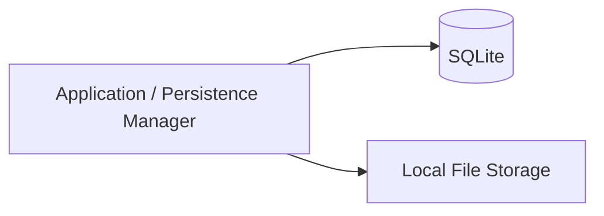

### SQLite conceptual responsibility

SQLite stores:

- document metadata;
- structured fields;
- structured tables;
- processing metadata;
- history information;
- user corrections/revisions as approved.

### File storage conceptual responsibility

File storage contains:

- original documents;
- captured images;
- PDF sources;
- temporary processing files;
- generated exports;
- AI model files where applicable.

### Consistency rule

A saved document is considered successfully persisted only when the required database and file references are in a valid, recoverable relationship.

Exact transaction strategy, schema, path mapping and migration behavior belong in `DATABASE.md`.

---

# 19. Structured Data Contract

## 19.1 Conceptual model

```text
Document
├── Metadata
├── Document Type
├── Fields
│   ├── Name / Key
│   ├── Value
│   └── Confidence (optional)
├── Tables
│   ├── Columns
│   └── Rows
├── OCR References (where supported)
├── Processing Metadata
└── User Corrections / Revision Information
```

## 19.2 Contract principles

- Fields are individually addressable.
- Tables preserve row/column relationships.
- Missing information is not fabricated.
- Confidence values are included only when actually produced.
- User edits are authoritative for current saved/exported data.
- Exporters consume the canonical current result.
- OCR/AI provider-specific objects do not leak into presentation code.

Final serialized schema and validation rules belong in `DATA_SCHEMA.md` or the approved database/schema artifact.

---

# 20. Export Architecture

## 20.1 Export flow

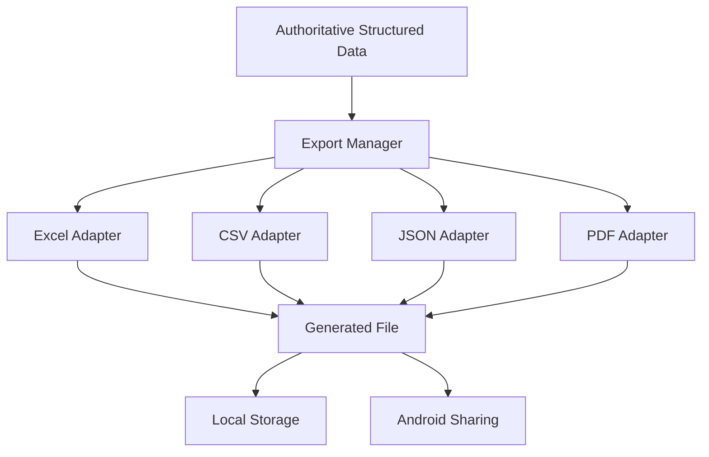

## 20.2 Export contract

| Format | Input | Output | Validation | Failure |
|---|---|---|---|---|
| Excel | StructuredDocument | `.xlsx` | Valid workbook + expected cells/tables | Mapping/generation/storage |
| CSV | StructuredDocument | `.csv` | Valid delimiters/encoding + expected data | Encoding/mapping |
| JSON | StructuredDocument | `.json` | Valid machine-readable document | Serialization/schema |
| PDF | StructuredDocument / render model | `.pdf` | Readable document representation | Layout/generation |

Exact libraries and dependency versions remain **TBD / REQUIRES TECHNICAL VALIDATION**.

## 20.3 Sharing

Sharing is downstream of file generation:

```text
Exported File
    ↓
Local File
    ↓
Android Sharing
```

A sharing failure must not delete the successfully generated file or alter persisted structured data.

---

# 21. Security & Privacy Architecture

## 21.1 Privacy boundary

```text
User Document
      ↓
Local Acquisition
      ↓
Local Preprocessing
      ↓
Local OCR
      ↓
Local AI
      ↓
Local Structured Data
      ↓
Local SQLite / File Storage
      ↓
Local Export
```

No mandatory cloud document processing exists in the current MVP architecture.

## 21.2 Explicitly not required for MVP

- cloud document upload;
- server-side OCR;
- server-side AI;
- mandatory synchronization;
- authentication service;
- remote document repository;
- core REST API.

## 21.3 Data minimization

Diagnostic systems should avoid logging:

- raw document images;
- full OCR text;
- extracted sensitive values;
- AI prompts containing private content;
- exported file contents.

Exact encryption, secure deletion, key management and PIN/biometric lock behavior remain **TBD** unless separately approved and validated.

---

# 22. Android Platform Boundaries

The logical architecture interfaces with Android through explicit platform boundaries:

| Platform capability | Architectural role | Exact API |
|---|---|---|
| Camera | Document acquisition | **TBD / generated-project dependent** |
| File/document picker | PDF/image acquisition | **TBD / generated-project dependent** |
| File storage | Documents, exports, temporary files | **REQUIRES TECHNICAL VALIDATION** |
| Application lifecycle | Background/interruption handling | **REQUIRES TECHNICAL VALIDATION** |
| Permissions | Camera/file capabilities | **TBD / generated-project dependent** |
| Background execution | Long operations where supported | **REQUIRES TECHNICAL VALIDATION** |
| Notifications | Optional progress/status support if required | **TBD** |
| Sharing | Share generated files | **TBD / generated-project dependent** |

The architecture must be adapted to the actual Android project produced by Google AI Studio.

---

# 23. Frontend ↔ Processing Boundary

The frontend interacts with the application layer through conceptual internal commands/events.

### Commands

```text
startDocumentProcessing(input)
cancelProcessing(operationId)
getProcessingStatus(operationId)
getProcessingResult(operationId)
saveEditedResult(documentId, editedData)
exportResult(documentId, format)
openHistoryItem(documentId)
deleteHistoryItem(documentId)
checkModelReadiness()
```

### Events

```text
ProcessingStarted
ProcessingStageChanged
ProcessingProgressChanged
ProcessingCompleted
ProcessingFailed
ProcessingCancelled
ModelReadinessChanged
SaveCompleted
SaveFailed
ExportCompleted
ExportFailed
```

These are **conceptual module interfaces**, not HTTP endpoints or public APIs.

---

# 24. Processing Pipeline Interfaces

## 24.1 Conceptual contracts

| Interface | Input | Output | Errors | Cancellation | Status |
|---|---|---|---|---|---|
| `DocumentAcquisition` | User acquisition command | `ProcessingInput` | Camera/file errors | Yes | **PROPOSED** |
| `InputValidator` | `ProcessingInput` | `ValidatedInput` | Input errors | Yes | **PROPOSED** |
| `Preprocessor` | `ValidatedInput` | `ProcessedDocument` | Preprocessing errors | Yes | **PROPOSED** |
| `OCR` | `ProcessedDocument` | `OCRResult` | OCR errors | Yes where provider supports | **PROPOSED** |
| `AI` | `AIInput` | `AIExtractionResult` | Model/inference errors | Yes where provider supports | **PROPOSED** |
| `StructuredDataBuilder` | Extraction result | `StructuredDocument` | Structuring errors | Optional | **PROPOSED** |
| `Persistence` | `StructuredDocument` | `SavedDocument` | Storage errors | Yes where safe | **PROPOSED** |
| `Export` | `StructuredDocument` + request | `ExportFile` | Export errors | Yes where safe | **PROPOSED** |

### Interface rule

Every pipeline interface should expose:

- valid input contract;
- success output contract;
- normalized error contract;
- status/progress reporting where meaningful;
- cancellation handling where meaningful.

---

# 25. Dependency Direction

## 25.1 Preferred direction

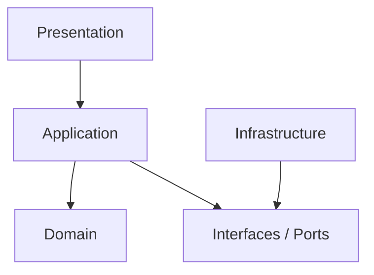

Infrastructure includes:

- Android platform;
- OCR provider;
- AI runtime;
- SQLite;
- local file storage;
- export libraries;
- sharing integration.

### Dependency rules

1. Domain must not depend directly on UI.
2. Domain must not depend directly on SQLite implementation.
3. Presentation must not invoke OCR/AI/storage providers directly.
4. Provider-specific implementations depend inward on stable interfaces.
5. Changing an OCR engine should not require a UI rewrite.
6. Changing an AI runtime/model should not require database schema redesign merely because the provider changed.
7. Exporters should depend on structured-data contracts, not on UI state.

**Overall pattern: PROPOSED.**

---

# 26. Concurrency & Long-Running Operations

Long-running work includes:

- OCR;
- AI inference;
- multi-page PDF processing;
- preprocessing;
- export generation;
- model loading.

The UI must remain responsive while these operations execute.

## 26.1 Architectural requirements

- Do not perform heavy processing directly on the UI execution path.
- Expose progress/stage updates asynchronously.
- Propagate cancellation into active operations when supported.
- Avoid duplicate concurrent processing of the same operation unless explicitly supported.
- Ensure shared storage writes are serialized/transactionally coordinated where required.

Exact threading, coroutine, executor or worker framework is **TBD / REQUIRES TECHNICAL VALIDATION**.

---

# 27. Memory Management

## 27.1 Risk areas

- high-resolution images;
- multi-page PDFs;
- OCR intermediate structures;
- large OCR text;
- AI input context;
- loaded AI model;
- export buffers.

## 27.2 Architectural strategies

| Strategy | Purpose | Status |
|---|---|---|
| Process page-by-page where practical | Limit peak memory | **PROPOSED** |
| Release intermediate image buffers promptly | Reduce memory pressure | **PROPOSED** |
| Avoid duplicate full-document copies | Reduce peak memory | **PROPOSED** |
| Prefer streaming/incremental export where practical | Avoid large in-memory buffers | **PROPOSED** |
| Lazy/controlled model loading | Avoid unnecessary model memory usage | **PROPOSED / VALIDATION** |
| Benchmark memory footprint | Establish real device limits | **REQUIRES TECHNICAL VALIDATION** |

Exact memory limits must come from device benchmarking.

---

# 28. Device Resource Management

The architecture must account for:

- low-memory conditions;
- low-storage conditions;
- model loading failures;
- large-document processing;
- unsupported hardware/resource combinations;
- background/process interruption.

## 28.1 Resource decision flow

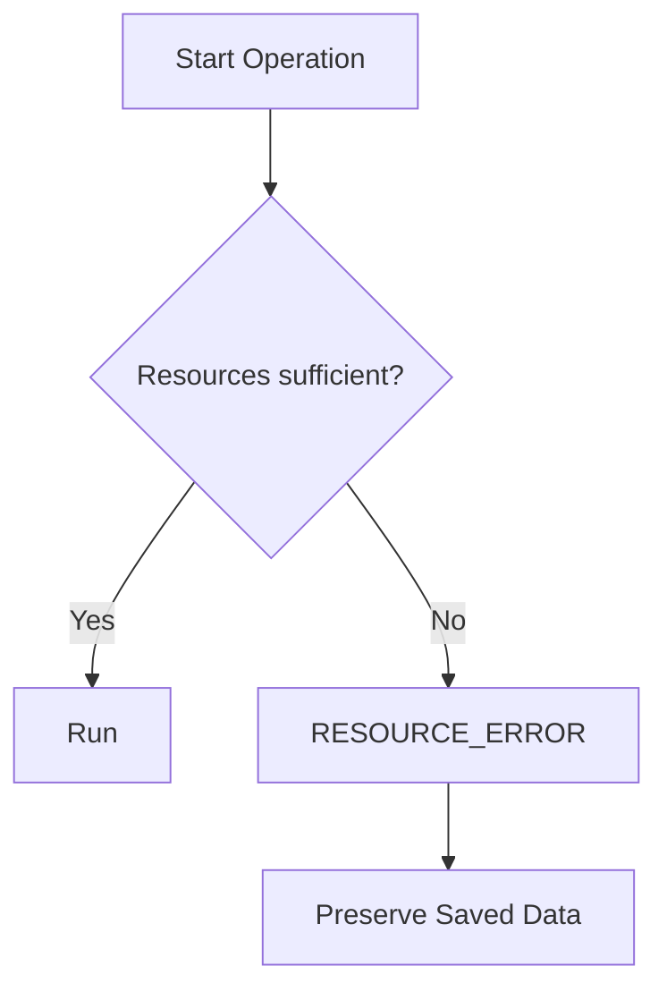

Exact minimum RAM, available storage, supported document size and device matrix are **TBD / REQUIRES TECHNICAL VALIDATION**.

---

# 29. Logging & Observability

## 29.1 Logging scope

Recommended architectural log events:

- application lifecycle events;
- processing operation start/end;
- stage transitions;
- non-sensitive timing metrics;
- model readiness/load status;
- adapter failures;
- persistence failures;
- export failures.

## 29.2 Correlation

Each processing operation may use an internal processing identifier to correlate:

```text
Processing ID
 ├── acquisition
 ├── preprocessing
 ├── OCR
 ├── AI
 ├── structuring
 ├── save
 └── export
```

This identifier must not itself contain sensitive document content.

Exact logging framework, log retention and release-build policy are **TBD**.

---

# 30. Test Architecture

## 30.1 Test boundaries

| Test Level | Primary boundary | Example |
|---|---|---|
| Unit | Domain/application logic | Structured-data validation |
| Adapter | Provider contract | OCR result mapping |
| Integration | Module handoff | OCR → AI → structuring |
| Pipeline | Full workflow | Image → OCR → AI → structured data |
| Persistence | SQLite/file contract | Save → reopen → edit |
| Export | Exporter correctness | Structured data → XLSX/CSV/JSON/PDF |
| Offline | No-network core flow | Model ready + airplane mode |
| Recovery | Failure/cancellation | Cancel during OCR/AI |
| Compatibility | Supported device matrix | Android/device combinations |
| Performance | Latency/resource | OCR, AI, memory |
| End-to-end | User workflow | Acquire → process → review → save → export |

## 30.2 Testability requirements

Every major module should have:

- explicit inputs/outputs;
- deterministic fixtures where feasible;
- replaceable provider dependencies;
- isolated error paths;
- cancellation behavior where applicable.

Testing framework and project-specific libraries remain **REQUIRES TECHNICAL VALIDATION**.

---

# 31. Scalability & Extensibility

The MVP does not require server scalability or cloud infrastructure.

Extensibility is instead achieved through modular local boundaries.

## 31.1 Planned extension points

```text
New Document Type
        ↓
Domain / Extraction Rules

New OCR Engine
        ↓
OCR Adapter

New AI Model
        ↓
AI Adapter / Model Manager

New AI Runtime
        ↓
AI Runtime Adapter

New Export Format
        ↓
Exporter Adapter

New Preprocessing Stage
        ↓
Pipeline Stage
```

Adding a new provider should not require rewriting unrelated layers.

---

# 32. Technology Decision Matrix

| Technology / Concern | Purpose | Current Choice | Status | Evidence | Alternative | Decision Required |
|---|---|---|---|---|---|---|
| Android language | Application implementation | Actual generated-project language | **REQUIRES TECHNICAL VALIDATION** | TRD says inspect generated project | TBD | Inspect project |
| UI framework | Android UI | Actual generated-project framework | **REQUIRES TECHNICAL VALIDATION** | TRD explicitly leaves open | TBD | Inspect project |
| Architecture pattern | App structure | Layered/modular | **PROPOSED** | Supports separation/testability | MVVM/MVI/Clean variants | Validate against project |
| Navigation | Screen routing | Generated-project mechanism | **REQUIRES TECHNICAL VALIDATION** | No final stack confirmed | TBD | Inspect project |
| State management | Processing state | Explicit state machine | **PROPOSED** | Required for reliability | Framework-specific state | Validate |
| OCR | Text extraction | Tesseract OCR | **CONFIRMED source-backed; integration TBD** | Workflow/TRD/SRS context | Other OCR after evaluation | Validate Android integration |
| AI model | Offline understanding | On-device/offline AI | **CONFIRMED capability; model TBD** | PRD/SRS | Candidate local models | Benchmark |
| AI runtime | Local inference | TBD | **TBD / REQUIRES TECHNICAL VALIDATION** | TRD leaves open | Candidate local runtimes | Benchmark |
| SQLite integration | Local database | SQLite | **CONFIRMED source-backed; integration TBD** | Project specification/TRD | Alternative only after approval | Inspect/integrate |
| File storage | Source/export/model files | Android-local storage mechanism | **REQUIRES TECHNICAL VALIDATION** | Exact API not specified | Platform-supported alternatives | Validate |
| PDF processing | Read/render PDF | TBD | **TBD** | SRS requires PDF input/output | Android/library approach | Validate |
| Excel export | `.xlsx` | Export adapter + TBD library | **PROPOSED / TBD** | Output requirement confirmed | Alternative libraries | Choose/validate |
| CSV export | `.csv` | Export adapter | **PROPOSED** | Output requirement confirmed | Native serializer | Validate |
| JSON export | `.json` | Export adapter | **PROPOSED** | Output requirement confirmed | Platform serializer | Validate |
| PDF export | `.pdf` | Export adapter + TBD implementation | **PROPOSED / TBD** | Output requirement confirmed | Alternative PDF libraries | Validate |
| Testing | Automated tests | Framework in generated project | **REQUIRES TECHNICAL VALIDATION** | TRD requires actual project | Standard Android testing stack if approved | Inspect project |
| Build | Android build/release | Generated project build system | **REQUIRES TECHNICAL VALIDATION** | Must match project | None until inspection | Inspect project |

### Technology assumptions explicitly avoided

**Node.js + Express.js — REJECTED for the current MVP architecture.**

The current product does not require server-side processing, cloud synchronization, authentication or a REST API. Carrying Node.js/Express.js from the historical workflow diagram into the Android architecture would create unnecessary infrastructure.

**React Native + TypeScript — NOT CONFIRMED.**

These appear in the supplied workflow diagram as source-backed historical technology context, but the current target is a Google AI Studio Android application. The actual generated Android project takes precedence.

---

# 33. Backend Architecture Decision

## Decision

**Current MVP backend requirement: NOT REQUIRED.**

### Rationale

The core workflow is local/offline and does not require:

- server-side processing;
- cloud synchronization;
- authentication;
- remote document storage;
- remote OCR;
- remote AI inference;
- REST APIs.

Therefore:

```text
Android App
   ↕
Local Processing + Local Storage
```

is the current architecture baseline.

### Status

**CONFIRMED architectural baseline.**

### Future backend

A future backend may be introduced only through formal scope/change control for an approved capability such as cloud synchronization or team collaboration.

The existence of a historical Node.js/Express.js diagram does not override this baseline.

---

# 34. API Architecture Decision

## Decision

**Core MVP REST API: NOT REQUIRED.**

The system uses internal module interfaces rather than network APIs for the core workflow.

### API boundary rule

No REST API should be introduced merely to connect:

- UI to processing;
- OCR to AI;
- processing to SQLite;
- processing to export.

Those are local application/module boundaries.

### Future API

API documentation belongs in `API.md` only when an approved future architecture introduces a network boundary.

**Status: CONFIRMED architectural baseline.**

---

# 35. Security & Privacy Boundaries

## 35.1 Trust boundaries

```text
[External Device Input]
       |
       v
[Acquisition Boundary]
       |
       v
[Local Processing Trust Zone]
  - Preprocessing
  - OCR
  - AI
  - Structuring
       |
       v
[Local Persistence Trust Zone]
  - SQLite
  - Files
       |
       v
[Local Export Boundary]
       |
       +--> Android Sharing
```

## 35.2 Network trust boundary

```text
[Network]
    |
    |  model setup/download only, where required
    v
[AI Model Manager]
```

No document-processing data path to the network is required by the MVP.

---

# 36. Architectural Risks

| Risk ID | Risk | Impact | Likelihood | Mitigation | Status |
|---|---|---|---|---|---|
| RSK-001 | AI model too large for target devices | High | Medium | Benchmark candidate models/runtimes and establish device requirements | **Open** |
| RSK-002 | AI inference too slow | High | Medium | Measure latency; validate model/runtime choices | **Open** |
| RSK-003 | OCR quality varies with image quality | High | High | Preprocessing + validation corpus + review/confidence | **Open** |
| RSK-004 | Complex table extraction unreliable | High | High | Dedicated table test corpus + editable review | **Open** |
| RSK-005 | Multi-page PDF memory pressure | High | Medium | Incremental/page-oriented processing + profiling | **Open** |
| RSK-006 | Android device compatibility varies | High | Medium | Build real device matrix and benchmark | **Open** |
| RSK-007 | Model download/setup fails | Medium/High | Medium | Readiness state, verification, retry/setup flow | **Open** |
| RSK-008 | Storage fills during processing | Medium/High | Medium | Preflight checks and cleanup strategy | **Open** |
| RSK-009 | DB/file inconsistency | High | Low/Medium | Coordinated persistence + recovery validation | **Open** |
| RSK-010 | Export fidelity differs by structure | Medium | Medium | Format-specific test corpus | **Open** |
| RSK-011 | Generated Google AI Studio architecture differs from assumptions | High | High | Inspect actual generated project before stack lock | **Open** |
| RSK-012 | Unnecessary backend complexity is introduced | Medium | Medium | Keep MVP explicitly local/no backend | **Controlled** |
| RSK-013 | Memory pressure during model + document processing | High | Medium | Controlled model loading, page processing, benchmark | **Open** |
| RSK-014 | App interruption loses unsaved edits | Medium/High | Medium | Define durable save points; do not promise resume until validated | **Open** |
| RSK-015 | Sensitive document content leaks through logs | High | Medium | Data-minimized logging and release review | **Open** |

---

# 37. Architecture Quality Attributes

## 37.1 Privacy

The architecture minimizes unnecessary data movement and avoids mandatory cloud processing.

**Status: CONFIRMED product requirement.**

## 37.2 Reliability

The system uses explicit states, failure normalization and persistence boundaries so failed operations cannot masquerade as successful ones.

**Status: CONFIRMED requirement / implementation PROPOSED.**

## 37.3 Performance

The architecture isolates long-running OCR/AI work from the UI and supports incremental processing.

Exact performance targets remain **TBD**.

## 37.4 Maintainability

Stable module boundaries reduce coupling between UI, AI, OCR, storage and exporters.

**Status: PROPOSED.**

## 37.5 Extensibility

Provider adapters and a stable structured-data contract allow future replacement/addition of OCR engines, AI models, runtimes and exporters.

**Status: PROPOSED.**

## 37.6 Portability

The application is targeted to Android. Concrete portability across Android versions/devices requires validation.

---

# 38. Architecture-to-Requirement Traceability

| Requirement area | Architectural element |
|---|---|
| Android/mobile | Android platform boundary |
| Camera input | Document Acquisition |
| PDF/image input | Document Acquisition + File Picker boundary |
| Image preprocessing | Preprocessor |
| OCR | OCR Layer / OCR Adapter |
| Offline AI | AI Layer / AI Adapter |
| Document type detection | AI + Extraction Processor |
| Field extraction | Extraction Processor |
| Table detection | Extraction Processor |
| Confidence score | Confidence Processor |
| Structured data | Structured Data Builder |
| User review/edit | Review/Edit Manager |
| Local storage | Persistence Manager + SQLite + File Storage |
| Document history | History Manager |
| Excel export | Excel Exporter |
| CSV export | CSV Exporter |
| JSON export | JSON Exporter |
| PDF export | PDF Exporter |
| Sharing | Android Sharing boundary |
| AI setup | AI Model Manager |
| Offline processing | Offline architecture |
| Error handling | Error Manager |
| Cancellation | Processing State Manager / pipeline |
| Progress reporting | Application/Processing events |
| Privacy | Local-only core processing + logging boundary |
| Testability | Explicit component/interface boundaries |
| Extensibility | Adapter-based infrastructure |
| No backend MVP | Backend Architecture Decision |
| No REST API MVP | API Architecture Decision |

---

# 39. Operational Scenarios

## Scenario A — First-time setup

```text
Launch
 ↓
Check model readiness
 ↓
Model missing
 ↓
Open setup
 ↓
Download/setup model
 ↓
Verify readiness
 ↓
Model ready
 ↓
Home
```

Network may be used during setup.

## Scenario B — Normal offline processing

```text
User selects/captures document
 ↓
Acquire
 ↓
Validate
 ↓
Preprocess
 ↓
OCR
 ↓
AI
 ↓
Structure
 ↓
Review
 ↓
Edit
 ↓
Save
 ↓
Export
```

No network call is required by the core architecture.

## Scenario C — AI model unavailable

```text
Start processing
 ↓
AI readiness check
 ↓
Model unavailable
 ↓
AI_MODEL_ERROR
 ↓
Show setup/readiness action
 ↓
Preserve previously saved records
```

## Scenario D — Export failure

```text
Saved structured result
 ↓
Export request
 ↓
Exporter failure
 ↓
EXPORT_ERROR
 ↓
Persisted result remains intact
 ↓
Retry / choose another format
```

---

# 40. Dependency & Module Boundaries

The exact source-code module/package structure is **REQUIRES TECHNICAL VALIDATION** and must be derived from the actual generated Android project.

The logical boundary should resemble:

```text
Presentation
Application
Domain
Processing
Infrastructure
├── OCR
├── AI
├── Persistence
├── File Storage
├── Export
└── Android Platform
```

A module should have one primary responsibility and should expose only the interfaces needed by adjacent layers.

Avoid creating artificial modules that add complexity without a meaningful boundary.

---

# 41. Implementation Validation Plan

## Phase 1 — Inspect the actual generated Android project

Verify:

- programming language;
- UI toolkit;
- architecture pattern already present;
- navigation;
- state management;
- package/module structure;
- build system;
- dependency versions;
- generated app lifecycle.

## Phase 2 — Validate document acquisition

Test:

- camera capture;
- image input;
- PDF input;
- multi-page PDF behavior;
- permissions;
- cancellation;
- malformed inputs.

## Phase 3 — Validate OCR

Test:

- Tesseract Android integration;
- representative document corpus;
- supported language set;
- image-quality sensitivity;
- OCR latency;
- memory use.

## Phase 4 — Validate offline AI

Test:

- model loading;
- setup/download;
- offline execution;
- inference latency;
- memory footprint;
- model storage size;
- device compatibility.

## Phase 5 — Validate pipeline behavior

Test:

- stage ordering;
- progress reporting;
- cancellation;
- failure propagation;
- intermediate-result preservation;
- state transitions.

## Phase 6 — Validate storage and export

Test:

- SQLite persistence;
- file references;
- reopen/history;
- edit/save;
- Excel;
- CSV;
- JSON;
- PDF;
- Android sharing.

## Phase 7 — Establish technical baseline

Promote decisions from TBD/PROPOSED/REQUIRES TECHNICAL VALIDATION to CONFIRMED only when evidence exists.

---

# 42. Architecture Governance

Architecture changes should use explicit decision records.

Any change to the following requires architecture review:

- adding a backend;
- adding a REST API;
- moving document data to cloud services;
- changing the offline processing requirement;
- replacing SQLite;
- replacing OCR provider;
- changing the AI runtime boundary;
- introducing a second persistence mechanism;
- changing the authoritative structured-data contract.

A source-backed historical technology should not be treated as an implementation mandate.

---

# 43. Architecture Acceptance Criteria

The architecture is ready for implementation when:

1. The generated Android project has been inspected and its concrete stack recorded.
2. The logical architecture can be implemented without violating PRD/SRS/TRD requirements.
3. OCR has a defined adapter boundary.
4. AI has a defined runtime/model boundary.
5. The structured-data contract is stable enough for UI, persistence and export.
6. User edits are established as the authoritative saved/exported result.
7. SQLite/file-storage responsibilities are separated.
8. Exporters are independent.
9. Processing states and error states are explicit.
10. Cancellation behavior is defined for each long-running stage.
11. No core processing path depends on network access.
12. Missing/corrupt/unavailable AI model states are handled safely.
13. Backend and REST API remain absent from the core MVP path.
14. Performance/resource constraints are measured rather than guessed.
15. Privacy-sensitive document content is excluded from normal diagnostics/logging.

---

# 44. Boundary with Other Project Documents

| Document | Responsibility | Relationship to this document |
|---|---|---|
| `PRD.md` | Product goals, scope and requirements | Source of WHAT/WHY |
| `SRS.md` | Software behavior and acceptance-level requirements | Source of software behavior |
| `TRD.md` | Technical requirements and technical decisions | Parent technical baseline |
| `SYSTEM_ARCHITECTURE.md` | Logical architecture and component boundaries | Current document |
| `FRONTEND.md` | Android UI implementation | Must follow architecture boundaries |
| `UI_UX.md` | Visual/interaction design | Consumes presentation contracts |
| `BACKEND.md` | Backend design if ever approved | Current MVP: no backend |
| `API.md` | Network API contracts if ever approved | Current MVP: no core REST API |
| `DATABASE.md` | SQLite schema/migrations/indexes | Implements persistence boundary |
| `DATA_SCHEMA.md` | Canonical serialized structured-data schema | Implements domain data contract |
| `AI_OCR.md` | AI/OCR/model/runtime/preprocessing details | Resolves AI/OCR TBDs |
| `TESTING.md` | Full test plan and cases | Verifies architectural boundaries |
| `BUILD_RELEASE.md` | Build/sign/release details | Resolves project-specific build decisions |

---

# 45. Source Alignment

## PRD

The PRD establishes SnapData as an Android/mobile application that converts PDFs/images into structured, editable information using OCR and AI; it requires review/editing, local storage, history and Excel/CSV/JSON/PDF export, with offline-first processing after initial AI setup. It also keeps exact device, model, performance and certain security decisions open.

## SRS

The SRS establishes the software workflow from acquisition and preprocessing through OCR, offline AI, structured data, review/editing, local persistence, export and history. It explicitly avoids finalizing implementation-specific APIs, database schema, AI model/runtime and preprocessing algorithms.

## TRD

The TRD establishes the current technical baseline: Android + Google AI Studio build workflow; SQLite source-backed; Tesseract OCR source-backed; offline AI capability confirmed but model/runtime TBD; backend and REST API not required for the MVP; concrete Android stack must be validated from the generated project.

## Original project specification

The original specification describes the conversion of PDFs/images into structured editable data through OCR and AI, camera/file acquisition, local/offline processing after model setup, SQLite storage, and Excel/CSV/JSON/PDF export.

## Workflow diagram

The supplied workflow diagram on page 2 illustrates the operational sequence from Start and Launch through Document Input, Acquisition, Image Pre-processing, OCR Processing, Offline AI Processing, Structured Data Generation, User Review & Editing, Local Storage, Export Module and Document History. It visually lists React Native, TypeScript, Node.js, Express.js, SQLite, Tesseract OCR, Offline AI and Excel/CSV/JSON/PDF export in its technology-stack footer. Those historical technology labels are treated as source-backed context only where the TRD has not promoted them to confirmed implementation choices.

---

# 46. Final Architectural Baseline

**SnapData is architecturally defined as a modular, local-first Android application with an on-device document-processing pipeline.**

The baseline core path is:

```text
Camera / File Picker
        ↓
Document Acquisition
        ↓
Validation
        ↓
Preprocessing
        ↓
Tesseract-backed OCR boundary
        ↓
Offline AI boundary
        ↓
Structured Data
        ↓
User Review / Edit
        ↓
SQLite + Local File Storage
        ↓
Excel / CSV / JSON / PDF Export
        ↓
History / Sharing
```

The following are explicitly **not assumed**:

- the concrete Android programming language;
- UI framework;
- exact Android architecture pattern;
- module/package structure;
- dependency versions;
- AI model;
- AI runtime;
- exact file-storage APIs;
- exact export libraries;
- exact threading mechanism;
- exact device/resource limits.

Those decisions remain **TBD / REQUIRES TECHNICAL VALIDATION** until the actual Google AI Studio-generated Android project is inspected and benchmarked.

The current MVP therefore intentionally avoids a backend and REST API. The architecture is designed to keep documents local and preserve the product's offline-first/privacy model.

---

# Appendix A — Status Summary

| Area | Status |
|---|---|
| Android target | **CONFIRMED** |
| Google AI Studio "Build an Android app" workflow | **CONFIRMED** |
| Offline-first core workflow | **CONFIRMED** |
| Local processing | **CONFIRMED** |
| SQLite local database | **CONFIRMED source-backed; integration TBD** |
| Tesseract OCR | **CONFIRMED source-backed; Android integration requires validation** |
| Offline AI capability | **CONFIRMED; exact model/runtime TBD** |
| Camera/PDF/image acquisition | **CONFIRMED** |
| Structured fields/tables | **CONFIRMED** |
| User review/editing | **CONFIRMED** |
| User-edited result authoritative for save/export | **CONFIRMED** |
| Document history | **CONFIRMED** |
| Excel/CSV/JSON/PDF export | **CONFIRMED** |
| Backend for MVP | **REJECTED / NOT REQUIRED** |
| REST API for MVP | **REJECTED / NOT REQUIRED** |
| Exact Android language | **REQUIRES TECHNICAL VALIDATION** |
| Exact UI framework | **REQUIRES TECHNICAL VALIDATION** |
| Exact architecture pattern | **PROPOSED** |
| Exact OCR integration | **REQUIRES TECHNICAL VALIDATION** |
| Exact AI model | **TBD** |
| Exact AI runtime | **TBD / REQUIRES TECHNICAL VALIDATION** |
| Exact storage APIs | **REQUIRES TECHNICAL VALIDATION** |
| Exact export libraries | **TBD / REQUIRES TECHNICAL VALIDATION** |
| Device/resource limits | **TBD / REQUIRES TECHNICAL VALIDATION** |
| Resume after interruption | **TBD** |
| Encryption/security mechanisms | **TBD** |
| Model update/delete | **TBD** |

---

# Appendix B — Architecture Decision Records (Initial)

## ADR-001 — Local-first MVP

**Decision:** Core processing is local/offline after required model setup.

**Status:** CONFIRMED.

**Reason:** Aligns with the product's privacy and offline-first requirements.

## ADR-002 — No required backend

**Decision:** Do not introduce a backend for the core MVP.

**Status:** CONFIRMED.

**Reason:** No server-side processing, synchronization, authentication or remote storage is required by the current scope.

## ADR-003 — No required REST API

**Decision:** Use internal module interfaces for the core workflow.

**Status:** CONFIRMED.

**Reason:** OCR, AI, persistence and export are local modules rather than network services.

## ADR-004 — OCR provider boundary

**Decision:** Isolate OCR behind an adapter.

**Status:** PROPOSED.

**Reason:** Keeps presentation/application layers independent of OCR implementation and supports future provider replacement.

## ADR-005 — AI runtime/model boundary

**Decision:** Isolate AI inference behind an adapter/model-manager boundary.

**Status:** PROPOSED.

**Reason:** Exact model/runtime are not finalized and must remain replaceable.

## ADR-006 — Structured-data authority

**Decision:** The latest user-edited structured result is authoritative for persistence/export.

**Status:** CONFIRMED.

**Reason:** Preserves user corrections and prevents stale machine output from being exported.

## ADR-007 — Historical React Native/Node stack not carried forward automatically

**Decision:** Do not treat React Native/TypeScript or Node.js/Express.js from the old workflow diagram as final implementation choices.

**Status:** CONFIRMED.

**Reason:** Current target is a Google AI Studio Android project, and the TRD explicitly requires actual-project verification.

---

# Appendix C — Reference Documents

1. `SnapData_PRD_v1.0.md`
2. `SnapData_SRS_v1.0.md`
3. `SnapData_TRD_v1.0.md`
4. `SnapData _ Ai-Powered Intelligent Document Processing & Data Extraction System.pdf`
5. SnapData workflow diagram
6. Supplementary SnapData feature/roadmap material where preserved by the PRD/SRS status model

**Document:** `SnapData_SYSTEM_ARCHITECTURE_v1.0.md`  
**Status:** Draft / Architecture Baseline  
**Date:** 30 August 2026
