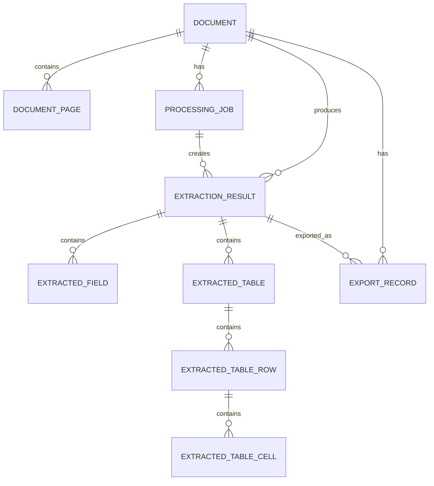

# SnapData: AI-Powered Intelligent Document Processing & Data Extraction System
## Database Technical Design Document

**Project:** SnapData  
**Document:** Database Technical Design  
**Version:** 1.0  
**Status:** Draft / Implementation Baseline  
**Date:** 30 August 2026  
**Database:** SQLite  
**Primary purpose:** Local/offline persistence

> **Design status:** This document defines the recommended SQLite logical design for the current MVP while explicitly separating source-confirmed facts from implementation decisions that still require validation. The available project sources confirm SQLite as the intended local database, but the actual Google AI Studio-generated Android source project was not available for direct inspection. Therefore Room/raw SQLite, exact Android persistence APIs, exact generated entities, and dependency versions are **REQUIRES TECHNICAL VALIDATION**, not assumed.

---

## 1. Document Control

| Item | Value |
|---|---|
| Project | SnapData |
| Document | Database Technical Design |
| Version | 1.0 |
| Status | Draft / Implementation Baseline |
| Date | 30 August 2026 |
| Database | SQLite |
| Architecture | Android, local-first, offline-capable |
| Backend | None for current MVP |
| Cloud sync | None for current MVP |
| REST API | None for current MVP |
| Database implementation | **REQUIRES TECHNICAL VALIDATION** |

### 1.1 Source hierarchy

```text
PRD
 ↓
SRS
 ↓
TRD
 ↓
SYSTEM_ARCHITECTURE
 ↓
FRONTEND / UI_UX
 ↓
DATABASE
```

Lower-level database decisions refine the higher-level documents but must not contradict them.

### 1.2 Status vocabulary

- **CONFIRMED** — explicitly established by source material or direct implementation evidence.
- **PROPOSED** — recommended implementation direction.
- **TBD** — decision not yet made.
- **REQUIRES TECHNICAL VALIDATION** — intent is established, but implementation feasibility or actual project evidence is still required.
- **REJECTED** — intentionally excluded from the current baseline.
- **OPTIONAL** — useful extension, not required by the current MVP baseline.

---

# 2. Purpose

This document defines the local SQLite persistence architecture for SnapData.

The database is responsible for preserving the durable state required by the product workflow:

```text
Document
  ↓
Processing
  ↓
OCR / AI result
  ↓
Structured fields + tables
  ↓
User review/edit
  ↓
Saved authoritative result
  ↓
Export metadata / history
```

The product baseline requires local storage of processed document records, structured data, sufficient processing/history metadata to reopen records, retention of user corrections, deletion of locally stored processed documents, and Excel/CSV/JSON/PDF export.

---

# 3. Database Principles

The SQLite design follows these principles:

1. **Local-first** — the database works without internet access.
2. **Offline operation** — the core workflow does not depend on a remote database or API.
3. **Data integrity** — foreign keys, constraints and transactions protect durable state.
4. **Minimal duplication** — structured data is modeled once unless denormalization has a clear query/performance benefit.
5. **Clear ownership** — each table has one primary domain responsibility.
6. **Migration safety** — schema changes are versioned and data-preserving where practical.
7. **Transactional updates** — related state changes commit atomically.
8. **Recoverability** — incomplete processing must not overwrite valid saved records.
9. **Privacy** — document content remains local and secrets are excluded.
10. **Performance** — indexes target actual history/result/export queries rather than speculative optimization.
11. **MVP simplicity** — no cloud database, synchronization, replication or server-side persistence is introduced.

---

# 4. Actual Project Inspection

## 4.1 Inspection result

**Overall status: REQUIRES TECHNICAL VALIDATION**

The project materials confirm that the current implementation target is a Google AI Studio **"Build an Android app"** workflow. However, the accessible project set contains the specification documents and workflow materials, not the generated Android source/build artifact.

The current source evidence therefore confirms **SQLite as the intended local database**, but does not confirm:

- Room versus direct SQLite access;
- SQLiteOpenHelper or another adapter;
- generated entity classes;
- repository implementations;
- schema version already present in the project;
- migration code already present;
- serialization library;
- actual file-storage API;
- exact table names in the generated code.

## 4.2 Verification matrix

| Area | Status | Evidence needed | Database action |
|---|---|---|---|
| SQLite as database | **CONFIRMED source-backed** | Project integration | Keep SQLite boundary |
| Room ORM | **REQUIRES TECHNICAL VALIDATION** | Gradle/dependencies/source | Adopt only if already present/approved |
| Raw SQLite | **REQUIRES TECHNICAL VALIDATION** | DB helper/SQL code | Adopt only if confirmed |
| Existing entities | **REQUIRES TECHNICAL VALIDATION** | Source tree | Map to logical schema |
| Existing migrations | **REQUIRES TECHNICAL VALIDATION** | DB migration code | Preserve existing history |
| Existing repositories | **REQUIRES TECHNICAL VALIDATION** | Repository/data layer | Implement contracts behind interfaces |
| Serialization format | **REQUIRES TECHNICAL VALIDATION** | Models/serializers | Preserve canonical data model |
| File storage mechanism | **REQUIRES TECHNICAL VALIDATION** | Android storage code | Persist stable references only |

---

# 5. Database Architecture

Recommended dependency direction:

```text
Presentation / Android UI
          ↓
Application / Use Cases
          ↓
Repository Interfaces
          ↓
Persistence Adapter
          ↓
SQLite
```

The UI must not issue SQL directly. The OCR/AI layer must not directly mutate UI state or manipulate database tables. Exporters should consume domain/repository data rather than querying SQLite directly.

## 5.1 Database ownership

| Responsibility | Primary owner | Database role |
|---|---|---|
| Document lifecycle | Document Repository | CRUD for `document` |
| Processing state/history | Processing Repository | CRUD/status for `processing_job` |
| Extraction result | Extraction Repository | `extraction_result`, fields, tables |
| Export metadata | Export Repository | `export_record` |
| Settings | Settings Repository | `app_setting` |
| Model metadata | Model/Settings Repository | Optional `model_metadata` |

A single repository is acceptable for a small MVP implementation if the codebase does not benefit from separate interfaces. The logical ownership boundaries should still remain explicit.

---

# 6. Data Ownership and Source of Truth

The authoritative saved structured result is the **latest user-reviewed/current result**.

```text
AI extraction
   ↓
original_value
   ↓
user review/edit
   ↓
current value
   ↓
SAVE TRANSACTION
   ↓
authoritative saved result
```

Database records are durable application state. Temporary UI state, navigation state and animations do not belong in SQLite.

---

# 7. Core Entity Set

The recommended MVP schema contains the following tables:

| Table | Responsibility | Status |
|---|---|---|
| `document` | Document identity and lifecycle metadata | **RECOMMENDED** |
| `document_page` | Optional page-level metadata for multi-page documents | **OPTIONAL / TBD priority** |
| `processing_job` | Processing attempt/state/history | **RECOMMENDED** |
| `extraction_result` | Versioned structured extraction result | **RECOMMENDED** |
| `extracted_field` | Discrete key-value extraction | **RECOMMENDED** |
| `extracted_table` | Detected table metadata | **RECOMMENDED** |
| `extracted_table_row` | Table rows | **RECOMMENDED** |
| `extracted_table_cell` | Individual table cells | **RECOMMENDED** |
| `export_record` | Generated-export metadata | **RECOMMENDED** |
| `app_setting` | Persisted application settings | **RECOMMENDED** |
| `model_metadata` | Optional AI model package metadata | **OPTIONAL / REQUIRES VALIDATION** |

No separate `history` table is required for the MVP because saved documents are already queryable from `document`, while processing attempts/history are represented by retained `processing_job` records. This avoids duplicating document history data.

---

# 8. Entity: `document`

## 8.1 Purpose

Represents a user-visible source document and its durable lifecycle metadata.

## 8.2 Logical columns

| Column | Type | Nullable | Default | Constraints / Notes |
|---|---|---:|---|---|
| `id` | INTEGER | No | auto | Primary key; recommended MVP ID strategy |
| `original_filename` | TEXT | No | — | Original imported/captured filename where available |
| `display_name` | TEXT | No | derived | User-visible name; fallback to original filename |
| `source_type` | TEXT | No | — | Proposed values: `CAMERA`, `PDF`, `IMAGE` |
| `mime_type` | TEXT | Yes | NULL | Source MIME type when known |
| `file_path` | TEXT | No | — | Stable app-local file reference, not binary content |
| `page_count` | INTEGER | Yes | NULL | Known page count; exact limits remain TBD |
| `document_type` | TEXT | Yes | NULL | AI-detected type where available |
| `processing_status` | TEXT | No | `PENDING` | Lifecycle summary; proposed enum |
| `review_status` | TEXT | No | `UNREVIEWED` | Proposed: `UNREVIEWED`, `IN_REVIEW`, `REVIEWED` |
| `error_code` | TEXT | Yes | NULL | Application-level mapped error identifier |
| `error_message` | TEXT | Yes | NULL | Safe user-independent diagnostic summary; avoid secrets |
| `created_at` | INTEGER | No | — | UTC epoch milliseconds recommended |
| `updated_at` | INTEGER | No | — | UTC epoch milliseconds |
| `last_processed_at` | INTEGER | Yes | NULL | Last completed/meaningful processing time |

### Constraints

- `page_count >= 0` when present.
- `display_name` must not be empty.
- `processing_status` should use a constrained application enum.
- `review_status` should use a constrained application enum.
- `file_path` must identify a logical storage reference, not a remote URL.

### Ownership

`document` owns document lifecycle, not detailed extraction values.

---

# 9. Entity: `document_page`

**Status: OPTIONAL / REQUIRES TECHNICAL VALIDATION**

Use this table when page-level reopen, OCR state, source references or per-page processing must persist.

| Column | Type | Nullable | Default | Constraints / Notes |
|---|---|---:|---|---|
| `id` | INTEGER | No | auto | Primary key |
| `document_id` | INTEGER | No | — | FK → `document.id` |
| `page_number` | INTEGER | No | — | 1-based; unique within document |
| `source_reference` | TEXT | Yes | NULL | File/page reference |
| `image_width` | INTEGER | Yes | NULL | Optional source metadata |
| `image_height` | INTEGER | Yes | NULL | Optional source metadata |
| `processing_state` | TEXT | No | `PENDING` | Proposed enum |
| `ocr_state` | TEXT | No | `PENDING` | Proposed enum |

Recommended constraint:

```text
UNIQUE(document_id, page_number)
```

Delete behavior: `ON DELETE CASCADE` from `document` to `document_page`.

---

# 10. Entity: `processing_job`

## 10.1 Purpose

Represents a processing attempt and preserves enough processing/history metadata to support status, recovery and history behavior.

## 10.2 Logical columns

| Column | Type | Nullable | Default | Constraints / Notes |
|---|---|---:|---|---|
| `id` | INTEGER | No | auto | Primary key |
| `document_id` | INTEGER | No | — | FK → `document.id` |
| `status` | TEXT | No | `PENDING` | Proposed: `PENDING`, `RUNNING`, `COMPLETED`, `FAILED`, `CANCELLED` |
| `current_stage` | TEXT | Yes | NULL | Proposed processing stage |
| `started_at` | INTEGER | Yes | NULL | UTC epoch ms |
| `completed_at` | INTEGER | Yes | NULL | UTC epoch ms |
| `error_code` | TEXT | Yes | NULL | Maps to application error categories |
| `error_message` | TEXT | Yes | NULL | Safe non-sensitive diagnostic |
| `cancelled_at` | INTEGER | Yes | NULL | Set when cancelled |
| `created_at` | INTEGER | No | — | Job creation time |

Suggested stages:

```text
ACQUISITION
VALIDATION
PREPROCESSING
OCR
AI_ANALYSIS
STRUCTURING
SAVING
COMPLETED
FAILED
CANCELLED
```

### 10.3 History behavior

Retain completed jobs and failed/cancelled jobs as processing history when they are useful for recovery/debugging. Do not retain unbounded transient progress events in MVP.

---

# 11. Entity: `extraction_result`

## 11.1 Purpose

Represents a structured extraction snapshot produced for a processing job.

## 11.2 Logical columns

| Column | Type | Nullable | Default | Constraints / Notes |
|---|---|---:|---|---|
| `id` | INTEGER | No | auto | Primary key |
| `document_id` | INTEGER | No | — | FK → `document.id` |
| `processing_job_id` | INTEGER | No | — | FK → `processing_job.id` |
| `document_type` | TEXT | Yes | NULL | Detected type |
| `schema_version` | TEXT | No | `1.0` | Version of structured extraction schema |
| `extraction_timestamp` | INTEGER | No | — | UTC epoch ms |
| `review_status` | TEXT | No | `UNREVIEWED` | Proposed values |
| `is_current` | INTEGER | No | `1` | Boolean 0/1; exactly one current result per document is recommended |
| `raw_ocr_text` | TEXT | Yes | NULL | Optional OCR text; see serialization section |
| `summary_text` | TEXT | Yes | NULL | Optional AI summary where enabled |
| `created_at` | INTEGER | No | — | Persisted result creation time |
| `updated_at` | INTEGER | No | — | Last result mutation |

### Current-result rule

For each document, only one extraction result should be the authoritative current result.

```text
UNIQUE(document_id) WHERE is_current = 1
```

If the project implementation does not support the preferred index form, enforce this invariant transactionally in repository code.

---

# 12. Entity: `extracted_field`

## 12.1 Purpose

Stores discrete key-value extraction units that the review/editor can address independently.

## 12.2 Logical columns

| Column | Type | Nullable | Default | Constraints / Notes |
|---|---|---:|---|---|
| `id` | INTEGER | No | auto | Primary key |
| `result_id` | INTEGER | No | — | FK → `extraction_result.id` |
| `field_key` | TEXT | No | — | Stable logical key |
| `field_label` | TEXT | Yes | NULL | Human-readable label |
| `value` | TEXT | Yes | NULL | Current authoritative value |
| `value_type` | TEXT | No | `TEXT` | Proposed: `TEXT`, `NUMBER`, `DATE`, `BOOLEAN`, `NULL`, etc. |
| `confidence` | REAL | Yes | NULL | 0..1 when provided; calculation remains outside DB |
| `source_page` | INTEGER | Yes | NULL | Optional page reference |
| `source_reference` | TEXT | Yes | NULL | Optional bounding/source reference |
| `original_value` | TEXT | Yes | NULL | AI/OCR value before user edits |
| `edited_flag` | INTEGER | No | `0` | 0/1 |
| `field_order` | INTEGER | No | `0` | Stable display/export ordering |
| `created_at` | INTEGER | No | — | Created timestamp |
| `updated_at` | INTEGER | No | — | Updated timestamp |

### Editing model

- `original_value` preserves the extracted baseline.
- `value` is the current editable value.
- `edited_flag = 1` indicates that the user has changed the value.

---

# 13. Entity: `extracted_table`

## 13.1 Purpose

Stores detected table metadata and establishes ownership of table rows.

## 13.2 Logical columns

| Column | Type | Nullable | Default | Constraints / Notes |
|---|---|---:|---|---|
| `id` | INTEGER | No | auto | Primary key |
| `result_id` | INTEGER | No | — | FK → `extraction_result.id` |
| `table_name` | TEXT | Yes | NULL | Display/export name |
| `table_order` | INTEGER | No | `0` | Order in result |
| `source_page` | INTEGER | Yes | NULL | Source page |
| `source_reference` | TEXT | Yes | NULL | Optional source region/reference |
| `created_at` | INTEGER | No | — | Created timestamp |
| `updated_at` | INTEGER | No | — | Updated timestamp |

---

# 14. Entity: `extracted_table_row`

## 14.1 Purpose

Stores the row order within a detected table.

| Column | Type | Nullable | Default | Constraints / Notes |
|---|---|---:|---|---|
| `id` | INTEGER | No | auto | Primary key |
| `table_id` | INTEGER | No | — | FK → `extracted_table.id` |
| `row_index` | INTEGER | No | `0` | Zero- or one-based convention must be fixed by implementation; recommendation: 0-based storage |
| `row_type` | TEXT | Yes | NULL | Optional: `HEADER`, `DATA`, `TOTAL` |
| `created_at` | INTEGER | No | — | Created timestamp |
| `updated_at` | INTEGER | No | — | Updated timestamp |

Recommended uniqueness:

```text
UNIQUE(table_id, row_index)
```

---

# 15. Entity: `extracted_table_cell`

## 15.1 Purpose

Stores the editable value for one table cell.

| Column | Type | Nullable | Default | Constraints / Notes |
|---|---|---:|---|---|
| `id` | INTEGER | No | auto | Primary key |
| `row_id` | INTEGER | No | — | FK → `extracted_table_row.id` |
| `column_key` | TEXT | Yes | NULL | Stable column identity where available |
| `column_index` | INTEGER | No | `0` | Physical/display order |
| `value` | TEXT | Yes | NULL | Current editable value |
| `value_type` | TEXT | No | `TEXT` | Proposed value type |
| `confidence` | REAL | Yes | NULL | 0..1 when supplied |
| `original_value` | TEXT | Yes | NULL | Pre-edit extracted value |
| `edited_flag` | INTEGER | No | `0` | 0/1 |
| `source_page` | INTEGER | Yes | NULL | Optional page reference |
| `source_reference` | TEXT | Yes | NULL | Optional cell/source reference |
| `created_at` | INTEGER | No | — | Created timestamp |
| `updated_at` | INTEGER | No | — | Updated timestamp |

---

# 16. User Edit Tracking

The recommended MVP strategy is lightweight:

```text
original_value = AI/OCR extraction
value          = current user-reviewed value
edited_flag    = whether the user changed it
```

This representation is used for both fields and cells.

---

# 17. Confidence Data

Confidence is **metadata produced by the OCR/AI pipeline**, not a database-calculated metric.

Recommended persistence levels:

| Level | Storage |
|---|---|
| Extraction-wide confidence | `extraction_result` if required by the final canonical data model; otherwise omit |
| Field confidence | `extracted_field.confidence` |
| Table confidence | Optional future extension if required |
| Cell confidence | `extracted_table_cell.confidence` |

Rules:

- Accept NULL when the processing layer provides no confidence.
- Persist the numeric value as supplied by the processing layer.
- Validate basic range `0.0 <= confidence <= 1.0` only if the processing contract explicitly guarantees that range.
- Do not encode UI thresholds in the database.

---

# 18. Entity: `export_record`

## 18.1 Purpose

Stores metadata about generated export files. The binary/file contents remain in Android-local file storage.

## 18.2 Logical columns

| Column | Type | Nullable | Default | Constraints / Notes |
|---|---|---:|---|---|
| `id` | INTEGER | No | auto | Primary key |
| `document_id` | INTEGER | No | — | FK → `document.id` |
| `result_id` | INTEGER | Yes | NULL | Exported extraction result when known |
| `format` | TEXT | No | — | `EXCEL`, `CSV`, `JSON`, `PDF` |
| `file_path` | TEXT | Yes | NULL | Created file reference |
| `status` | TEXT | No | `PENDING` | Proposed `PENDING`, `COMPLETED`, `FAILED` |
| `error_code` | TEXT | Yes | NULL | Application-level mapping |
| `error_message` | TEXT | Yes | NULL | Safe diagnostic |
| `created_at` | INTEGER | No | — | Start/create time |
| `completed_at` | INTEGER | Yes | NULL | Completion time |
| `file_size_bytes` | INTEGER | Yes | NULL | Optional metadata |

### File ownership

`export_record.file_path` is a reference. The export bytes do not belong in SQLite unless a future requirement explicitly changes the storage boundary.

---

# 19. Entity: `app_setting`

## 19.1 Purpose

Stores persistent application settings that should survive process restarts.

## 19.2 Logical columns

| Column | Type | Nullable | Default | Constraints / Notes |
|---|---|---:|---|---|
| `key` | TEXT | No | — | Primary key |
| `value` | TEXT | Yes | NULL | Serialized primitive value |
| `value_type` | TEXT | No | `TEXT` | `STRING`, `BOOLEAN`, `INTEGER`, `JSON` as needed |
| `updated_at` | INTEGER | No | — | Last change time |

### Candidate settings

- `onboarding_completed`
- `ocr_language`
- `theme_preference`
- `selected_model_id`
- `storage_preferences` only when explicitly approved

Do not persist secrets, passwords, API keys, authentication tokens or transient screen state.

---

# 20. Entity: `model_metadata`

**Status: OPTIONAL / REQUIRES TECHNICAL VALIDATION**

This table is justified only if the final model manager needs persistent metadata for locally installed AI models.

| Column | Type | Nullable | Default | Constraints / Notes |
|---|---|---:|---|---|
| `id` | INTEGER | No | auto | Primary key |
| `model_identifier` | TEXT | No | — | Logical model ID |
| `model_version` | TEXT | Yes | NULL | Version |
| `file_path` | TEXT | No | — | Local model file/package reference |
| `status` | TEXT | No | `AVAILABLE` | Proposed status |
| `installed_at` | INTEGER | Yes | NULL | Installation time |
| `file_size_bytes` | INTEGER | Yes | NULL | Optional size |
| `checksum` | TEXT | Yes | NULL | Optional integrity metadata |
| `created_at` | INTEGER | No | — | Record creation time |
| `updated_at` | INTEGER | No | — | Last update |

The AI model binary itself must never be stored inside SQLite. The database stores metadata/reference only.

---

# 21. Relationships / ER Diagram



### 21.1 Cardinality

| Relationship | Cardinality | Meaning |
|---|---|---|
| Document → DocumentPage | 1:N | A document may have zero or more persisted pages |
| Document → ProcessingJob | 1:N | A document may be processed/reprocessed multiple times |
| Document → ExtractionResult | 1:N | A document can have multiple historical results, one current |
| ProcessingJob → ExtractionResult | 1:N | Normally 0 or 1 completed result; schema permits retry/partial extensions |
| ExtractionResult → ExtractedField | 1:N | A result contains zero or more fields |
| ExtractionResult → ExtractedTable | 1:N | A result contains zero or more tables |
| ExtractedTable → TableRow | 1:N | A table contains rows |
| TableRow → TableCell | 1:N | A row contains cells |
| Document → ExportRecord | 1:N | A document can have multiple exports |
| ExtractionResult → ExportRecord | 1:N | A result can be exported multiple times |

---

# 22. Normalization Strategy

The schema targets a practical relational design approximately consistent with 3NF for core entities:

- Document identity is stored once.
- Processing attempts are separate from document identity.
- Extraction result metadata is separate from fields/tables.
- Table rows/cells are normalized for editing.
- Export metadata references documents/results instead of copying structured payloads.
- Settings use key/value semantics because their shape is naturally heterogeneous and small.

### Deliberate denormalization

`extracted_field.original_value` + `value` intentionally duplicates the value concept to preserve the original extraction baseline while allowing the current edited value to become authoritative.

`document.document_type` and `extraction_result.document_type` may appear duplicated because the document list/history needs a fast, current summary without joining the latest extraction result on every history query. The repository must keep the document-level summary synchronized with the authoritative current result within the same save/review transaction.

---

# 23. Primary-Key Strategy

## Decision

**Status: PROPOSED / REQUIRES TECHNICAL VALIDATION against actual project.**

### Recommendation: INTEGER PRIMARY KEY

For the current offline SQLite MVP, use SQLite integer primary keys for local relational records.

Reasons:

- compact storage;
- efficient indexing and joins;
- simple foreign keys;
- low implementation complexity;
- no current synchronization requirement;
- no current multi-device merge requirement.

Text UUIDs are valid but add storage/index overhead that is not justified by the current no-sync architecture.

---

# 24. Foreign Keys

Foreign-key enforcement must be enabled for every database connection.

| Child table | FK | Parent | Delete behavior | Update behavior |
|---|---|---|---|---|
| `document_page` | `document_id` | `document.id` | CASCADE | RESTRICT |
| `processing_job` | `document_id` | `document.id` | CASCADE | RESTRICT |
| `extraction_result` | `document_id` | `document.id` | CASCADE | RESTRICT |
| `extraction_result` | `processing_job_id` | `processing_job.id` | RESTRICT | RESTRICT |
| `extracted_field` | `result_id` | `extraction_result.id` | CASCADE | RESTRICT |
| `extracted_table` | `result_id` | `extraction_result.id` | CASCADE | RESTRICT |
| `extracted_table_row` | `table_id` | `extracted_table.id` | CASCADE | RESTRICT |
| `extracted_table_cell` | `row_id` | `extracted_table_row.id` | CASCADE | RESTRICT |
| `export_record` | `document_id` | `document.id` | CASCADE | RESTRICT |
| `export_record` | `result_id` | `extraction_result.id` | SET NULL | RESTRICT |

---

# 25. Delete Strategy

## 25.1 Database records

**Recommended MVP strategy: hard delete with cascade.**

When a user deletes a saved document:

```text
DELETE document
   ↓
CASCADE document pages
CASCADE processing jobs
CASCADE extraction results
CASCADE fields/tables/rows/cells
CASCADE export metadata
```

## 25.2 Physical files

Database deletion and physical-file deletion are separate operations.

The application should coordinate them through a storage service:

```text
User confirms delete
       ↓
SQLite transaction deletes DB records
       ↓
Storage cleanup attempts physical file removal
       ↓
Cleanup result handled by storage layer
```

A database record must never assume that the physical file exists merely because `file_path` is non-null.

---

# 26. File Storage Boundary

SQLite stores:

- document metadata;
- file references;
- processing state/history;
- structured extraction;
- user edits;
- export metadata;
- approved persistent settings;
- optional model metadata.

Android-local file storage stores:

- original imported PDFs/images;
- captured images;
- retained processed/derived images where required;
- generated exports;
- AI model files;
- temporary working artifacts.

---

# 27. Serialization Strategy

## 27.1 Evaluation

### Option A — Fully relational

Fields and tables are stored entirely in normalized SQLite tables.

**Pros:** excellent editability, queryability and export mapping.  
**Cons:** more mapping code for arbitrary future extraction schemas.

### Option B — Relational metadata + opaque JSON payload

Store core metadata relationally and keep the full structured result as JSON.

**Pros:** flexible schema.  
**Cons:** weak cell-level editing/querying, harder partial updates, poorer relational integrity.

### Option C — Hybrid

Store editable/reviewable fields and tables relationally while optionally preserving raw OCR/AI payloads as JSON/text when needed for recovery or forward compatibility.

**Pros:** strong mobile editing and export support with controlled flexibility.  
**Cons:** requires careful synchronization between relational data and optional raw payload.

## 27.2 Decision

**RECOMMENDED: Hybrid.**

The relational model is authoritative for user-editable fields/tables. Optional raw OCR text or raw AI payloads may be retained when they provide recovery/debugging value, but they must not become a second conflicting source of truth.

### Canonical schema dependency

Exact canonical field names/types remain **TBD / REQUIRES TECHNICAL VALIDATION** until reconciled with the canonical data-schema artifact.

---

# 28. Large Data Handling

## Large OCR text

`raw_ocr_text` may be stored as SQLite `TEXT` for MVP-scale documents. The implementation should not store binary document images or PDFs in SQLite.

## Large documents

Never store source PDF/image binaries as BLOBs in SQLite unless a new approved requirement explicitly demands it.

## Large tables

Use batched transactional inserts and edits. Avoid loading every cell of a huge table when a screen only needs the currently visible region.

## Many history records

History queries should be paged/limited at repository level. The database should support indexed ordering by `created_at`/`updated_at` without loading the complete history into memory.

---

# 29. Indexing Strategy

Indexes must map to expected queries.

| Index | Columns | Purpose | Expected query |
|---|---|---|---|
| `idx_document_created_at` | `document.created_at DESC` | Recent history | Recent documents |
| `idx_document_updated_at` | `document.updated_at DESC` | Latest changes | Reopen/recently edited |
| `idx_document_processing_status` | `document.processing_status` | Status filtering | Active/failed processing |
| `idx_document_type` | `document.document_type` | Type filtering | Documents by type |
| `idx_processing_document` | `processing_job.document_id` | Child lookup | Job history for a document |
| `idx_processing_status` | `processing_job.status` | Background recovery | Find running/failed jobs |
| `idx_processing_created_at` | `processing_job.created_at DESC` | Job history | Most recent jobs |
| `idx_result_document_current` | `extraction_result.document_id, is_current` | Current result lookup | Open saved document |
| `idx_field_result_order` | `extracted_field.result_id, field_order` | Ordered field load | Results editor |
| `idx_table_result_order` | `extracted_table.result_id, table_order` | Ordered table load | Results editor |
| `idx_row_table_order` | `extracted_table_row.table_id, row_index` | Row lookup | Table editor |
| `idx_cell_row_order` | `extracted_table_cell.row_id, column_index` | Cell ordering | Table editor |
| `idx_export_document_created` | `export_record.document_id, created_at DESC` | Export history | Exports for document |
| `idx_export_status` | `export_record.status` | Recovery/cleanup | Pending/failed exports |

Do **not** create indexes on large text columns such as `raw_ocr_text` unless a future validated search feature requires it.

---

# 30. Constraints

## Required integrity constraints

- Primary keys on all entity tables.
- Foreign keys on all parent-child relationships.
- `NOT NULL` on required identity and ownership fields.
- Unique `(document_id, page_number)` for pages.
- Unique `(table_id, row_index)` for rows.
- Boolean flags constrained to `0/1`.
- Confidence constrained to valid range only where contractually guaranteed.
- Timestamps required on durable records.

## Enum-style values

SQLite does not have a native enum type. Proposed application states should be represented as `TEXT` with `CHECK` constraints or a stable application enum mapping.

Example logical check:

```text
processing_job.status IN ('PENDING','RUNNING','COMPLETED','FAILED','CANCELLED')
```

---

# 31. Transactions

## 31.1 Document creation

Atomic unit:

```text
BEGIN
  create document metadata
  create optional page metadata
COMMIT
```

Physical source-file capture/import occurs outside SQLite because file I/O and SQLite are not a single atomic resource.

## 31.2 Processing result persistence

Recommended boundary:

```text
BEGIN
  update processing_job = COMPLETED
  insert extraction_result
  insert fields
  insert tables
  insert rows
  insert cells
  update document.processing_status
  update document.document_type
  update document.last_processed_at
  update document.updated_at
COMMIT
```

On failure:

```text
ROLLBACK
```

## 31.3 Save reviewed extraction

Required transaction:

```text
BEGIN
  update changed extracted fields
  update changed table cells
  update table/row metadata if supported
  set edited flags
  update extraction_result.review_status
  update document.review_status
  update document.updated_at
COMMIT
```

## 31.4 Document deletion

```text
BEGIN
  DELETE document
  -- foreign-key cascades remove dependent DB rows
COMMIT
```

## 31.5 Export record creation

Create the metadata record and file generation state in a short transaction. Do not hold a database transaction open during a long export generation process.

---

# 32. Migrations

## Strategy

Use a monotonically increasing SQLite schema version.

Recommended baseline:

```text
Schema 1 — Initial SnapData relational schema
Schema 2 — Future approved change
Schema 3 — Future approved change
...
```

Every schema migration must:

1. Have a unique version number.
2. Be deterministic and idempotence-aware at the migration framework level.
3. Preserve existing user data whenever practical.
4. Be covered by automated migration tests.
5. Be tested on representative pre-migration datasets.
6. Avoid destructive data loss unless explicitly approved.
7. Record the resulting schema version.

---

# 33. Seed / Initial Data

The database does not require sample domain records.

### Allowed seed data

- Default application settings.
- Default configuration values if required by the validated implementation.

### Prohibited production seed data

- Sample documents.
- Fake user records.
- Demo extraction results.
- Embedded secrets/API keys.

---

# 34. Offline-First Behavior

The database must support these operations without internet:

```text
Create/import document
        ↓
Process locally
        ↓
Save extraction
        ↓
Review/edit
        ↓
Reopen history
        ↓
Export
```

No database operation may depend on a server response.

---

# 35. Privacy

The database layer must enforce a local-only persistence model for the MVP.

### Store

- required document metadata;
- structured extraction;
- processing state/history;
- user-edited values;
- file references;
- approved settings.

### Do not store

- API keys;
- passwords;
- authentication secrets;
- unnecessary personal data;
- network credentials;
- remote access tokens.

### Logging restriction

SQL statements, extracted document content, OCR text and sensitive field values must not be written to normal production logs.

---

# 36. Database Security Decision

| Capability | Status | Decision |
|---|---|---|
| Local SQLite database | **CONFIRMED** | Required |
| Database encryption at rest | **TBD** | Do not assume SQLCipher or another encryption layer without approved security requirement |
| App lock / PIN / biometric | **TBD** | Outside current DB baseline unless approved |
| API key storage in DB | **REJECTED** | Never store secrets in this database |
| Network sync credentials | **REJECTED** | No network sync in MVP |
| Secure delete semantics | **TBD** | Must be separately specified if required |

---

# 37. Database Error Handling

Database/storage failures map into application-level error categories.

| Database/storage condition | Application mapping | Required behavior |
|---|---|---|
| Open/connection failure | `ERR-013` | Explain local storage unavailable; do not expose SQL details |
| Constraint violation | `ERR-013` | Preserve valid state; log sanitized diagnostic |
| Transaction failure | `ERR-013` | Roll back; preserve in-memory edits where safe |
| Migration failure | Startup/storage recovery error | Do not present corrupted/incomplete data as normal |
| Disk full | `ERR-014` | Inform user and preserve existing saved records |
| Missing source file | File/storage recovery state | Show missing source; do not fabricate content |
| Corrupt record | Local data recovery state | Isolate affected record where possible |
| File exists but DB record absent | Orphan cleanup/reconciliation | Never silently expose orphan as saved document |

Application code must never display raw SQL exception messages to users.

---

# 38. Repository Contracts

These are conceptual internal contracts, not REST APIs.

## 38.1 DocumentRepository

```text
create(document)
getById(documentId)
getRecent(limit, offset)
update(document)
delete(documentId)
```

## 38.2 ProcessingRepository

```text
createJob(documentId)
updateStatus(jobId, status, stage)
getJob(jobId)
getJobsForDocument(documentId)
completeJob(jobId)
failJob(jobId, error)
cancelJob(jobId)
```

## 38.3 ExtractionRepository

```text
saveResult(result)
getCurrentResult(documentId)
getResult(resultId)
updateField(fieldId, value)
updateTableCell(cellId, value)
saveReview(resultId, reviewedChanges)
```

## 38.4 ExportRepository

```text
createExportRecord(metadata)
getExports(documentId)
updateExportStatus(exportId, status)
```

## 38.5 SettingsRepository

```text
getSetting(key)
setSetting(key, value)
```

---

# 39. Query Patterns

## 39.1 Recent documents

```text
SELECT documents
ORDER BY created_at DESC
LIMIT :pageSize OFFSET :offset
```

## 39.2 Document by ID

```text
SELECT document WHERE id = :documentId
```

## 39.3 Processing status

```text
SELECT processing_job
WHERE status IN (RUNNING, PENDING)
ORDER BY created_at DESC
```

## 39.4 Current extraction result

```text
SELECT extraction_result
WHERE document_id = :documentId
  AND is_current = 1
```

Then load fields/tables using ordered indexes.

## 39.5 Fields for result

```text
SELECT extracted_field
WHERE result_id = :resultId
ORDER BY field_order
```

## 39.6 Tables for result

```text
SELECT extracted_table
WHERE result_id = :resultId
ORDER BY table_order
```

## 39.7 Export history

```text
SELECT export_record
WHERE document_id = :documentId
ORDER BY created_at DESC
```

## 39.8 Settings

```text
SELECT value, value_type
FROM app_setting
WHERE key = :key
```

---

# 40. Concurrency

SQLite is well suited to a single-device local-first application, but application-level coordination is still required.

### Processing active + UI read

- Background worker writes status/result state.
- UI reads through repository/state layer.
- UI must not hold write transactions open.

### User edit + background completion

The critical rule is to avoid background processing overwriting a user-reviewed current result.

Recommended state rule:

```text
Processing result is current
        ↓
User enters review
        ↓
User edits
        ↓
Save transaction establishes authoritative result
```

A later background retry must create a new processing job/result rather than replacing saved reviewed data without explicit user action.

### Export read + user edit

Export should read a consistent saved result at the time export begins.

---

# 41. Background Processing

The database interaction should be independent of Android UI lifecycle.

Recommended pattern:

```text
Background worker
      ↓
ProcessingRepository
      ↓
SQLite
      ↓
Observed repository state
      ↓
UI
```

The worker, not the screen, owns critical processing writes.

---

# 42. Application Interruption / Recovery

Current status: **TBD / REQUIRES TECHNICAL VALIDATION**

The database should nevertheless preserve enough state to avoid false completion.

Recommended recovery rule:

- `RUNNING` jobs found at startup are inspected.
- They must not automatically be converted to `COMPLETED`.
- If safe resume exists, the processing layer may resume.
- Otherwise mark/reconcile the job as interrupted/failed using application logic.
- Existing committed extraction results remain valid.

---

# 43. Missing File / Orphan Recovery

Because database and filesystem operations are not atomic, the application should include reconciliation checks where appropriate.

### Case A — DB record exists, file missing

```text
Document row found
      ↓
File reference check fails
      ↓
Recovery state
      ↓
Do not claim source is available
```

### Case B — File exists, DB row missing

Treat as an orphan file. It should not appear in History. A cleanup policy may remove it later.

### Case C — DB save succeeds, file save fails

Do not mark the document complete unless the required file boundary is satisfied. Surface local-storage failure and preserve any valid prior saved record.

### Case D — File save succeeds, DB commit fails

Treat the file as an orphan candidate and reconcile it through the storage layer.

---

# 44. Performance Design

The database is not expected to be the main performance bottleneck; OCR/AI processing is more likely to dominate.

### History loading

- Index by `created_at`.
- Page results.
- Fetch thumbnails/files lazily from storage.

### Result loading

- Load document metadata first.
- Load fields and tables through indexed foreign-key queries.
- Avoid loading large raw OCR text unless requested.

### Table loading

- Batch large row/cell operations.
- Keep row/cell order deterministic.

### Save edits

- Wrap multi-field/table edits in one transaction.
- Avoid one transaction per cell when a user saves a complete review.

### Delete

- Use foreign-key cascades rather than issuing many manual deletes when supported by the implementation.

### Export retrieval

- Read the current result and its child entities through predictable indexed queries.
- Do not make exporters perform broad history scans.

---

# 45. Database Testing Strategy

The database test suite should cover:

### Creation and schema

- Database opens successfully.
- All required tables exist.
- Foreign keys are enabled.
- Required indexes exist.
- Default settings initialize correctly.

### CRUD

- Document create/read/update/delete.
- Processing job lifecycle.
- Result save/read.
- Field edits.
- Table/row/cell edits.
- Export metadata.
- Settings.

### Integrity

- Foreign-key enforcement rejects invalid child references.
- Unique page ordering works.
- Unique row ordering works.
- Current-result invariant holds.
- Invalid enum states are rejected where constraints are enabled.

### Transactions

- Full extraction save commits atomically.
- Extraction failure rolls back.
- Review save is atomic.
- Delete is atomic at DB level.
- Export metadata failure does not damage structured data.

### Migration

- Fresh database creation.
- Upgrade from every supported previous schema version.
- Existing records are preserved.
- Migration failure does not silently corrupt data.

### Edge cases

- Empty values.
- NULL optional source references.
- Large text.
- Empty tables.
- Missing cells.
- Many rows.
- Missing physical files.
- Orphan files.
- Disk-full simulation where testable.
- Concurrent reads/writes.

---

# 46. Backup / Restore

**Status: OUT OF SCOPE FOR MVP.**

No cloud backup or sync is introduced.

A future local backup/restore feature requires separate product/technical specification.

---

# 47. Complete Logical Schema

## 47.1 Table summary

| Table | PK | Required FKs | Main purpose |
|---|---|---|---|
| `document` | `id` | — | Source document lifecycle |
| `document_page` | `id` | `document_id` | Page-level metadata |
| `processing_job` | `id` | `document_id` | Processing state/attempt |
| `extraction_result` | `id` | `document_id`, `processing_job_id` | Structured result snapshot |
| `extracted_field` | `id` | `result_id` | Key-value field |
| `extracted_table` | `id` | `result_id` | Table metadata |
| `extracted_table_row` | `id` | `table_id` | Table row |
| `extracted_table_cell` | `id` | `row_id` | Table cell |
| `export_record` | `id` | `document_id`, optional `result_id` | Export metadata |
| `app_setting` | `key` | — | Persistent app settings |
| `model_metadata` | `id` | — | Optional model metadata |

## 47.2 Logical schema by table

### `document`

```text
id                 INTEGER   PK
original_filename  TEXT      NOT NULL
display_name       TEXT      NOT NULL
source_type        TEXT      NOT NULL
mime_type          TEXT      NULL
file_path          TEXT      NOT NULL
page_count         INTEGER   NULL
document_type      TEXT      NULL
processing_status  TEXT      NOT NULL
review_status      TEXT      NOT NULL
error_code         TEXT      NULL
error_message      TEXT      NULL
created_at         INTEGER   NOT NULL
updated_at         INTEGER   NOT NULL
last_processed_at  INTEGER   NULL
```

### `document_page`

```text
id                 INTEGER   PK
document_id        INTEGER   NOT NULL FK
page_number        INTEGER   NOT NULL
source_reference   TEXT      NULL
image_width        INTEGER   NULL
image_height       INTEGER   NULL
processing_state   TEXT      NOT NULL
ocr_state          TEXT      NOT NULL
```

### `processing_job`

```text
id                 INTEGER   PK
document_id        INTEGER   NOT NULL FK
status             TEXT      NOT NULL
current_stage      TEXT      NULL
started_at         INTEGER   NULL
completed_at       INTEGER   NULL
error_code         TEXT      NULL
error_message      TEXT      NULL
cancelled_at       INTEGER   NULL
created_at         INTEGER   NOT NULL
```

### `extraction_result`

```text
id                  INTEGER   PK
document_id         INTEGER   NOT NULL FK
processing_job_id   INTEGER   NOT NULL FK
document_type       TEXT      NULL
schema_version      TEXT      NOT NULL
extraction_timestamp INTEGER  NOT NULL
review_status       TEXT      NOT NULL
is_current          INTEGER   NOT NULL
raw_ocr_text        TEXT      NULL
summary_text        TEXT      NULL
created_at          INTEGER   NOT NULL
updated_at          INTEGER   NOT NULL
```

### `extracted_field`

```text
id                 INTEGER   PK
result_id          INTEGER   NOT NULL FK
field_key          TEXT      NOT NULL
field_label        TEXT      NULL
value              TEXT      NULL
value_type         TEXT      NOT NULL
confidence         REAL      NULL
source_page        INTEGER   NULL
source_reference   TEXT      NULL
original_value     TEXT      NULL
edited_flag        INTEGER   NOT NULL
field_order        INTEGER   NOT NULL
created_at         INTEGER   NOT NULL
updated_at         INTEGER   NOT NULL
```

### `extracted_table`

```text
id                 INTEGER   PK
result_id          INTEGER   NOT NULL FK
table_name         TEXT      NULL
table_order        INTEGER   NOT NULL
source_page        INTEGER   NULL
source_reference   TEXT      NULL
created_at         INTEGER   NOT NULL
updated_at         INTEGER   NOT NULL
```

### `extracted_table_row`

```text
id                 INTEGER   PK
table_id           INTEGER   NOT NULL FK
row_index          INTEGER   NOT NULL
row_type           TEXT      NULL
created_at         INTEGER   NOT NULL
updated_at         INTEGER   NOT NULL
```

### `extracted_table_cell`

```text
id                 INTEGER   PK
row_id             INTEGER   NOT NULL FK
column_key         TEXT      NULL
column_index       INTEGER   NOT NULL
value              TEXT      NULL
value_type         TEXT      NOT NULL
confidence         REAL      NULL
original_value     TEXT      NULL
edited_flag        INTEGER   NOT NULL
source_page        INTEGER   NULL
source_reference   TEXT      NULL
created_at         INTEGER   NOT NULL
updated_at         INTEGER   NOT NULL
```

### `export_record`

```text
id                 INTEGER   PK
document_id        INTEGER   NOT NULL FK
result_id          INTEGER   NULL FK
format             TEXT      NOT NULL
file_path          TEXT      NULL
status             TEXT      NOT NULL
error_code         TEXT      NULL
error_message      TEXT      NULL
created_at         INTEGER   NOT NULL
completed_at       INTEGER   NULL
file_size_bytes    INTEGER   NULL
```

### `app_setting`

```text
key                TEXT      PK
value              TEXT      NULL
value_type         TEXT      NOT NULL
updated_at         INTEGER   NOT NULL
```

### `model_metadata`

```text
id                 INTEGER   PK
model_identifier   TEXT      NOT NULL
model_version      TEXT      NULL
file_path          TEXT      NOT NULL
status             TEXT      NOT NULL
installed_at       INTEGER   NULL
file_size_bytes    INTEGER   NULL
checksum           TEXT      NULL
created_at         INTEGER   NOT NULL
updated_at         INTEGER   NOT NULL
```

---

# 48. Sample Dataset — Fictional

> **Example only.** This data is fictional and must never be seeded into production.

## Document

| id | original_filename | display_name | source_type | mime_type | file_path | page_count | document_type | processing_status | review_status |
|---:|---|---|---|---|---|---:|---|---|---|
| 101 | `invoice_demo_01.pdf` | `Acme Invoice 01` | PDF | `application/pdf` | `documents/101/original.pdf` | 2 | `INVOICE` | `COMPLETED` | `REVIEWED` |

## Processing job

| id | document_id | status | current_stage | started_at | completed_at |
|---:|---:|---|---|---:|---:|
| 5001 | 101 | `COMPLETED` | `COMPLETED` | 1788129000000 | 1788129014500 |

## Extraction result

| id | document_id | processing_job_id | document_type | schema_version | review_status | is_current |
|---:|---:|---:|---|---|---|---:|
| 8001 | 101 | 5001 | `INVOICE` | `1.0` | `REVIEWED` | 1 |

## Fields

| id | result_id | field_key | field_label | value | confidence | original_value | edited_flag |
|---:|---:|---|---|---|---:|---|---:|
| 9001 | 8001 | `invoice_number` | Invoice Number | `INV-2026-0142` | 0.99 | `INV-2026-0142` | 0 |
| 9002 | 8001 | `invoice_date` | Invoice Date | `2026-08-28` | 0.97 | `2026-08-28` | 0 |
| 9003 | 8001 | `vendor_name` | Vendor | `Acme Office Supplies` | 0.94 | `Acme Office Supplles` | 1 |
| 9004 | 8001 | `total_amount` | Total Amount | `2450.00` | 0.98 | `2450.00` | 0 |

## Extracted table

| id | result_id | table_name | table_order |
|---:|---:|---|---:|
| 9101 | 8001 | `Line Items` | 0 |

## Table rows

| id | table_id | row_index |
|---:|---:|---:|
| 9201 | 9101 | 0 |
| 9202 | 9101 | 1 |
| 9203 | 9101 | 2 |

## Table cells

| id | row_id | column_key | column_index | value | original_value | edited_flag |
|---:|---:|---|---:|---|---|---:|
| 9301 | 9201 | `description` | 0 | `Description` | `Description` | 0 |
| 9302 | 9201 | `qty` | 1 | `Qty` | `Qty` | 0 |
| 9303 | 9201 | `amount` | 2 | `Amount` | `Amount` | 0 |
| 9304 | 9202 | `description` | 0 | `Printer Paper` | `Printer Paper` | 0 |
| 9305 | 9202 | `qty` | 1 | `10` | `10` | 0 |
| 9306 | 9202 | `amount` | 2 | `1500.00` | `1500.00` | 0 |
| 9307 | 9203 | `description` | 0 | `Stapler` | `Stapler` | 0 |
| 9308 | 9203 | `qty` | 1 | `5` | `5` | 0 |
| 9309 | 9203 | `amount` | 2 | `950.00` | `950.00` | 0 |

## Export record

| id | document_id | result_id | format | file_path | status |
|---:|---:|---:|---|---|---|
| 9701 | 101 | 8001 | `EXCEL` | `exports/101/Acme_Invoice_01.xlsx` | `COMPLETED` |

---

# 49. Traceability

| Database entity | Requirement / behavior | Domain component | Frontend usage |
|---|---|---|---|
| `document` | FR-031/FR-033/FR-034/FR-035 | Document Repository | History, recent documents, reopen, delete |
| `document_page` | Multi-page support where approved | Document/Acquisition Repository | Page-aware preview/processing |
| `processing_job` | FR-033; progress/error/recovery behaviors | Processing Repository | Processing screen/status |
| `extraction_result` | FR-021/FR-022/FR-023 | Extraction Repository | Results screen, save/export |
| `extracted_field` | FR-021/FR-025/FR-027 | Extraction Repository | Field editor |
| `extracted_table` | FR-022/FR-026 | Extraction Repository | Table editor |
| `extracted_table_row` | FR-022/FR-029 where enabled | Extraction Repository | Row editing |
| `extracted_table_cell` | FR-026/FR-027 | Extraction Repository | Cell editing |
| `export_record` | FR-036..FR-041 | Export Repository | Export status/history |
| `app_setting` | Settings requirements | Settings Repository | Settings screen |
| `model_metadata` | Model readiness/setup | Model Manager Repository | AI Model Manager |

---

# 50. Requirement Traceability by SRS IDs

### Local storage / lifecycle

- **FR-031** — store processed document records locally → `document`.
- **FR-032** — store extracted structured data locally → `extraction_result`, `extracted_field`, `extracted_table`, rows, cells.
- **FR-033** — retain processing/history metadata → `processing_job`, `document`, timestamps.
- **FR-034** — delete local processed documents → `document` cascade delete strategy.
- **FR-035** — restore corrections on reopen → `original_value`, `value`, `edited_flag`, current result.

### Structured extraction / editing

- **FR-021** — structured fields → `extracted_field`.
- **FR-022** — structured tables → `extracted_table`, row, cell.
- **FR-023** — preserve current edited values → current `value` + transactional save.
- **FR-025** — edit field values → `extracted_field.value`.
- **FR-026** — edit table values → `extracted_table_cell.value`.
- **FR-027** — save corrections → review-save transaction.

### Export

- **FR-036** — Excel → `export_record.format = EXCEL`.
- **FR-037** — CSV → `export_record.format = CSV`.
- **FR-038** — JSON → `export_record.format = JSON`.
- **FR-039** — PDF → `export_record.format = PDF`.

### Error handling

- **ERR-013** — local storage failure → repository/database error mapping.
- **ERR-014** — insufficient storage → storage layer/application mapping.
- **ERR-018** — application interruption → processing job recovery logic.

The requirement IDs above are source-derived; their semantics are defined by the SRS, while the table mapping is this database design's implementation recommendation.

---

# 51. Frontend Integration Contract

The database exposes persistence through repository/use-case boundaries, not directly to screens.

```text
UI Screen
   ↓
View / State Model
   ↓
Use Case
   ↓
Repository Interface
   ↓
SQLite Adapter
```

### Results screen

Reads:

- document metadata;
- current extraction result;
- fields;
- tables/rows/cells.

### Editor

Writes:

- field current values;
- cell current values;
- review status;
- document updated timestamp.

### History

Reads:

- document display name;
- type;
- created/updated time;
- processing/review summary.

### Export

Reads the authoritative current saved/edited result and writes files through the export layer. It does not directly query SQLite.

---

# 52. What the Database Must NOT Do

The SQLite layer must not:

- perform OCR;
- run AI inference;
- determine confidence calculations;
- render UI;
- own navigation state;
- generate Excel/PDF binaries directly;
- store source document binaries as its default mechanism;
- call a remote REST API;
- implement cloud synchronization;
- store API keys or authentication secrets.

Those responsibilities belong to higher-level/domain adapters or local file storage.

---

# 53. Open Decisions

| ID | Decision | Status | Resolution owner |
|---|---|---|---|
| DB-TBD-001 | Room vs raw SQLite vs another adapter | **REQUIRES TECHNICAL VALIDATION** | Actual Android project inspection |
| DB-TBD-002 | Exact schema/version already present in generated project | **REQUIRES TECHNICAL VALIDATION** | Android implementation |
| DB-TBD-003 | Canonical `DATA_SCHEMA_v1.0.md` field names | **TBD** | Data schema artifact |
| DB-TBD-004 | Whether page-level persistence is required for MVP | **TBD** | Product + technical |
| DB-TBD-005 | Exact OCR language fields required in DB | **TBD** | AI/OCR artifact |
| DB-TBD-006 | Raw OCR text retained in SQLite vs file-backed | **REQUIRES TECHNICAL VALIDATION** | Performance benchmark |
| DB-TBD-007 | Exact confidence value contract | **TBD** | AI/OCR + data schema |
| DB-TBD-008 | Exact interruption/resume state model | **TBD** | Architecture/testing |
| DB-TBD-009 | SQLite encryption requirement | **TBD** | Security decision |
| DB-TBD-010 | Model metadata table required | **TBD** | AI model management |
| DB-TBD-011 | Exact export metadata retention policy | **TBD** | Product/technical |
| DB-TBD-012 | Exact document/page/size retention limits | **REQUIRES TECHNICAL VALIDATION** | Performance/test plan |

---

# 54. Implementation Acceptance Criteria

The database design should be considered implementation-ready when all of the following are demonstrated:

1. SQLite opens and schema validation passes.
2. The actual generated Android project integration has been inspected and documented.
3. Foreign keys are enabled and validated.
4. Fresh database creation produces the required tables/indexes.
5. Document records can be created, reopened, updated and deleted.
6. Processing jobs survive UI lifecycle changes and persist valid state.
7. Extraction fields and tables can be saved atomically.
8. User edits survive app restart and reopen.
9. Failed saves do not overwrite the previously valid saved result.
10. Export metadata can be recorded without corrupting structured data.
11. Migration tests pass from every supported schema version.
12. Missing-file/orphan scenarios have deterministic recovery behavior.
13. Large realistic results remain usable on the validated device matrix.
14. No cloud/server dependency exists in the MVP database path.
15. No secret or unnecessary sensitive value is persisted.

---

# 55. Final Database Baseline

SnapData's MVP persistence model is a **local SQLite relational database plus Android-local file storage**.

The core durable path is:

```text
Document metadata
      ↓
Processing jobs / history
      ↓
Current extraction result
      ↓
Fields + tables + rows + cells
      ↓
User corrections become authoritative
      ↓
Export metadata
```

### Final decisions

- **SQLite:** **CONFIRMED source-backed** as the intended local database.
- **Backend/cloud database:** **REJECTED / NOT REQUIRED for MVP**.
- **Direct UI-to-SQLite access:** **REJECTED**.
- **Relational fields/tables:** **RECOMMENDED** because mobile editing and export require addressable structured values.
- **Hybrid raw payload/text support:** **RECOMMENDED**, provided relational data remains authoritative.
- **Integer local primary keys:** **RECOMMENDED / subject to actual project validation**.
- **Cascade child cleanup on document delete:** **RECOMMENDED**.
- **Physical file cleanup:** separate storage responsibility, not a fake atomic DB transaction.
- **Full edit-audit table:** **NOT REQUIRED for MVP**.
- **SQLite encryption:** **TBD**, not assumed.
- **Room/raw SQLite:** **REQUIRES TECHNICAL VALIDATION** from actual Google AI Studio-generated Android source.

---

# Appendix A — Source References

1. `SnapData_PRD_v1.0.md` — product requirements and scope.
2. `SnapData_SRS_v1.0.md` — software behavior and requirements.
3. `SnapData_TRD_v1.0.md` — technical baseline and storage boundary.
4. `SnapData_SYSTEM_ARCHITECTURE_v1.0.md` — component and persistence boundaries.
5. `SnapData_FRONTEND_v1.0.md` — repository/persistence/export interaction rules.
6. `SnapData_UI_UX_v1.0.md` — screen behavior and MVP scope boundaries.
7. Original SnapData project specification.
8. SnapData workflow diagram.

---

# Appendix B — Status Summary

| Area | Status |
|---|---|
| SQLite local database | **CONFIRMED source-backed** |
| Local/offline persistence | **CONFIRMED** |
| Document metadata | **CONFIRMED requirement** |
| Processing/history metadata | **CONFIRMED requirement** |
| Structured fields | **CONFIRMED requirement** |
| Structured tables | **CONFIRMED requirement** |
| User-edit persistence | **CONFIRMED requirement** |
| Export metadata | **RECOMMENDED / derived from export workflow** |
| App settings | **RECOMMENDED** |
| Model metadata | **OPTIONAL / validation required** |
| Document pages | **OPTIONAL / priority TBD** |
| Integer PKs | **PROPOSED** |
| Hybrid serialization | **RECOMMENDED** |
| Room | **REQUIRES TECHNICAL VALIDATION** |
| Raw SQLite adapter | **REQUIRES TECHNICAL VALIDATION** |
| SQLite encryption | **TBD** |
| Cloud database | **REJECTED for MVP** |
| Firebase | **OUT OF SCOPE** |
| PostgreSQL | **OUT OF SCOPE** |
| Synchronization | **OUT OF SCOPE** |

**Document status:** **Draft / Implementation Baseline — ready to reconcile with the actual Android project and canonical DATA_SCHEMA artifact before implementation freeze.**
