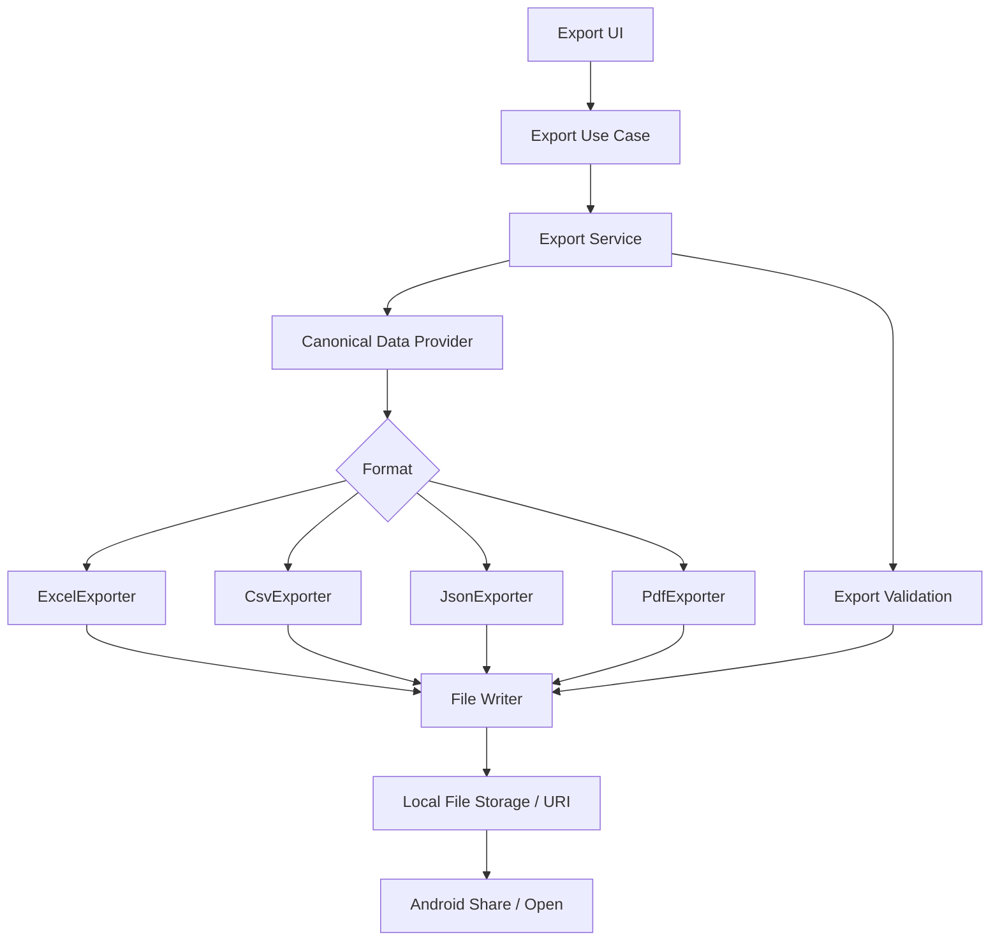
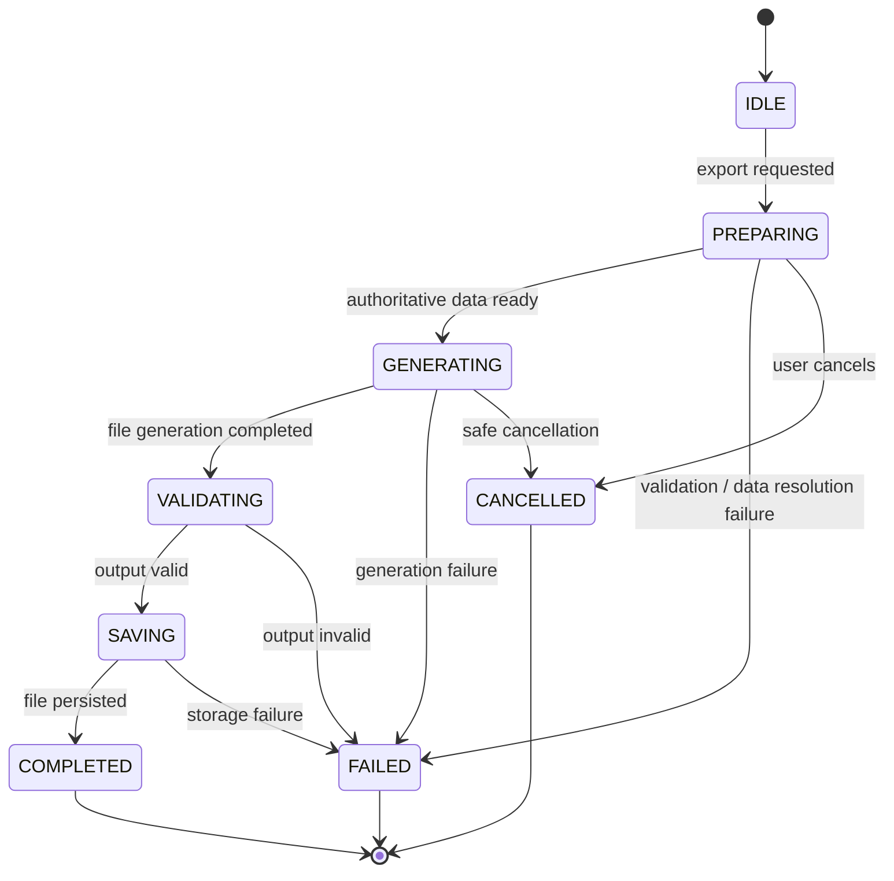
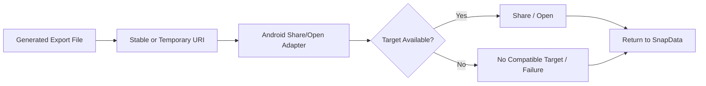

# SnapData: AI-Powered Intelligent Document Processing & Data Extraction System
## Export Module Technical Design & Implementation

**Project:** SnapData  
**Document:** Export Module Technical Design & Implementation  
**Version:** 1.0  
**Status:** Draft / Technical Baseline  
**Date:** 30 August 2026  
**Filename:** `SnapData_EXPORT_v1.0.md`

---

## 0. Document Authority and Status Policy

This document defines the technical design and implementation contract for the SnapData Export Module. It is subordinate to the project requirements and must consume the canonical structured-data contract rather than introduce a competing model.

### Source hierarchy

1. `SnapData_PRD_v1.0.md`
2. `SnapData_SRS_v1.0.md`
3. `SnapData_TRD_v1.0.md`
4. `SnapData_SYSTEM_ARCHITECTURE_v1.0.md`
5. `SnapData_DOCUMENT_PROCESSING_v1.0.md`
6. `SnapData_DATA_SCHEMA_v1.0.md`
7. `SnapData_DATABASE_v1.0.md`
8. `SnapData_FRONTEND_v1.0.md`
9. `SnapData_UI_UX_v1.0.md`
10. `SnapData_AI_OCR_v1.0.md`
11. Original SnapData project specification
12. Supplied SnapData workflow diagram

### Decision-status vocabulary

| Status | Meaning |
|---|---|
| **CONFIRMED** | Explicitly established by the source material or directly verified in implementation evidence. |
| **PROPOSED** | Recommended design direction not yet verified as implemented. |
| **TBD** | Decision has not yet been made. |
| **REQUIRES TECHNICAL VALIDATION** | Product intent exists, but exact API/library/device compatibility/performance remains to be verified. |
| **OPTIONAL** | Permitted capability not required for the current baseline. |
| **REJECTED** | Intentionally excluded from the current baseline. |

> **Critical rule:** This document must not promote an unverified Android API, export library, PDF engine, workbook library, storage API, MIME/share mechanism, or implementation language to CONFIRMED.

---

# 1. Document Control

| Item | Value |
|---|---|
| Project | SnapData |
| Document | Export Module Technical Design & Implementation |
| Version | 1.0 |
| Status | Draft / Technical Baseline |
| Date | 30 August 2026 |
| Target platform | Android application |
| Implementation workflow | Google AI Studio — “Build an Android app” |
| Export formats | `.xlsx`, `.csv`, `.json`, `.pdf` |
| Core processing mode | Offline-first / local |
| Persistence | SQLite + Android-local file storage boundary |
| Canonical data authority | `SnapData_DATA_SCHEMA_v1.0.md` |
| Physical DB authority | `SnapData_DATABASE_v1.0.md` |
| Exact export libraries | **TBD / REQUIRES TECHNICAL VALIDATION** |
| Exact Android file API | **REQUIRES TECHNICAL VALIDATION** |

---

# 2. Export Objective

The Export Module transforms the user's **current saved structured result** into one of the supported portable formats and makes the resulting file available for local use and Android sharing/opening.

Primary flow:

```text
Document
   ↓
Processing
   ↓
Structured Result
   ↓
User Review / Edit
   ↓
Save
   ↓
Current Authoritative Result
   ↓
Export Service
   ↓
Format Exporter
   ↓
Generated File
   ↓
Local File Storage / Android URI
   ↓
Share / Open
```

### Export goals

- Preserve semantic correctness.
- Export current user-approved values.
- Keep exporters independent from OCR and AI implementations.
- Produce valid files for supported formats.
- Fail safely without changing saved structured data.
- Respect Android storage restrictions.
- Preserve privacy by keeping export generation local.
- Provide deterministic and testable mapping rules.

---

# 3. Scope

## 3.1 P0 / Baseline

- Excel `.xlsx`
- CSV `.csv`
- JSON `.json`
- PDF `.pdf`
- Export from saved structured data.
- Validation before and after generation.
- Local file creation.
- Android-compatible share/open handoff.
- Export failure handling.
- Safe, non-destructive file naming.
- Export metadata compatible with `export_record`.

## 3.2 P1 / Product-aligned but not necessarily required for first implementation

- Batch export.
- Additional PDF/Excel formatting controls.
- Export history presentation.
- Fine-grained export options.

## 3.3 Out of scope / REJECTED for MVP

- OCR inside exporter.
- AI inference inside exporter.
- Reprocessing the source document during export.
- Direct SQL calls from format exporters.
- Cloud upload as part of export.
- Reconstructing the original document pixel-for-pixel.
- Full export-specific schema separate from canonical data.
- Storing export binary content inside SQLite.
- Full edit audit trail for every export.

---

# 4. Architectural Principles

1. **Canonical-data first.** The exporter consumes `ExtractionResult` and its child semantic objects.
2. **Saved-result authority.** The latest saved user-approved result is authoritative.
3. **Read-only export transformation.** Export does not mutate source structured data.
4. **Provider neutrality.** OCR and AI provider changes must not force exporter redesign.
5. **Format isolation.** Each format has its own exporter adapter.
6. **Safe failure.** A failed export cannot invalidate the saved document/result.
7. **Local-first privacy.** No remote processing or cloud fallback is permitted in the MVP export path.
8. **Storage abstraction.** Exporters write through a file-writer/storage boundary, not directly to arbitrary filesystem paths.
9. **Validation is explicit.** Generation success is not assumed until output validation completes.
10. **No stale snapshots.** Cached or pre-edit results may only be used when they are verified to be the current authoritative saved result.

---

# 5. Supported Export Formats

| Format | Extension | Purpose | Strengths | Limitations | Status |
|---|---|---|---|---|---|
| Excel | `.xlsx` | Spreadsheet-oriented structured data | Strong table representation, editable, familiar | Workbook generation is more complex; complex-layout fidelity needs validation | **CONFIRMED requirement** |
| CSV | `.csv` | Flat/tabular interchange | Simple, portable, easy to parse | Cannot natively represent multiple independent tables or rich metadata in one flat file | **CONFIRMED requirement** |
| JSON | `.json` | Machine-readable canonical structured data | Preserves nesting and semantic structure | Less directly human-friendly; consumers need schema awareness | **CONFIRMED requirement** |
| PDF | `.pdf` | Human-readable structured report | Portable, printable, shareable | Layout constraints; not a canonical machine-readable representation | **CONFIRMED requirement** |

---

# 6. Export Architecture



The UI must not construct XLSX/CSV/JSON/PDF bytes itself. It invokes an application-level export use case/service that resolves authoritative data and delegates to a format exporter.

---

# 7. Module Boundaries

| Module | Responsibility | Must know about OCR? | Must know about AI? | Must access SQLite directly? | Status |
|---|---|---:|---:|---:|---|
| Export UI | Format selection, filename/options, progress, success/failure presentation | No | No | No | **CONFIRMED boundary** |
| Export Use Case | Coordinates request and result delivery | No | No | No | **PROPOSED** |
| Export Service | Validation, authoritative-result resolution, exporter selection, lifecycle | No | No | No | **PROPOSED** |
| Canonical Data Provider | Reads current saved structured result through repository/domain boundary | No | No | No | **PROPOSED** |
| Format Exporter | Maps canonical model to one output format | No | No | No | **PROPOSED** |
| File Writer | Safely creates/writes output artifact | No | No | No | **PROPOSED** |
| Share/Open Adapter | Converts saved artifact into platform-appropriate URI/share action | No | No | No | **PROPOSED / REQUIRES TECHNICAL VALIDATION** |
| Database Repository | Reads `document`, `extraction_result`, fields/tables and export metadata | No | No | Yes, behind repository boundary | **Source-backed boundary** |

---

# 8. Export Service

## 8.1 Conceptual interface

```text
ExportService

export(request: ExportRequest) -> ExportResult
cancel(operationId) -> CancellationResult
```

Exact language, interface syntax, coroutine/task model and dependency injection approach are **REQUIRES TECHNICAL VALIDATION** from the generated Android project.

## 8.2 Responsibilities

- Validate the request.
- Resolve the selected document/result.
- Verify the latest saved authoritative revision.
- Load canonical structured data.
- Validate exportability.
- Select the requested exporter.
- Generate the output.
- Validate the generated artifact.
- Persist export metadata where approved.
- Return a user-safe file reference/result.
- Map failures to standardized error codes.
- Support safe cancellation.

## 8.3 Non-responsibilities

- OCR.
- AI inference.
- Prompt construction.
- Source-document reprocessing.
- Direct SQL from the export layer.
- Editing structured data.
- User-interface rendering.
- Cloud synchronization or upload.

---

# 9. Export Request

## 9.1 Conceptual `ExportRequest`

```text
ExportRequest
- document/result identifier
- format
- file name preference
- destination preference
- export options
- request timestamp
```

### Status

**PROPOSED conceptual contract.** Exact field names are **REQUIRES TECHNICAL VALIDATION**.

---

# 10. Export Result

## 10.1 Conceptual `ExportResult`

```text
ExportResult
- success / failure
- format
- file reference
- user-facing file name
- file size
- created timestamp
- error information (when unsuccessful)
- optional export metadata identifier
```

### Status

**PROPOSED.**

---

# 11. Export State Machine



### State semantics

| State | Meaning |
|---|---|
| `IDLE` | No active export operation. |
| `PREPARING` | Resolving authoritative data and validating the request. |
| `GENERATING` | Format exporter is producing output bytes. |
| `VALIDATING` | Generated artifact is being checked for structural/readability correctness. |
| `SAVING` | Output is being committed to the configured local destination/storage mechanism. |
| `COMPLETED` | Output has passed required validation and save succeeded. |
| `FAILED` | Operation failed without a successful output contract. |
| `CANCELLED` | User or system safely abandoned the operation. |

---

# 12. Authoritative Data Resolution

The single most important export invariant is:

```text
User edits
    ↓
Save
    ↓
Latest authoritative saved result
    ↓
Export
```

### Required algorithm

1. Identify the selected document.
2. Resolve the current extraction result for that document.
3. Verify it is the latest authoritative saved result.
4. Read the canonical structured data through the repository/provider boundary.
5. Validate the result.
6. Pass a read-only snapshot of that authoritative result to the selected exporter.

### Never export

- stale in-memory AI output;
- pre-edit extraction snapshots;
- a previous revision when a newer saved revision exists;
- raw OCR reconstructed into a different schema;
- an uncommitted UI draft;
- a partially failed processing result presented as complete.

---

# 13. Revision / Stale-Data Protection

If the data model supports multiple historical results:

```text
Document
  ├── Result v1 (old)
  ├── Result v2 (old)
  └── Result v3 (CURRENT / SAVED)
                    ↓
                  EXPORT
```

The exporter MUST use the current result.

### Example

```text
AI extraction:      Total = ₹10,000
User edits:         Total = ₹10,500
User saves:         Total = ₹10,500

Exported result:    Total = ₹10,500
```

---

# 14. Pre-Export Validation

Validation should fail fast before file generation whenever possible.

### Document validation

- Document exists.
- Document is accessible in the local data model.
- Selected result belongs to the selected document.
- Current result can be resolved.

### Structured-data validation

- Canonical result is structurally valid.
- Fields have valid semantic values.
- Tables have valid columns/rows/cells.
- Required relationships are present.
- Unsupported or corrupt states are rejected.

### Export validation

- Requested format is supported.
- Requested options are supported.
- Filename is safe.
- Destination is available or can be created.
- Sufficient temporary/output storage is available where it can be checked.

---

# 15. Data Mapping Contract

The exporter consumes semantic objects from the canonical schema:

```text
Document
  ↓
ExtractionResult
  ├── ExtractedField[]
  └── ExtractedTable[]
       ├── TableColumn[]
       └── TableRow[]
            └── TableCell[]
```

### Export transformation rule

```text
Canonical Object
      ↓
Read-only Export View
      ↓
Format-specific rendering
      ↓
File bytes
```

The export view is a transformation layer, not a second persisted domain model.

---

# 16. Canonical Value Handling

The exporter must preserve the semantic value type defined by the canonical contract without introducing unsafe coercions.

| Canonical value type | Export handling |
|---|---|
| Text | Preserve text exactly, subject to format escaping. |
| Identifier | Preserve as text; never coerce meaningful leading zeros into numbers. |
| Number | Emit a numeric representation only when the canonical value is unambiguously numeric. |
| Date | Preserve canonical date semantics; format only at the presentation boundary. |
| DateTime | Preserve date/time semantics; use a consistent human/readable format in visual exports. |
| Currency | Preserve amount plus currency semantics where the canonical contract provides them. |
| Boolean | Emit true/false semantics in JSON; format appropriately in spreadsheet/report representations. |
| Null / missing | Preserve distinction according to canonical schema semantics. |

---

# 17. Excel Export — Overview

**Extension:** `.xlsx`  
**MIME:** `application/vnd.openxmlformats-officedocument.spreadsheetml.sheet`

### Purpose

Provide a spreadsheet-friendly representation of the current structured result.

### Status

Excel export is **CONFIRMED as a product requirement**. Exact workbook libraries and Android integration are **TBD / REQUIRES TECHNICAL VALIDATION**.

---

# 18. Excel Workbook Structure

Recommended logical structure:

```text
Workbook
 ├── Document / Summary
 ├── Fields
 ├── Table 1
 ├── Table 2
 └── ...
```

### Sheet 1 — Document / Summary

Potential content:

- Human-readable document title/name.
- Document type.
- Selected metadata approved for export.
- Export timestamp.

Exact metadata set: **TBD / REQUIRES TECHNICAL VALIDATION**.

### Sheet 2 — Fields

Recommended shape:

| Field | Value |
|---|---|
| Invoice Number | INV-1023 |
| Date | 2026-08-30 |
| Vendor | Example Ltd |
| Total | ₹10,500 |

The values in this sheet MUST come from the current authoritative result.

### Additional table sheets

Each detected logical table SHOULD map to its own worksheet for deterministic handling.

---

# 19. Excel Field Mapping

```text
ExtractedField.key        → field identifier / internal mapping only
ExtractedField.label      → display label
ExtractedField.value      → exported value
ExtractedField.valueType  → presentation/type decision
```

Do not expose SQLite primary keys or internal foreign keys merely because they exist in the database.

### Optional metadata

Confidence, source page and edit indicators MAY be included in a dedicated metadata/diagnostic area if product scope approves them.

Status: **OPTIONAL / PROPOSED**.

---

# 20. Excel Table Mapping

A canonical table is transformed as follows:

```text
TableColumn[]
     ↓
worksheet header row
     ↓
TableRow[]
     ↓
TableCell[]
     ↓
worksheet cells
```

### Preserve

- Column order.
- Row order.
- Cell order.
- Current cell values.
- Empty cells where semantically present.

### Do not invent

- Formula cells unless the canonical schema explicitly represents formulas.
- Totals that are not in the saved data.
- Hidden rows/columns.
- Merged-cell semantics not represented by the canonical model.

---

# 21. Excel Data Types

### Type safety rules

1. Text remains text.
2. Identifiers remain identifiers.
3. Ambiguous numeric-looking strings remain text unless the canonical value type explicitly identifies a number.
4. Date formatting is presentation-only; the semantic date must remain intact.
5. Currency formatting must not change the underlying amount.
6. Null values must not silently become the string `"null"` unless that is explicitly the canonical semantic value.

### Status

**CONFIRMED design principle / exact workbook cell-type API REQUIRES TECHNICAL VALIDATION.**

---

# 22. Excel Formatting

### MVP recommended formatting

- Header emphasis.
- Reasonable column widths.
- Basic date/number/currency formatting.
- Optional frozen header rows for table sheets.
- Optional auto-filter for table headers.

Status: **PROPOSED**.

### Explicit non-goals

- Complex themes.
- Charts.
- Pivot tables.
- Formula generation.
- Conditional formatting based on confidence.
- Pixel-perfect reproduction of the source document.

---

# 23. CSV Export — Overview

**Extension:** `.csv`  
**MIME:** `text/csv`

CSV is inherently flat, while SnapData structured results may contain both fields and multiple tables. Therefore the multi-table strategy must be deterministic.

### Single-table mapping

For a result with one logical table:

```text
Table columns → CSV header row
Table rows    → CSV data rows
```

### Field-only mapping

For field-oriented export:

```text
Field,Value
Invoice Number,INV-1023
Date,2026-08-30
Vendor,Example Ltd
Total,₹10,500
```

### Multiple tables

**TBD / REQUIRES TECHNICAL VALIDATION**.

---

# 24. Recommended MVP CSV Strategy

**PROPOSED:** one CSV file per logical table, plus a separate fields CSV when non-table fields exist, with the final delivery packaging decision marked **TBD / REQUIRES TECHNICAL VALIDATION**.

Example:

```text
SnapData_Invoice_20260830_191500_fields.csv
SnapData_Invoice_20260830_191500_table_1.csv
SnapData_Invoice_20260830_191500_table_2.csv
```

### Packaging options

1. Multiple independent CSV files — **PROPOSED**.
2. ZIP package containing multiple CSVs — **OPTIONAL / REQUIRES TECHNICAL VALIDATION**.
3. One merged CSV with table identifiers — **REJECTED for MVP unless explicitly required**.

---

# 25. CSV Escaping

CSV output MUST correctly handle:

- commas;
- double quotes;
- embedded newlines;
- Unicode text;
- empty values.

A safe standard-compatible CSV serializer is preferred over handwritten escaping logic.

---

# 26. CSV Encoding

**Proposed default:** UTF-8.

The exact handling of a UTF-8 BOM is:

**TBD / REQUIRES TECHNICAL VALIDATION**.

---

# 27. JSON Export — Overview

**Extension:** `.json`  
**MIME:** `application/json`

JSON is the most direct portable representation of SnapData's canonical structured data.

### Core rule

JSON export MUST serialize the canonical data representation.

It MUST NOT create a second export JSON schema that conflicts with `SnapData_DATA_SCHEMA_v1.0.md`.

---

# 28. JSON Export Content

Where present in the canonical model, preserve:

- schema version;
- document metadata;
- document type;
- fields;
- current values;
- original values;
- edit flags;
- tables;
- columns;
- rows;
- cells;
- value types;
- confidence metadata;
- warnings;
- review state;
- source references;
- approved summary data;
- other canonical semantic properties.

---

# 29. JSON Serialization Rules

### Nulls

Preserve canonical null semantics.

### Unicode

Unicode document content must be serialized without lossy conversion.

### Numbers

Do not coerce identifier-like strings into numbers.

### Dates / DateTimes

Use the canonical semantic representation defined by the schema.

### Booleans

Serialize true/false as JSON booleans when the canonical type is boolean.

### Arrays

Preserve order for ordered semantic collections such as fields, columns, rows and cells.

### Objects

Preserve canonical nesting and property meaning.

---

# 30. JSON Round-Trip Invariant

A valid JSON export should satisfy:

```text
Canonical Object
      ↓
    JSON
      ↓
   Parse
      ↓
Equivalent Canonical Object
```

Minimum round-trip checks:

- Field count preserved.
- Table count preserved.
- Column order preserved.
- Row order preserved.
- Current values preserved.
- Original values preserved where defined.
- Edit state preserved where defined.
- Null/empty distinctions preserved where defined.
- Date/time semantics preserved.
- Identifier leading zeros preserved.

---

# 31. JSON Validation

The generated JSON must be:

1. syntactically valid JSON;
2. structurally compatible with the canonical data schema;
3. semantically consistent with the source result.

If JSON validation fails:

```text
VALIDATING
    ↓
FAILED
```

The operation must not be reported as completed.

---

# 32. PDF Export — Overview

**Extension:** `.pdf`  
**MIME:** `application/pdf`

PDF export provides a human-readable representation of the structured result.

### Recommended logical layout

```text
Header
   ↓
Document information
   ↓
Extracted fields
   ↓
Tables
   ↓
Optional summary
   ↓
Footer
```

PDF export is a representation of processed structured information, not a requirement to reconstruct the original document pixel-for-pixel.

---

# 33. PDF Field Representation

Example:

```text
Invoice Number: INV-1023
Date: 30 August 2026
Vendor: Example Ltd
Total: ₹10,500
```

Values MUST come from the current authoritative result.

---

# 34. PDF Table Representation

Detected tables should be rendered as readable tables where technically practical.

### Required handling

- Column headers.
- Row order.
- Cell values.
- Empty cells.
- Long cell text.
- Long tables.
- Wide tables.

### Wide tables

A deterministic strategy is required, such as:

- landscape page orientation;
- controlled column sizing;
- horizontal splitting;
- smaller table typography within readable limits.

Exact behavior: **PROPOSED / REQUIRES TECHNICAL VALIDATION**.

### Complex tables

Exact fidelity for irregular/complex tables is **REQUIRES TECHNICAL VALIDATION**.

---

# 35. PDF Pagination

When content exceeds one page:

- continue in reading order;
- avoid truncating data;
- repeat table headers where practical;
- prevent important rows from being split in an unreadable way where feasible;
- preserve long-cell text through wrapping;
- maintain consistent page numbering or footer behavior if implemented.

Exact pagination engine and layout rules: **TBD / REQUIRES TECHNICAL VALIDATION**.

---

# 36. PDF Metadata

Potential metadata:

- Title.
- Creator.
- Creation/export date.
- Schema version.

Status: **PROPOSED / TBD**.

Do not add internal IDs, SQL details, API keys, authentication material, model prompts or sensitive implementation data merely because PDF metadata permits arbitrary values.

---

# 37. File Naming

Recommended conceptual pattern:

```text
SnapData_<DocumentName>_<Timestamp>.<extension>
```

Example:

```text
SnapData_Invoice_20260830_191500.xlsx
```

### Rules

- Strip or replace unsafe characters.
- Prevent path traversal.
- Prevent control characters.
- Avoid accidental absolute paths.
- Preserve a readable document name.
- Keep extension consistent with format.
- Avoid silently overwriting existing exports.

Exact timestamp format is **TBD**.

---

# 38. Filename Sanitization

The filename sanitizer must operate on a user-controlled value.

### Input

```text
User-provided display name
```

### Output

```text
Safe leaf filename only
```

### Forbidden patterns

- directory separators;
- parent-directory traversal such as `..` as a path component;
- control characters;
- reserved or implementation-specific path syntax where relevant;
- empty/whitespace-only names.

Status: **PROPOSED security control**.

---

# 39. Duplicate File Names

MVP preference: **safe non-destructive naming**.

Recommended behavior:

```text
Invoice.xlsx
Invoice (1).xlsx
Invoice (2).xlsx
```

Overwrite should not be the default because silent replacement can destroy a previously generated export.

---

# 40. Storage Model

The export module should separate:

```text
SQLite
  → export metadata/reference

Android-local file storage
  → actual export bytes
```

The actual binary output belongs outside SQLite.

---

# 41. Android File Access

The implementation must respect modern Android storage restrictions and must not assume unrestricted filesystem access.

### Required design

- Use a platform-safe local file/reference mechanism.
- Do not hard-code deprecated storage access patterns.
- Keep internal file paths hidden from the user-facing contract.
- Return a platform-compatible URI/reference for sharing/opening.

Exact Android APIs, document-provider usage, URI authority configuration and permission lifecycle are **REQUIRES TECHNICAL VALIDATION**.

---

# 42. Share / Open Architecture



### Requirements

- Generated file must remain preserved if sharing is cancelled.
- Generated file should remain available if sharing fails.
- MIME type must match the selected export format.
- The share/open operation must not mutate the structured result.
- Internal filesystem paths should not be exposed unnecessarily.

---

# 43. MIME Types

| Format | MIME type |
|---|---|
| Excel | `application/vnd.openxmlformats-officedocument.spreadsheetml.sheet` |
| CSV | `text/csv` |
| JSON | `application/json` |
| PDF | `application/pdf` |

These values are the project-specified target mappings; exact Android intent/provider integration remains **REQUIRES TECHNICAL VALIDATION**.

---

# 44. Export UI Contract

The UI should provide:

- Format selection.
- File-name field.
- Supported option controls.
- Export action.
- Stage/progress feedback.
- Success state.
- Failure state.
- Share/open action after successful generation.

The UI MUST NOT build output files itself.

---

# 45. Export Options

| Format | Option | Status |
|---|---|---|
| Excel | Include metadata | **OPTIONAL / TBD** |
| Excel | Include confidence | **OPTIONAL / TBD** |
| Excel | Include original values | **OPTIONAL / TBD** |
| CSV | Select table | **PROPOSED if multiple-table export is exposed** |
| CSV | Encoding | **PROPOSED / exact BOM behavior TBD** |
| JSON | Full canonical data | **CONFIRMED requirement** |
| JSON | Compact vs pretty output | **OPTIONAL / TBD** |
| PDF | Include summary | **OPTIONAL / TBD** |
| PDF | Include metadata | **OPTIONAL / TBD** |
| PDF | Page format | **PROPOSED / exact values TBD** |

Only options approved in the final product scope should reach the MVP UI.

---

# 46. Export Progress

Recommended stage progression:

```text
Preparing
   ↓
Generating
   ↓
Validating
   ↓
Saving
   ↓
Completed
```

Progress should use stage-based status rather than fake numeric precision when the selected exporter cannot calculate reliable byte/page progress.

---

# 47. Export Cancellation

If the user cancels an active export:

1. Signal cancellation to the active export operation where supported.
2. Stop work at a safe cancellation boundary.
3. Do not mark the export completed.
4. Delete/ignore incomplete temporary output.
5. Keep the authoritative saved data untouched.
6. Return a `CANCELLED` result/state.

Cancellation of export must not cancel or roll back the saved document/result.

---

# 48. Temporary Output and Atomicity

For formats that may take time to generate, prefer:

```text
Temporary output
      ↓
Format validation
      ↓
Atomic/controlled finalization
      ↓
Final export artifact
```

The precise atomic-move capability depends on the Android storage destination and is **REQUIRES TECHNICAL VALIDATION**.

A partially generated file must never be reported as a completed export.

---

# 49. Standard Export Errors

| Code | Cause | User message concept | Recovery | Logging |
|---|---|---|---|---|
| `EXPORT_UNSUPPORTED_FORMAT` | Requested format is not available | “This export format is not supported.” | Choose another supported format | Safe code + format |
| `EXPORT_NO_DATA` | No exportable structured data | “There is no saved data to export.” | Return to result/review | Safe context |
| `EXPORT_INVALID_DATA` | Canonical result invalid | “The saved data is not valid for export.” | Reopen/review/retry | Safe validation summary |
| `EXPORT_SERIALIZATION_FAILED` | Data could not be transformed/serialized | “The data could not be prepared for export.” | Retry / alternate format | Safe code |
| `EXPORT_FILE_CREATION_FAILED` | Output artifact could not be created | “The export file could not be created.” | Retry / storage action | Safe code |
| `EXPORT_STORAGE_UNAVAILABLE` | Destination/storage unavailable | “Storage is unavailable.” | Manage storage / choose destination | Safe code |
| `EXPORT_PERMISSION_FAILED` | Platform access/share/storage permission issue | “SnapData could not access the selected destination.” | Retry / choose destination | Safe code |
| `EXPORT_CANCELLED` | User cancellation | “Export cancelled.” | Retry when desired | Normal event |
| `EXPORT_FORMATTING_FAILED` | Format-specific rendering failed | “The file could not be formatted correctly.” | Retry / alternate format | Safe code + stage |
| `EXPORT_UNKNOWN_ERROR` | Unexpected failure | “Export failed. Please try again.” | Retry / report issue | Redacted diagnostics |

---

# 50. Format-Specific Validation

## Excel

Validate where practical:

- file exists;
- file is non-empty;
- extension is correct;
- workbook can be opened/read by the selected implementation;
- expected worksheet count/structure exists;
- expected representative cell values are present.

## CSV

Validate:

- file exists;
- file is non-empty when data exists;
- parser can read the output;
- row/column structure is coherent;
- special characters remain correctly escaped.

## JSON

Validate:

- file exists;
- valid JSON syntax;
- canonical schema validation passes;
- representative current values are preserved.

## PDF

Validate where practical:

- file exists;
- file is non-empty;
- PDF structure is valid enough for the selected reader/parser;
- representative text/table content is present.

Exact validation libraries are **TBD / REQUIRES TECHNICAL VALIDATION**.

---

# 51. File Integrity Checks

After generation and before declaring success:

- Confirm output exists.
- Confirm output is non-empty.
- Confirm extension matches format.
- Confirm output can be read by a format-specific validator where practical.
- Confirm output is associated with the correct export operation.

### Do not use file size alone as proof of correctness.

A non-empty file can still be malformed.

---

# 52. Export Record Persistence

The database baseline defines `export_record` as metadata associated with the document and optionally its exported result.

Conceptual metadata includes:

- document ID;
- result ID;
- format;
- file reference/path;
- status;
- error code/message;
- created timestamp;
- completion timestamp;
- file size.

### Persistence policy

- Create or update an export record as appropriate to the implementation.
- Failed export metadata may be retained if product/history behavior supports it.
- Do not persist sensitive file contents in the database.
- Do not let export metadata persistence failure corrupt the saved structured result.

Exact transaction boundaries: **REQUIRES TECHNICAL VALIDATION**.

---

# 53. Export History

The product/database model allows multiple exports for the same document/result.

```text
Document
   ├── Export #1 — XLSX
   ├── Export #2 — PDF
   ├── Export #3 — JSON
   └── Export #4 — XLSX
```

A new export must never replace or rewrite saved extraction values.

Whether the UI exposes a dedicated export-history list is **P1 / TBD**.

---

# 54. Re-Export Semantics

Users must be able to export the same saved document more than once.

Example:

```text
Version 1:
Total = ₹10,000
↓
Export

User edits:
Total = ₹10,500
↓
Save
↓
Export again

Second export:
Total = ₹10,500
```

Each export is a fresh transformation of the then-current authoritative saved result.

---

# 55. Concurrency and Consistency

The export module must avoid exporting a result that changes underneath it without a defined consistency policy.

### MVP recommendation

**PROPOSED:** serialize editing and export for the same document/result at the UI/application level:

```text
Editing active → Save → Export enabled
Export active → editing disabled for that result
```

### Advanced alternative

A repository can create an immutable export snapshot tied to a result revision. This is **OPTIONAL / REQUIRES TECHNICAL VALIDATION**.

---

# 56. Security Requirements

The export module must prevent:

- path traversal;
- arbitrary path injection;
- unauthorized document/result lookup;
- accidental overwrite;
- sensitive metadata leakage;
- export of a non-authoritative result;
- logging of raw sensitive document content.

Never place in export metadata:

- API keys;
- authentication tokens;
- secret credentials;
- internal stack traces;
- private prompts;
- unnecessary SQL or filesystem diagnostics.

---

# 57. Privacy / Offline Boundary

SnapData is designed as an offline-first application. Core export generation therefore runs locally on the device.

### Prohibited export behavior

```text
Local export fails
      ↓
Upload structured data to cloud service
      ↓
Cloud exporter
```

This is **REJECTED** for the MVP because it would introduce a server/cloud dependency into a locally processed privacy-sensitive workflow.

---

# 58. Original Document vs Exported Structured Representation

These are different artifacts:

```text
Original document
    ≠
Structured export representation
```

PDF export means a human-readable representation of processed information unless a separate requirement says otherwise.

It does not mean:

- exact visual recreation of the scanned page;
- preservation of original PDF internals;
- image-for-image reconstruction.

---

# 59. API / Interface Contract with Application Layer

Conceptual call path:

```text
UI
 ↓
ExportUseCase
 ↓
ExportService
 ↓
AuthoritativeResultProvider
 ↓
FormatExporter
 ↓
FileWriter
 ↓
ExportRepository / FileReference
 ↓
ShareOpenAdapter
```

### Example conceptual pseudocode

```text
export(request): ExportResult {
    validateRequest(request)

    authoritative = resultProvider.loadCurrentSavedResult(
        request.documentOrResultIdentifier
    )

    validateExportable(authoritative, request.format)

    outputName = filenamePolicy.createSafeName(
        authoritative.document,
        request.format
    )

    exporter = exporterRegistry.get(request.format)
    operation = exporter.generate(authoritative, request.options)

    validator.validate(operation.file, request.format)

    saved = fileWriter.finalize(operation.file, outputName)

    exportRepository.recordSuccess(authoritative, saved)

    return ExportResult.success(saved)
}
```

Exact classes, packages, threading model and Android-specific APIs are **REQUIRES TECHNICAL VALIDATION**.

---

# 60. Exporter Registry

A registry/factory is a useful modular design:

```text
EXCEL → ExcelExporter
CSV   → CsvExporter
JSON  → JsonExporter
PDF   → PdfExporter
```

### Benefits

- Clear format isolation.
- Independent unit testing.
- Simple addition of future formats.
- Avoids format conditionals spreading through the UI.

### Status

**PROPOSED.**

---

# 61. Performance and Resource Management

Quantitative export-performance targets remain TBD; establish measurements rather than inventing numbers.

### Requirements

- Avoid unnecessary full-result duplication.
- Avoid loading large intermediate copies when streaming is possible.
- Release large temporary buffers promptly.
- Keep long-running generation off the UI thread where appropriate.
- Avoid blocking the main UI during file generation.
- Abort cleanly on cancellation when supported.
- Measure export generation for realistic field/table sizes.
- Measure large PDF/table scenarios separately.

### Metrics to establish during validation

| Metric | Status |
|---|---|
| Excel generation time | **TBD / validation** |
| CSV generation time | **TBD / validation** |
| JSON generation time | **TBD / validation** |
| PDF generation time | **TBD / validation** |
| Peak memory | **TBD / validation** |
| Temporary storage requirement | **TBD / validation** |
| Large-table behavior | **TBD / validation** |
| Multi-table behavior | **TBD / validation** |

---

# 62. Cancellation and Resource Cleanup

When an export is cancelled or fails:

- stop generation at a safe boundary;
- close open output resources;
- delete incomplete temporary artifacts where appropriate;
- do not retain corrupted files as successful exports;
- preserve authoritative structured data;
- preserve any previously completed exports.

Exact cancellation semantics depend on the chosen export libraries and Android file APIs and remain **REQUIRES TECHNICAL VALIDATION**.

---

# 63. Offline Test Model

Export should work with network access disabled because it consumes local saved data.

### Test scenario

```text
AI model ready
   ↓
Network disabled
   ↓
Document already processed and saved
   ↓
Open result
   ↓
Export XLSX/CSV/JSON/PDF
   ↓
Success
```

No network call should be required to generate the export.

---

# 64. Failure Isolation

A failed export must not modify:

- original document;
- OCR result;
- AI extraction candidate;
- current authoritative extraction result;
- user edits;
- saved review state;
- document history record.

Only export-specific temporary artifacts and export metadata may change.

---

# 65. Logging and Diagnostics

### Safe events

- export requested;
- format selected;
- stage transition;
- elapsed duration;
- file size;
- success/failure code;
- validator result;
- storage result.

### Do not log by default

- complete OCR text;
- complete structured document content;
- full table contents;
- sensitive field values;
- API keys or credentials;
- raw file bytes;
- internal stack traces to user-facing UI.

---

# 66. Test Strategy

## 66.1 Unit tests

Test:

- filename sanitization;
- extension mapping;
- MIME mapping;
- field mapping;
- table mapping;
- identifier preservation;
- null handling;
- CSV escaping;
- JSON serialization;
- export-state transitions;
- error mapping.

## 66.2 Integration tests

Test:

```text
Saved Result
   ↓
Export Service
   ↓
Exporter
   ↓
File Writer
   ↓
Validator
```

## 66.3 End-to-end tests

- Edit total from ₹10,000 to ₹10,500.
- Save.
- Export all four formats.
- Verify all outputs contain ₹10,500.

## 66.4 Regression tests

- Old AI value must not reappear after export.
- Re-export after further edits must use the latest saved revision.
- Export failure must not corrupt the saved record.

## 66.5 Compatibility tests

- Open XLSX in representative spreadsheet software.
- Import CSV into representative consumers.
- Parse JSON against canonical schema.
- Open PDF in representative PDF readers.

---

# 67. Export Acceptance Criteria

| ID | Acceptance criterion |
|---|---|
| EX-AC-001 | A saved structured result can be exported to XLSX. |
| EX-AC-002 | A saved structured result can be exported to CSV where the selected CSV strategy supports its structure. |
| EX-AC-003 | A saved structured result can be exported to canonical JSON. |
| EX-AC-004 | A saved structured result can be exported to a readable PDF representation. |
| EX-AC-005 | Export reflects the latest saved user-edited values. |
| EX-AC-006 | Stale AI extraction is never exported when a newer saved value exists. |
| EX-AC-007 | Generated files pass applicable format validation before success is reported. |
| EX-AC-008 | Export failure does not corrupt saved structured data. |
| EX-AC-009 | Share/open uses the correct format MIME type. |
| EX-AC-010 | Sharing cancellation or failure preserves the generated file where supported. |
| EX-AC-011 | Export works without a network connection when the saved result is locally available. |
| EX-AC-012 | Unsafe filenames cannot cause path traversal or unintended overwrite. |
| EX-AC-013 | JSON export remains compatible with the canonical data schema. |
| EX-AC-014 | Multi-row and multi-column tables preserve their order and cell values. |
| EX-AC-015 | Identifier values with meaningful leading zeros are preserved. |
| EX-AC-016 | Cancellation does not change the authoritative saved result. |

---

# 68. Traceability

| Source requirement | Export design response |
|---|---|
| F-EXP-001 Excel | §§17–22 |
| F-EXP-002 CSV | §§23–26 |
| F-EXP-003 JSON | §§27–31 |
| F-EXP-004 PDF | §§32–36 |
| F-EXP-005 Share | §§42–44 |
| Current saved values authoritative | §§12–13, 54 |
| Local storage | §§40, 52 |
| Export failure preservation | §§49, 64 |
| Progress/status | §46 |
| Cancellation | §§47, 62 |
| Offline operation | §63 |
| Canonical schema ownership | §§0, 15, 27–31 |
| Database export metadata | §§52–53 |
| Android storage uncertainty | §41 |
| Exact export libraries TBD | §§17, 26, 50, 61 |

---

# 69. Implementation Status Matrix

| Decision / capability | Status | Notes |
|---|---|---|
| Excel export required | **CONFIRMED** | Product/SRS requirement |
| CSV export required | **CONFIRMED** | Product/SRS requirement |
| JSON export required | **CONFIRMED** | Product/SRS requirement |
| PDF export required | **CONFIRMED** | Product/SRS requirement |
| Current saved result is export authority | **CONFIRMED** | Canonical/data-processing contract |
| Independent format exporters | **PROPOSED** | Strong modular architecture |
| Export service/use case | **PROPOSED** | UI/application boundary |
| Excel workbook layout | **PROPOSED** | Exact layout TBD |
| Excel library | **TBD / REQUIRES TECHNICAL VALIDATION** | Must match Android project |
| CSV serializer/library | **TBD / REQUIRES TECHNICAL VALIDATION** | Standards-compatible behavior required |
| JSON serializer | **TBD / REQUIRES TECHNICAL VALIDATION** | Must serialize canonical model |
| PDF generator/library | **TBD / REQUIRES TECHNICAL VALIDATION** | Exact rendering capability open |
| Multi-table CSV convention | **TBD / REQUIRES TECHNICAL VALIDATION** | Canonical schema leaves open |
| UTF-8 BOM policy | **TBD / REQUIRES TECHNICAL VALIDATION** | Spreadsheet interoperability question |
| Filename timestamp format | **TBD** | Product implementation decision |
| Duplicate filename suffix behavior | **TBD** | Safe non-destructive naming recommended |
| Android URI/share API | **REQUIRES TECHNICAL VALIDATION** | Must inspect actual project/target API |
| Exact storage destination mechanism | **REQUIRES TECHNICAL VALIDATION** | App-local vs user-selected destination |
| Full audit history of edits | **REJECTED for MVP** | Not source-backed |
| Export binary in SQLite | **REJECTED for MVP** | File storage boundary |
| Cloud export fallback | **REJECTED for MVP** | Violates local-first boundary |
| Original-PDF pixel recreation | **REJECTED** | Separate future feature |

---

# 70. Recommended Implementation Order

### Phase 1 — Contract and service skeleton

1. Define format enum and export state model.
2. Define `ExportRequest` and `ExportResult`.
3. Implement authoritative-result provider interface.
4. Implement exporter registry/factory.
5. Implement error mapping.

### Phase 2 — JSON exporter

1. Reuse canonical structured model.
2. Serialize without schema duplication.
3. Validate JSON syntax.
4. Validate against canonical schema.
5. Add round-trip tests.

### Phase 3 — CSV exporter

1. Implement single-table mapping.
2. Implement standards-compatible escaping.
3. Validate Unicode/newlines/quotes.
4. Resolve multi-table CSV packaging decision.

### Phase 4 — Excel exporter

1. Implement document/summary sheet if approved.
2. Implement fields sheet.
3. Implement one worksheet per table.
4. Validate identifiers/numbers/dates/currency.
5. Add only MVP formatting.

### Phase 5 — PDF exporter

1. Implement document header.
2. Implement fields.
3. Implement tables.
4. Implement pagination/wrapping.
5. Validate representative outputs.

### Phase 6 — Android file/share integration

1. Validate exact Android storage API.
2. Implement file writer.
3. Implement MIME mapping.
4. Implement share/open adapter.
5. Verify cancellation/share-failure behavior.

### Phase 7 — Persistence and history

1. Record export metadata if approved.
2. Link export metadata to document/result.
3. Verify re-export behavior.
4. Verify cleanup/retry behavior.

### Phase 8 — Performance and compatibility validation

1. Establish real device matrix.
2. Measure resource usage.
3. Test large tables and multi-page PDF.
4. Verify spreadsheet/PDF compatibility.

---

# 71. Definition of Done

The Export Module is considered implementation-complete for the approved baseline when:

- [ ] XLSX export works from saved canonical data.
- [ ] CSV export works for the approved CSV strategy.
- [ ] JSON export validates against the canonical schema.
- [ ] PDF export produces a readable representation.
- [ ] Latest saved values are always exported.
- [ ] Stale extraction cannot silently override saved edits.
- [ ] Pre-export validation is enforced.
- [ ] Post-generation validation is enforced.
- [ ] Export failures leave saved data untouched.
- [ ] Cancellation leaves saved data untouched.
- [ ] Filename sanitization prevents path traversal.
- [ ] Duplicate filenames are non-destructive.
- [ ] Android file sharing uses validated platform mechanisms.
- [ ] Correct MIME types are used.
- [ ] Offline export succeeds for locally saved results without cloud dependency.
- [ ] Sensitive data is excluded from normal logs.
- [ ] Export metadata aligns with `DATABASE.md`.
- [ ] Tests cover values, tables, empty/null data, Unicode, special CSV characters and large outputs.
- [ ] Actual Android project dependencies/APIs have been technically validated before being marked CONFIRMED.

---

# 72. Open Technical Decision Register

| ID | Decision | Status | Resolution artifact |
|---|---|---|---|
| EXP-TBD-001 | Exact Android file/storage API | **REQUIRES TECHNICAL VALIDATION** | Android implementation inspection |
| EXP-TBD-002 | Exact XLSX library/runtime | **TBD / REQUIRES TECHNICAL VALIDATION** | Dependency validation |
| EXP-TBD-003 | Exact CSV library/runtime | **TBD / REQUIRES TECHNICAL VALIDATION** | Dependency validation |
| EXP-TBD-004 | Exact JSON serializer | **TBD / REQUIRES TECHNICAL VALIDATION** | Dependency validation |
| EXP-TBD-005 | Exact PDF generator/runtime | **TBD / REQUIRES TECHNICAL VALIDATION** | Dependency + rendering validation |
| EXP-TBD-006 | Final Excel sheet metadata set | **TBD** | Product/UX decision |
| EXP-TBD-007 | Include confidence/original values in Excel | **OPTIONAL / TBD** | Product decision |
| EXP-TBD-008 | Multi-table CSV packaging | **TBD / REQUIRES TECHNICAL VALIDATION** | Export decision record |
| EXP-TBD-009 | CSV UTF-8 BOM behavior | **TBD / REQUIRES TECHNICAL VALIDATION** | Compatibility testing |
| EXP-TBD-010 | Exact filename timestamp format | **TBD** | Product decision |
| EXP-TBD-011 | Duplicate-name suffix policy | **TBD** | Storage/file policy |
| EXP-TBD-012 | User-selected Android destination vs app-local default | **TBD / REQUIRES TECHNICAL VALIDATION** | UX + Android validation |
| EXP-TBD-013 | Export metadata retention policy | **TBD** | DATABASE alignment |
| EXP-TBD-014 | Concurrent edit/export policy | **TBD / REQUIRES TECHNICAL VALIDATION** | Application-state decision |
| EXP-TBD-015 | Exact PDF page/typography rules | **TBD / REQUIRES TECHNICAL VALIDATION** | PDF validation corpus |
| EXP-TBD-016 | Complex-table PDF behavior | **REQUIRES TECHNICAL VALIDATION** | Rendering validation |
| EXP-TBD-017 | Export performance thresholds | **TBD / REQUIRES TECHNICAL VALIDATION** | Device benchmark |

---

# 73. Architectural Rules — Final Baseline

### Rule 1 — Saved data wins

> The latest successfully saved/approved structured result is the only authoritative source for export.

### Rule 2 — Export is read-only

> Export transforms data; it does not edit or “fix” the underlying structured result.

### Rule 3 — No reprocessing

> Export never invokes OCR, AI, document parsing or source reprocessing.

### Rule 4 — Canonical schema only

> Export consumes the canonical data contract and must not define a competing export-only domain schema.

### Rule 5 — Format isolation

> XLSX, CSV, JSON and PDF logic must remain isolated behind format exporter boundaries.

### Rule 6 — Validate before success

> A generated file is not successful until required integrity/format validation has passed.

### Rule 7 — Fail safely

> Export failure cannot corrupt saved structured data.

### Rule 8 — Local-first

> Export generation is local and does not require cloud processing for the MVP.

### Rule 9 — Android-safe file handling

> File access and sharing must follow the validated Android storage model of the actual generated project.

### Rule 10 — No invented implementation facts

> A library/API/runtime remains TBD or REQUIRES TECHNICAL VALIDATION until verified against the actual Android project.

---

# Appendix A — End-to-End Export Flow

```text
┌──────────────────────────────┐
│ User opens saved document    │
└───────────────┬──────────────┘
                ↓
┌──────────────────────────────┐
│ Select Export format         │
└───────────────┬──────────────┘
                ↓
┌──────────────────────────────┐
│ ExportService                │
│ validate request             │
└───────────────┬──────────────┘
                ↓
┌──────────────────────────────┐
│ Resolve latest saved result  │
└───────────────┬──────────────┘
                ↓
┌──────────────────────────────┐
│ Validate canonical data      │
└───────────────┬──────────────┘
                ↓
┌──────────────────────────────┐
│ Select format exporter       │
└───────────────┬──────────────┘
                ↓
        ┌───────┴────────┐
        ↓                ↓
   XLSX / CSV / JSON / PDF
        ↓
┌──────────────────────────────┐
│ Generate temporary output    │
└───────────────┬──────────────┘
                ↓
┌──────────────────────────────┐
│ Validate generated artifact  │
└───────────────┬──────────────┘
                ↓
┌──────────────────────────────┐
│ Save final export artifact   │
└───────────────┬──────────────┘
                ↓
┌──────────────────────────────┐
│ Persist export metadata      │
│ where configured             │
└───────────────┬──────────────┘
                ↓
┌──────────────────────────────┐
│ Share / Open                 │
└──────────────────────────────┘
```

---

# Appendix B — Example Authoritative Result

```text
Document: Invoice

Original extracted value:
Total = ₹10,000

User correction:
Total = ₹10,500

Saved authoritative value:
Total = ₹10,500
```

### Required outputs

| Format | Required result |
|---|---|
| XLSX | `Total = ₹10,500` |
| CSV | `Total = ₹10,500` in the selected CSV representation |
| JSON | canonical current value representing `₹10,500` |
| PDF | visible `Total: ₹10,500` |

No output may silently revert to `₹10,000`.

---

# Appendix C — Source References

1. `SnapData_PRD_v1.0.md`
2. `SnapData_SRS_v1.0.md`
3. `SnapData_TRD_v1.0.md`
4. `SnapData_SYSTEM_ARCHITECTURE_v1.0.md`
5. `SnapData_DOCUMENT_PROCESSING_v1.0.md`
6. `SnapData_DATA_SCHEMA_v1.0.md`
7. `SnapData_DATABASE_v1.0.md`
8. `SnapData_FRONTEND_v1.0.md`
9. `SnapData_UI_UX_v1.0.md`
10. `SnapData_AI_OCR_v1.0.md`
11. Original SnapData project specification
12. Supplied SnapData workflow diagram

---

# Appendix D — Final Baseline Summary

```text
Current Saved Structured Result
            ↓
       Export Service
            ↓
   Authoritative Result Provider
            ↓
       Format Exporter
       ┌────┼─────┬─────┐
       ↓    ↓     ↓     ↓
      XLSX CSV   JSON   PDF
       └────┴─────┴─────┘
            ↓
        Validation
            ↓
        File Writer
            ↓
   Local File / Android URI
            ↓
       Share / Open
```

**Final authority:** `SnapData_DATA_SCHEMA_v1.0.md` defines the structured-data meaning.  
**Final persistence authority:** `SnapData_DATABASE_v1.0.md` defines SQLite storage details.  
**Final application behavior authority:** `SnapData_SRS_v1.0.md`.  
**Final technical boundary:** `SnapData_TRD_v1.0.md` + `SnapData_SYSTEM_ARCHITECTURE_v1.0.md`.  
**Export implementation status:** format requirements are **CONFIRMED**; exact Android/export libraries and platform APIs remain **TBD / REQUIRES TECHNICAL VALIDATION** until verified in the actual Google AI Studio Android project.

---

**Document Status:** Draft / Technical Baseline  
**Version:** 1.0  
**Date:** 30 August 2026  
**Document:** `SnapData_EXPORT_v1.0.md`
