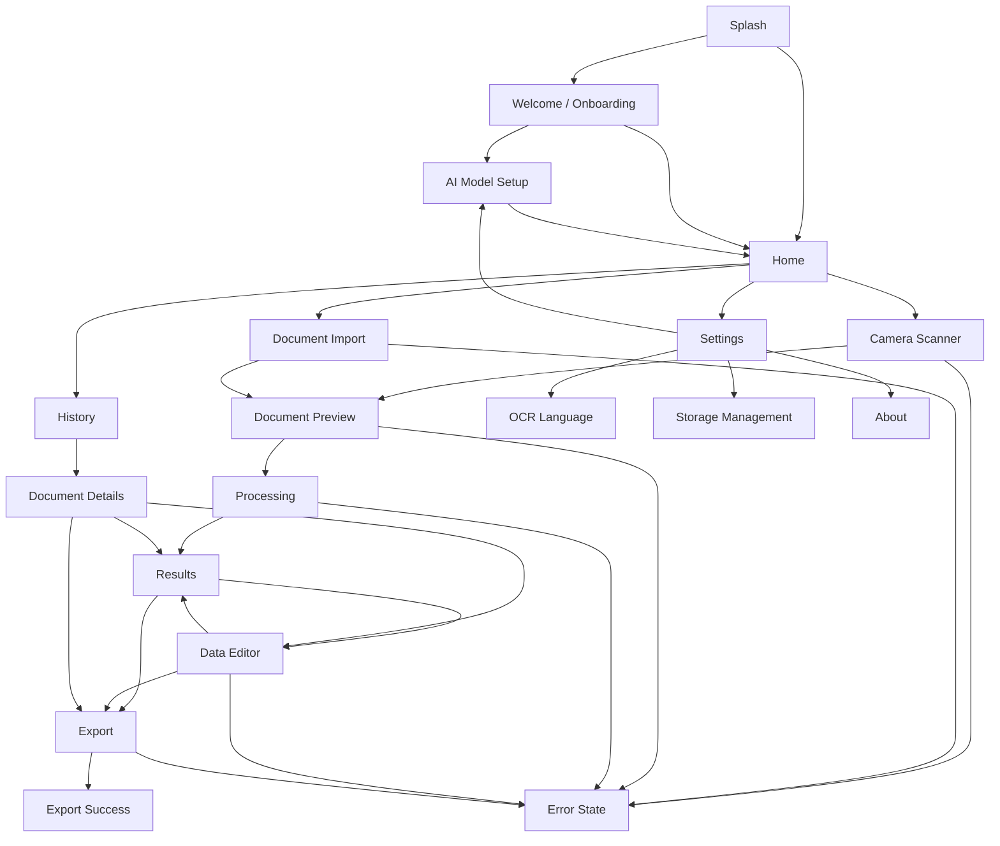

# SnapData: AI-Powered Intelligent Document Processing & Data Extraction System
## Frontend Technical Implementation Document

**Project:** SnapData  
**Document:** Frontend Technical Implementation Document  
**Version:** 1.0  
**Status:** Draft / Implementation Baseline  
**Date:** 30 August 2026  
**Implementation Target:** Android application built using Google AI Studio — **"Build an Android app"**  

---

## Document Control

| Item | Value |
|---|---|
| Project | SnapData |
| Document | Frontend Technical Implementation Document |
| Version | 1.0 |
| Status | Draft / Implementation Baseline |
| Date | 30 August 2026 |
| Product Type | Android/mobile offline-first document processing application |
| Primary Sources | `SnapData_PRD_v1.0.md`, `SnapData_SRS_v1.0.md` |
| Parent Technical Sources | `SnapData_TRD_v1.0.md`, `SnapData_SYSTEM_ARCHITECTURE_v1.0.md` |
| UX Source | `SnapData_UI_UX_v1.0.md` |
| Supporting Sources | Original SnapData project specification; SnapData workflow diagram |
| Concrete Android Stack | **REQUIRES TECHNICAL VALIDATION** |
| Backend for MVP | **CONFIRMED: Not required** |
| REST API for MVP | **CONFIRMED: Not required** |
| Canonical data schema | Defined outside this document by `DATA_SCHEMA.md` / equivalent artifact |

### Decision-status vocabulary

- **CONFIRMED** — explicitly established by project sources or directly verified in the implementation.
- **PROPOSED** — recommended implementation direction, not yet confirmed in code.
- **TBD** — decision has not yet been made.
- **REQUIRES TECHNICAL VALIDATION** — intent is known, but the exact implementation or feasibility must be verified.
- **OPTIONAL** — permitted by scope but not mandatory for the baseline.
- **OUT OF SCOPE** — intentionally excluded from the current MVP.

---

# 1. Purpose

This document defines how the SnapData frontend should be implemented on Android while preserving the behavior, architecture, and scope established by the PRD, SRS, TRD, system architecture, and UI/UX specification.

It bridges:

```text
UI / UX specification
        ↓
Android presentation implementation
        ↓
Application / domain interfaces
        ↓
Local document-processing system
```

The document is implementation-oriented, but it deliberately does **not** invent a final Android language, UI toolkit, navigation library, state-management library, dependency-injection framework, database API, camera library, OCR engine integration, or AI runtime where the current sources have not confirmed those choices.

The core product path remains:

```text
Acquire
  ↓
Validate
  ↓
Pre-process
  ↓
OCR
  ↓
Offline AI
  ↓
Structure
  ↓
Review
  ↓
Edit
  ↓
Save
  ↓
Export / Share
  ↓
History
```

The supplied workflow diagram also presents this flow visually, including Document Input, Acquisition, Image Pre-processing, OCR, Offline AI Processing, Structured Data Generation, User Review & Editing, Local Storage, Export, and Document History. The footer visually lists React Native, TypeScript, Node.js, Express.js, SQLite, Tesseract OCR, Offline AI, and Excel/CSV/JSON/PDF, but the current TRD explicitly treats the older stack labels as source-backed context rather than automatically confirmed implementation choices.

---

# 2. Source-of-Truth and Alignment Rules

The frontend SHALL follow the following authority order:

```text
PRD
 ↓
SRS
 ↓
TRD
 ↓
SYSTEM ARCHITECTURE
 ↓
UI_UX
 ↓
FRONTEND
```

Lower-level implementation may refine the higher-level documents, but it MUST NOT contradict them.

Examples:

- The frontend MUST NOT introduce a required backend because the MVP architecture does not require one.
- The frontend MUST NOT send documents to a remote OCR/AI service as part of the core MVP path.
- The frontend MUST NOT bypass repository/use-case boundaries to query SQLite directly.
- The frontend MUST NOT load an AI model directly from a screen.
- The frontend MUST NOT generate export files inside visual components.
- The frontend MUST NOT silently discard edits.
- The frontend MUST NOT report a stage as successful when the underlying application/service failed.

---

# 3. Actual Android Project Inspection

## 3.1 Inspection Result

**Status: REQUIRES TECHNICAL VALIDATION**

The accessible project materials establish that the implementation target is a Google AI Studio **"Build an Android app"** project. However, the actual generated Android source project/build artifact was not included in the uploaded source set.

A GitHub repository search located `ishant-rathore/SnapData`, but the accessible repository is currently empty and therefore does not provide Android source code for verification.

The local project materials contain specification documents and the workflow image/PDF, but no Gradle project, Android source tree, manifest, build configuration, dependency lockfile, or generated application source.

### 3.2 Concrete stack verification matrix

| Implementation concern | Current status | Evidence needed | Action before implementation freeze |
|---|---|---|---|
| Programming language | **REQUIRES TECHNICAL VALIDATION** | Android source files | Inspect actual generated project |
| UI framework | **REQUIRES TECHNICAL VALIDATION** | UI source/dependencies | Inspect actual generated project |
| Android framework/API level | **REQUIRES TECHNICAL VALIDATION** | Gradle/build files | Inspect actual generated project |
| Build system | **REQUIRES TECHNICAL VALIDATION** | Gradle/settings/project files | Inspect actual generated project |
| Project/module structure | **REQUIRES TECHNICAL VALIDATION** | Directory tree | Inspect actual generated project |
| Navigation implementation | **REQUIRES TECHNICAL VALIDATION** | Route/nav source/dependencies | Inspect actual generated project |
| State management | **REQUIRES TECHNICAL VALIDATION** | State holders/view models/stores | Inspect actual generated project |
| Dependency injection | **REQUIRES TECHNICAL VALIDATION** | Service/provider graph | Inspect actual generated project |
| Existing camera implementation | **REQUIRES TECHNICAL VALIDATION** | Camera source + manifest | Inspect actual generated project |
| Existing file picker | **REQUIRES TECHNICAL VALIDATION** | Intent/picker code | Inspect actual generated project |
| Persistence implementation | **REQUIRES TECHNICAL VALIDATION** | SQLite/DB/file code | Inspect actual generated project |
| Existing OCR integration | **REQUIRES TECHNICAL VALIDATION** | Engine dependency/code | Inspect actual generated project |
| Existing AI integration | **REQUIRES TECHNICAL VALIDATION** | Runtime/model loader/code/assets | Inspect actual generated project |
| Existing export integration | **REQUIRES TECHNICAL VALIDATION** | Export code/dependencies | Inspect actual generated project |
| Test framework | **REQUIRES TECHNICAL VALIDATION** | Test source/build config | Inspect actual generated project |

### 3.3 Implementation rule

Until actual source inspection is completed, every concrete technology decision in this document remains **PROPOSED**, **TBD**, or **REQUIRES TECHNICAL VALIDATION**. No example package name, class name, framework, or dependency shown below should be mistaken for a confirmed generated-project implementation.

---

# 4. Frontend Responsibilities

The frontend is responsible for:

- application screens;
- navigation and route transitions;
- user input and interaction handling;
- camera acquisition UI;
- file/document acquisition UI;
- document preview;
- processing progress/status presentation;
- extraction result presentation;
- data and table editing interactions;
- validation feedback;
- save actions;
- export selection and export initiation;
- sharing UI;
- history UI;
- settings UI;
- loading, empty, success, error and cancelled states;
- accessibility behavior;
- user feedback and confirmation flows;
- lifecycle-aware rendering of application state.

The frontend is **not** responsible for:

- OCR algorithms;
- AI model internals;
- AI inference implementation;
- image-processing algorithms;
- database internals;
- SQLite schema/migrations;
- export-generation algorithms;
- file-format encoding internals;
- provider-specific processing logic.

These responsibilities belong behind application/domain/service boundaries.

---

# 5. Architectural Baseline

## 5.1 Architecture status

**Logical separation: PROPOSED**  
**Concrete Android implementation: REQUIRES TECHNICAL VALIDATION**

The recommended conceptual frontend boundary is:

```text
Presentation
    ↓
UI State
    ↓
Screen / View Model
    ↓
Application Use Cases
    ↓
Domain Interfaces
    ↓
Infrastructure Services
```

## 5.2 Layer responsibilities

### Presentation
Owns screens, components, navigation, transient UI state, user actions, accessibility and visual state.

**Must not:** contain OCR, AI runtime, SQL, export encoding, or direct file-format generation.

### UI State
Provides immutable or controlled snapshots of what the screen should render.

**Must contain:** user-visible state, loading flags, validation state, available actions and mapped error states.

**Should not contain:** provider-specific exceptions, raw OCR objects, database cursors, or runtime handles.

### Screen / View Model
Coordinates screen-level events and invokes application use cases.

The exact implementation pattern is **REQUIRES TECHNICAL VALIDATION**.

### Application Use Cases
Represent user-oriented operations such as:

- acquire document;
- validate input;
- start processing;
- cancel processing;
- load results;
- save corrections;
- list history;
- delete document;
- export result;
- prepare sharing.

### Domain Interfaces
Define provider-neutral contracts for document acquisition, processing, persistence and export.

### Infrastructure Services
Implement platform/provider-specific work such as camera access, file access, SQLite, OCR, AI runtime and exporter adapters.

---

# 6. Recommended Project Structure

**Status: PROPOSED** — this is a conceptual structure only and MUST be adapted to the actual generated Android project.

```text
app/
├── src/main/
│   ├── <android-source-root>/
│   │   ├── presentation/
│   │   │   ├── navigation/
│   │   │   ├── screens/
│   │   │   │   ├── splash/
│   │   │   │   ├── onboarding/
│   │   │   │   ├── modelsetup/
│   │   │   │   ├── home/
│   │   │   │   ├── scanner/
│   │   │   │   ├── importdocument/
│   │   │   │   ├── preview/
│   │   │   │   ├── processing/
│   │   │   │   ├── results/
│   │   │   │   ├── editor/
│   │   │   │   ├── export/
│   │   │   │   ├── history/
│   │   │   │   ├── details/
│   │   │   │   ├── settings/
│   │   │   │   ├── ocrlanguage/
│   │   │   │   ├── storage/
│   │   │   │   └── about/
│   │   │   ├── components/
│   │   │   └── state/
│   │   ├── domain/
│   │   │   ├── model/
│   │   │   ├── usecase/
│   │   │   └── interface/
│   │   ├── data/
│   │   │   ├── repository/
│   │   │   ├── local/
│   │   │   └── file/
│   │   ├── processing/
│   │   │   ├── pipeline/
│   │   │   ├── preprocessing/
│   │   │   ├── ocr/
│   │   │   ├── ai/
│   │   │   └── structuring/
│   │   ├── export/
│   │   │   ├── excel/
│   │   │   ├── csv/
│   │   │   ├── json/
│   │   │   └── pdf/
│   │   ├── platform/
│   │   │   ├── camera/
│   │   │   ├── picker/
│   │   │   ├── sharing/
│   │   │   └── permissions/
│   │   └── core/
│   │       ├── error/
│   │       ├── logging/
│   │       ├── lifecycle/
│   │       └── utility/
│   └── assets/
└── src/test/
└── src/androidTest/
```

### Structure rules

1. Screens depend on use cases/interfaces, not on SQLite.
2. Processing adapters must not depend on UI components.
3. Exporters must not depend on screen state.
4. Platform components expose controlled abstractions to the application layer.
5. Shared UI components live outside individual screen packages.
6. Canonical domain data objects are not copied into multiple competing models without a clear mapping reason.

---

# 7. Screen Inventory

| ID | Screen | Baseline status | Implementation role |
|---|---|---|---|
| SCR-001 | Splash | MVP | Startup/readiness routing |
| SCR-002 | Welcome / Onboarding | MVP | First-run orientation |
| SCR-003 | AI Model Setup | MVP | Model readiness/setup |
| SCR-004 | Home Dashboard | MVP | Primary hub |
| SCR-005 | Camera Scanner | MVP | Camera acquisition |
| SCR-006 | Document Import | MVP acquisition flow | File acquisition |
| SCR-007 | Document Preview | MVP / flow state | Confirm source before processing when needed |
| SCR-008 | Processing | MVP | OCR/AI pipeline feedback |
| SCR-009 | Results | MVP | Review extracted result |
| SCR-010 | Data Editor | MVP | Correct fields/tables |
| SCR-011 | Export | MVP | Choose output format |
| SCR-012 | Export Success | OPTIONAL | Post-export outcome; may be an inline success state |
| SCR-013 | Document History | MVP | Browse saved records |
| SCR-014 | Document Details | OPTIONAL | Dedicated detail route; may reuse Results |
| SCR-015 | Settings | MVP/P1 mix | Approved settings categories |
| SCR-016 | OCR Language | P1 / OPTIONAL | Language selection once list is finalized |
| SCR-017 | Storage Management | P1 / OPTIONAL | Local storage visibility/management |
| SCR-018 | About | P1 | Product/project information |
| SCR-019 | Error State | Reusable pattern | Failure/recovery |
| SCR-020 | Empty State | Reusable pattern | No-content/no-capability states |

Error and empty states need not become separate navigation destinations unless the actual UX implementation benefits from dedicated routing.

---

# 8. Navigation Architecture

## 8.1 Primary navigation

Recommended baseline:

```text
Home
History
Settings
```

A persistent bottom navigation bar is **PROPOSED**, not mandatory. It should not include Export as an always-visible primary destination because Export is part of the current document task.

## 8.2 Core route graph



## 8.3 Navigation rules

| Context | Forward navigation | Back navigation |
|---|---|---|
| Splash | Resolve to onboarding/home/setup | Not user-driven |
| Onboarding | Continue → setup/home | Previous onboarding step where applicable |
| Model Setup | Setup succeeds → Home | Return to previous context if safe |
| Home | Scan/import/history/settings | Normal Android app behavior |
| Scanner | Capture → Preview | Cancel → previous |
| Import | File selected → Preview | Cancel → previous |
| Preview | Confirm → Processing | Back → acquisition flow |
| Processing | Success → Results | Cancel/back → safe prior state |
| Results | Edit/export/save | Back → previous task context |
| Editor | Save → Results | Unsaved changes → confirm |
| Export | Success → Export Success/inline success | Back → Results/Editor |
| History | Item → Details/Results | Back → History |
| Settings | Sub-setting → detail/dialog | Back → Settings |

## 8.4 Android system Back

- Close transient dialogs/bottom sheets first.
- Scanner Back cancels acquisition unless a captured page is waiting for confirmation.
- Preview Back returns to acquisition without persisting unconfirmed data.
- Processing Back must never silently pretend processing completed.
- Editor Back with no changes returns immediately.
- Editor Back with unsaved changes opens a confirmation dialog.
- Exporting Back uses only cancellation behavior supported by the export/application layer; it must preserve already-saved user data.

## 8.5 Deep navigation

Deep links are **TBD** and are not required by the current MVP scope.

---

# 9. Application State Model

## 9.1 Top-level application state

```text
AppState
├── InitializationState
├── OnboardingState
├── ModelState
├── CurrentDocumentState
├── ProcessingState
├── ExtractionResultState
├── EditorState
├── SaveState
├── ExportState
├── HistoryState
└── ErrorState
```

## 9.2 Source-of-truth rules

| Data | Source of truth |
|---|---|
| Saved document record | Repository / local persistence |
| Current unsaved edits | Editor state owned by active document workflow |
| Processing status | Processing controller/use case |
| Model readiness | Model manager/application service |
| History list | Repository/use case |
| Export status | Export use case/manager |
| Current navigation location | Navigation layer |
| Dialog visibility | Transient UI state |
| Input focus | UI-local transient state |
| Scroll position | UI-local transient state where restoration is beneficial |

### Persisted vs transient

Persisted data includes successful saved document records, user-approved corrections, relevant processing/history metadata, and other information defined by the database/data-schema documents.

Transient UI state includes dialogs, focus, temporary button loading states, temporary picker state, and unsaved editor changes.

The frontend should not maintain an independent shadow database merely to render a screen.

---

# 10. Processing State Contract

The frontend SHALL be able to represent the following processing stages/states:

```text
IDLE
ACQUIRING
VALIDATING
PREPROCESSING
OCR_PROCESSING
AI_PROCESSING
STRUCTURING
REVIEW
EDITING
SAVING
EXPORTING
COMPLETED
FAILED
CANCELLED
```

## 10.1 State mapping

| Service/application state | UI state | User-visible message | Available action |
|---|---|---|---|
| IDLE | Ready | Ready | Start a new document |
| ACQUIRING | Acquiring | Getting your document ready… | Cancel |
| VALIDATING | Validating | Checking the document… | Cancel/back where safe |
| PREPROCESSING | Preprocessing | Preparing the document… | Cancel where supported |
| OCR_PROCESSING | OCR active | Reading the document… | Cancel/retry depending on failure |
| AI_PROCESSING | AI active | Understanding the document… | Cancel/retry where supported |
| STRUCTURING | Structuring | Organizing extracted data… | Wait/cancel where supported |
| REVIEW | Review ready | Extraction complete — review before export. | Review/edit/save/export |
| EDITING | Editing | Editing extracted data | Save/cancel |
| SAVING | Saving | Saving your changes… | Wait/cancel only if supported |
| EXPORTING | Exporting | Creating your file… | Wait/cancel if supported |
| COMPLETED | Success | Done | Open/share/export/history |
| FAILED | Error | Clear failure message | Retry/recover/back |
| CANCELLED | Cancelled | Processing cancelled. | Return/restart |

## 10.2 Processing screen stages

The baseline visual sequence is:

```text
Document
   ↓
Preprocessing
   ↓
OCR
   ↓
AI Analysis
   ↓
Extraction
   ↓
Complete
```

Each stage supports:

- Pending
- Active
- Completed
- Failed
- Cancelled

### Progress rule

If exact numerical progress is unavailable, the UI MUST use stage-based progress. It MUST NOT fabricate a percentage, ETA, or remaining time.

---

# 11–99. Complete Approved Frontend Specification

The remainder of this file must preserve **all remaining sections of `SnapData_FRONTEND_v1.0.md` verbatim in meaning and structure**, including sections 11–99 and Appendices A–D. No sections may be omitted, summarized, invented, or replaced with generic implementation guidance.

**Source continuation required from the approved project document.**

---

**End of `SnapData_FRONTEND_v1.0.md`**
