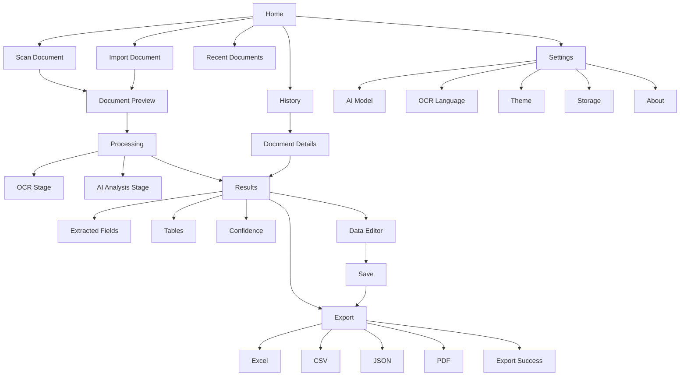
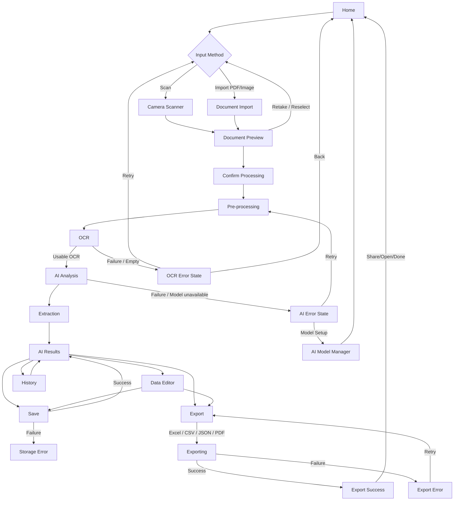
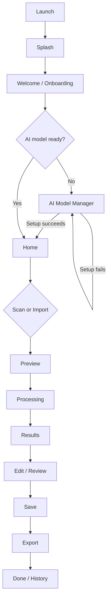
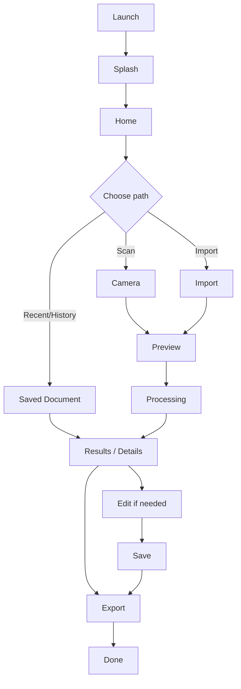

# SnapData: AI-Powered Intelligent Document Processing & Data Extraction System
## UI/UX Design Specification

**Document:** `SnapData_UI_UX_v1.0.md`  
**Version:** 1.0  
**Status:** Draft / Design Baseline  
**Date:** 30 August 2026  
**Platform:** Android  
**Implementation Target:** Android application built using Google AI Studio's **"Build an Android app"** workflow  

---

## Document Control

| Item | Value |
|---|---|
| Project | SnapData |
| Document | UI/UX Design Specification |
| Version | 1.0 |
| Status | Draft / Design Baseline |
| Date | 30 August 2026 |
| Primary Sources | `SnapData_PRD_v1.0.md`, `SnapData_SRS_v1.0.md` |
| Technical Sources | `SnapData_TRD_v1.0.md`, `SnapData_SYSTEM_ARCHITECTURE_v1.0.md` |
| Supporting Sources | Original SnapData project specification; SnapData workflow diagram |
| UI Boundary | User experience, navigation, visual design, states, interactions and accessibility |
| Implementation Boundary | No Kotlin/Java/Compose/XML/database/API/backend/AI/OCR implementation details |

### Source Hierarchy

```text
PRD
  ↓
SRS
  ↓
TRD
  ↓
SYSTEM ARCHITECTURE
  ↓
UI/UX
```

This document refines the approved product/software/technical contract into a user-facing design baseline. It does not create new product capabilities. P1/P2/TBD capabilities remain explicitly qualified rather than being promoted to MVP.

The PRD establishes the central promise: capture/upload a document, process it through OCR and AI, produce structured fields/tables, allow review and correction, save locally, and export to Excel/CSV/JSON/PDF.

The SRS defines P0/P1 behavior, user-visible state transitions, offline readiness, error handling, local history, editing and export behavior.

The architecture establishes a presentation layer, navigation boundary, processing state manager, AI model manager, history manager and export components without requiring a particular UI implementation framework.

## 1. Design Objectives

SnapData UI/UX shall optimize for:

1. **Simplicity** — a first-time user can understand the core workflow without training.
2. **Fast task completion** — Scan/Import are the dominant entry actions.
3. **Clear feedback** — every meaningful system action has a visible state.
4. **Easy review** — extracted content is readable before export.
5. **Easy correction** — fields and supported table cells can be corrected directly.
6. **Minimal friction** — unnecessary confirmations and navigation are avoided.
7. **Privacy visibility** — local/offline behavior is understandable without technical jargon.
8. **Offline-first communication** — loss of internet does not imply that the app is unusable.
9. **Accessibility** — meaning is not conveyed by color or icons alone.
10. **Professional appearance** — clean, document-focused, trustworthy visual language.
11. **Consistent navigation** — Android back behavior and screen transitions are predictable.
12. **Recoverability** — errors explain what happened and what the user can do next.

### Primary Task Model

```text
CAPTURE / IMPORT
       ↓
    PROCESS
       ↓
     REVIEW
       ↓
      EDIT
       ↓
      SAVE
       ↓
     EXPORT
```

The UI should keep this sequence visually and behaviorally obvious.

## 2. UX Principles

| Principle | SnapData application |
|---|---|
| Simple over complex | Prefer a single clear primary action over multiple competing controls. |
| Progressive disclosure | Show essential information first; place secondary details behind expandable sections, sheets or details views. |
| Clear primary actions | Use strong hierarchy for Scan, Import, Edit, Save and Export. |
| Consistent navigation | Use standard Android back behavior and predictable destination rules. |
| Immediate feedback | Acknowledge capture, import, save and export actions promptly. |
| Visible processing status | Show stage-based progress for long OCR/AI work. |
| User control | Cancellation, retry and back behavior must be understandable and safe. |
| Error recovery | Every P0 error should provide a practical recovery path where possible. |
| Privacy transparency | Make local processing and model readiness visible without exposing implementation complexity. |
| Accessibility | Critical controls use text labels and meaningful accessibility descriptions. |
| Responsive interaction | The UI must remain responsive during processing/saving/exporting. |
| Predictable behavior | Similar actions behave consistently across screens. |

## 3. Product Scope Guardrails

### 3.1 MVP / P0 UX scope

The baseline UI shall support:

- Camera capture.
- Image import.
- PDF import.
- Core preprocessing visibility where useful.
- OCR processing state.
- Offline AI readiness and processing state.
- Document type detection result where available.
- Extracted fields / key-value pairs.
- Extracted tables where detection succeeds.
- Confidence information where the processing pipeline produces it.
- Review and field/table editing.
- Save corrected data locally.
- History, reopen and delete.
- Export to Excel, CSV, JSON and PDF.
- Clear processing, error, cancellation and storage states.
- Initial AI model setup/readiness flow.

### 3.2 P1 / TBD features retained as qualified UX

The following may be represented only when enabled/approved:

- Multi-page PDF support — **P1 / Requires Technical Validation**.
- OCR language selection — **P1; exact MVP language list TBD**.
- Theme selection — **P1**.
- Storage management — **P1**.
- Model information — **P1**.
- Share generated file — **P1**.
- Search/rename history — **P1 where prioritized**.
- Direct OCR text editing — **P1**.
- Add/delete table rows — **P1**.
- Undo/redo — **P1**.
- AI document summary — **P1 / MVP status TBD**.

### 3.3 Explicitly not baseline UI

Do not expose the following as current product functionality:

- Cloud synchronization.
- Team collaboration.
- Authentication/login/account screens.
- Billing/subscription.
- Admin dashboards.
- Voice commands.
- Handwriting recognition.
- Offline document chat/question answering.
- Mandatory server-side processing.
- Merge/split table cells.
- Model update/delete controls until approved.
- Folders, favorites, tags, duplicate detection unless separately approved.

## 4. Information Architecture

### 4.1 Application hierarchy



### 4.2 Information architecture rules

- **Home** is the default operational hub.
- **Scan** and **Import** are the primary entry points into document processing.
- **Processing** is a controlled task state rather than a general browsing destination.
- **Results** is the review hub for a completed extraction.
- **Editor** is a task-focused editing state entered from Results.
- **Export** is a terminal task within the current document workflow, not a separate content-management system.
- **History** contains only locally saved processed records.
- **Settings** contains approved configuration categories only.

## 5. Navigation Architecture

### 5.1 Primary navigation

Recommended baseline:

- **Home** — primary start point.
- **History** — saved document access.
- **Settings** — preferences/capabilities.

A persistent bottom navigation bar is **PROPOSED**, not mandatory. During active document processing, review, editing and export, task-specific full-screen navigation should take precedence over persistent navigation to reduce accidental task switching.

### Recommended bottom navigation

```text
┌──────────────────────────────────────────────┐
│                  Screen Content              │
│                                              │
│                                              │
├──────────────────────────────────────────────┤
│  Home           History          Settings    │
└──────────────────────────────────────────────┘
```

The design should not allocate a permanent bottom-navigation destination solely to Export because Export belongs to the active document task and is not an independent browsing area.

### 5.2 Secondary navigation

Use:

- Top app bar title + Android back affordance.
- Contextual actions such as Edit, Save or Export within the current task.
- Tabs or segmented controls only where they materially improve Results/Editor comprehension.
- Dialogs for destructive or high-risk confirmations.
- Bottom sheets for compact selection/confirmation tasks when they reduce navigation overhead.

### 5.3 Android Back behavior

| Context | Back behavior |
|---|---|
| Home | Exit according to normal Android application behavior. |
| Scanner | Cancel acquisition and return to the previous screen. No successful record is created. |
| Preview | Return to acquisition/source selection; uncommitted changes are not persisted. |
| Processing | Show cancellation confirmation only if active work cannot safely stop immediately; otherwise cancel safely and return to a valid prior state. |
| Results | Return to the preceding task/document context. Saved data remains intact. |
| Editor with no changes | Return to Results. |
| Editor with unsaved changes | Show a discard confirmation before leaving. |
| Exporting | Do not silently discard the operation; preserve saved data. If cancellation is safe, offer cancellation. Exact semantics are **TBD** where implementation limitations apply. |
| Dialog/bottom sheet | Close the transient surface first. |

### 5.4 Navigation after important actions

| Action | Destination |
|---|---|
| First-time onboarding completed | AI Model Manager when setup is required; otherwise Home. |
| Model setup succeeds | Home. |
| Capture accepted | Preview or Processing according to validated capture flow. |
| Import accepted | Preview when user confirmation is useful; otherwise Processing. |
| Preview confirmed | Processing. |
| Processing succeeds | AI Results. |
| Processing fails | Error State with retry/back recovery. |
| Save succeeds | Remain on Results/Editor; show clear saved status. |
| Export succeeds | Export Success. |
| Export fails | Export failure state; keep source/structured data intact. |
| Share succeeds/cancelled | Keep exported file available; return to Export Success or Export. |
| History item opened | Document Details or Results/Editor depending on approved flow. |
| Delete document | Return to History and refresh list. |

## 6. Screen Inventory

| ID | Screen | Baseline status | Role |
|---|---|---|---|
| SCR-001 | Splash | **MVP** | Application launch/initialization state |
| SCR-002 | Welcome / Onboarding | **MVP** | First-run orientation |
| SCR-003 | AI Model Manager | **MVP** | Readiness/setup |
| SCR-004 | Home Dashboard | **MVP** | Primary document entry |
| SCR-005 | Camera Scanner | **MVP** | Camera acquisition |
| SCR-006 | Document Import | **MVP as acquisition flow; native picker preferred** | File selection |
| SCR-007 | Document Preview | **MVP / flow state** | Confirm source before processing when required |
| SCR-008 | Processing | **MVP** | OCR/AI pipeline feedback |
| SCR-009 | AI Results | **MVP** | Review extracted result |
| SCR-010 | Data Editor | **MVP** | Correct structured result |
| SCR-011 | Export | **MVP** | Select output format |
| SCR-012 | Export Success | **PROPOSED / OPTIONAL separate screen; may be a success state** | Post-export outcome |
| SCR-013 | Document History | **MVP** | Saved record list |
| SCR-014 | Document Details | **PROPOSED / OPTIONAL** | Dedicated saved-document detail surface; may reuse Results |
| SCR-015 | Settings | **MVP/P1 mix** | Approved configuration categories |
| SCR-016 | OCR Language | **P1 / OPTIONAL until language scope finalized** | Language selection |
| SCR-017 | Storage Management | **P1 / OPTIONAL** | Storage usage/management |
| SCR-018 | About | **P1** | Product/project information |
| SCR-019 | Error State | **Reusable UX pattern, not necessarily a standalone route** | Failure/recovery |
| SCR-020 | Empty State | **Reusable UX pattern, not necessarily a standalone route** | No-content/no-capability states |

## 7. Common Screen Template

Every screen specification uses:

- **Screen ID / Name**
- **Purpose**
- **Entry Conditions**
- **Exit Conditions**
- **Primary User**
- **Primary Action**
- **Secondary Actions**
- **UI Components**
- **Content**
- **Navigation**
- **Loading State**
- **Empty State**
- **Error State**
- **Success State**
- **Offline State**
- **Accessibility Notes**
- **Related Requirements**

## 8. Screen Specifications

### SCR-001 — Splash

**Purpose**  
Provide a brief branded launch state while required initialization and readiness checks are performed.

**Entry Conditions**  
Application is launched or resumed through a full application restart.

**Exit Conditions**  
Initialization completes sufficiently to choose the correct next destination.

**Primary User**  
All users.

**Primary Action**  
None; the screen should be passive and brief.

**Secondary Actions**  
None.

**UI Components**  
- SnapData logo/wordmark.
- App name.
- Short product descriptor.
- Minimal progress/readiness indicator only if startup work is genuinely active.

**Content**  
Recommended descriptor: **"Smart Document to Structured Data"**.

**Navigation**  
- First launch → Welcome/Onboarding.
- Returning user → Home.
- If a required startup capability is unavailable, route to an appropriate recoverable setup/error state instead of looping indefinitely.

**Loading State**  
Minimal startup indicator; no artificial delay.

**Empty State**  
Not applicable.

**Error State**  
Startup interruption/failure should use a concise recovery message. Avoid stack traces.

**Success State**  
Transition automatically.

**Offline State**  
Offline itself is not an error. If local capabilities are ready, continue to Home. If required model setup is missing, show that prerequisite later in the model readiness path.

**Accessibility Notes**  
Screen reader should identify the app name and startup status if a meaningful status is exposed.

**Related Requirements**  
PRD 19.1; SRS UI requirements; FR-051; NFR-019.

### SCR-002 — Welcome / Onboarding

**Purpose**  
Explain what SnapData does and establish the user's mental model of the offline-first workflow.

**Entry Conditions**  
First launch or first-run state not yet completed.

**Exit Conditions**  
User completes onboarding or explicitly skips where skipping is permitted.

**Primary User**  
First-time user.

**Primary Action**  
**Get Started** / **Continue**.

**Secondary Actions**  
**Skip** where product-approved.

**UI Components**  
- Short 2–3 step onboarding carousel or single concise introduction.
- Progress indicator.
- Get Started button.
- Skip text action.
- Small privacy/offline reassurance.

**Content**  
The onboarding should communicate:

1. Capture or import documents.
2. OCR reads the document.
3. AI converts information into structured fields/tables.
4. User reviews and corrects the result.
5. Data can be saved locally and exported.
6. Core processing is intended to work offline after required model setup.

**Navigation**  
- Continue through onboarding.
- Completion → AI Model Manager if required; otherwise Home.

**Loading State**  
Not expected except a short readiness transition after completion.

**Empty State**  
Not applicable.

**Error State**  
If required setup cannot begin, remain in a recoverable setup state.

**Success State**  
Show completion once, then move forward. Avoid celebratory animation that delays progress.

**Offline State**  
Explain that first-time model setup may require connectivity, while core processing is intended to work offline after setup.

**Accessibility Notes**  
Each page should have a meaningful heading and a concise screen-reader reading order. Skip and Continue must be distinct and labeled.

**Related Requirements**  
PRD 19.2; FR-047..FR-053; NFR-018..NFR-019.

### SCR-003 — AI Model Manager

**Purpose**  
Show whether the required local AI capability is ready and guide the initial setup/download flow.

**Entry Conditions**  
First-run setup, model not ready, or Settings → AI Model.

**Exit Conditions**  
Setup succeeds, the user returns, or setup fails and a recovery path is shown.

**Primary User**  
First-time user or user troubleshooting readiness.

**Primary Action**  
**Set up AI** / **Download model** when the model is not ready.

**Secondary Actions**  
View status/information; retry failed setup; return.

**UI Components**  
- Readiness card.
- Setup action.
- Stage/progress indicator.
- Optional model information section.
- Storage/network prerequisite messaging.

**Content**  
Use user-facing states:

| State | Recommended message |
|---|---|
| Not Ready | "Offline AI needs to be set up before processing." |
| Setup Required + Online | "Set up the required AI capability to enable offline processing." |
| Setup In Progress | "Setting up offline AI…" |
| Ready | "Offline AI is ready." |
| Setup Failed | "Setup could not be completed. Check the requirement shown below and try again." |
| Missing Storage | "Not enough storage to complete AI setup." |

Do not expose model runtime internals, quantization details, or unsupported technical specifications.

**Navigation**  
Successful setup → Home. Failure → stay on screen with retry/recovery.

**Loading State**  
Show meaningful progress. If exact byte/percentage progress is available, it may be shown; otherwise use stage-based progress.

**Empty State**  
No model installed is the Not Ready state.

**Error State**  
Network interruption, insufficient storage or unavailable model must be described in plain language.

**Success State**  
Show Ready state and enable the route to Home.

**Offline State**  
If setup requires network and device is offline, explain that initial setup requires connectivity. Do not imply core processing is unavailable forever.

**Accessibility Notes**  
Progress must expose text/status, not only animation. State changes should be announced where supported.

**Related Requirements**  
FR-051, FR-052, FR-053; F-MDL-001, F-MDL-002, F-MDL-004. Model update/delete remains excluded from MVP.

### SCR-004 — Home Dashboard

**Purpose**  
Serve as the primary operational hub and make the core workflow immediately obvious.

**Entry Conditions**  
Normal application state.

**Exit Conditions**  
User begins acquisition, opens History, or opens Settings.

**Primary User**  
All users.

**Primary Action**  
Two dominant actions: **Scan Document** and **Import Document**.

**Secondary Actions**  
Recent documents, History, Settings, model status.

**UI Components**  
- App bar with SnapData identity.
- Primary Scan button/card.
- Secondary Import button/card.
- Recent Documents section.
- AI readiness status chip/card.
- History entry point.
- Settings entry point.

**Content hierarchy**

```text
SnapData
Smart document → structured data

[ Scan Document ]
[ Import Document ]

Recent Documents
• Invoice — Today
• Certificate — Yesterday

AI Status: Ready for offline processing

Home     History     Settings
```

**Navigation**  
- Scan → Camera.
- Import → Document Import/native picker.
- Recent → saved document detail/results.
- History → History.
- Settings → Settings.

**Loading State**  
Recent documents may load progressively without blocking Scan/Import.

**Empty State**  
Show a focused first-use message: **"No saved documents yet. Scan or import a document to get started."** with Scan as the main action.

**Error State**  
Storage/query error should not block acquisition if the core capability is still usable; show a non-blocking warning where appropriate.

**Success State**  
After a completed workflow, return to Home with the newest saved item visible in Recent Documents when available.

**Offline State**  
Show a compact status such as **"Offline • Processing available"** when the model is ready. If the model is missing, show **"Offline AI not ready"** with a route to Model Manager.

**Accessibility Notes**  
Scan and Import need explicit text labels. Avoid icon-only primary actions.

**Related Requirements**  
FR-001..FR-003; FR-042..FR-045; FR-047..FR-051; NFR-013..NFR-019.

### SCR-005 — Camera Scanner

**Purpose**  
Capture a document image suitable for the processing workflow.

**Entry Conditions**  
User taps Scan Document and camera access is available/authorized.

**Exit Conditions**  
Capture accepted → Preview/Processing; Cancel → previous screen.

**Primary User**  
User capturing a physical document.

**Primary Action**  
**Capture**.

**Secondary Actions**  
Cancel, flash control where available, retake/confirm after capture, multi-page continuation only if approved.

**UI Components**  
- Live camera preview.
- Document framing guidance.
- Capture control.
- Optional flash control.
- Optional page indicator only if multi-page capture is approved.
- Retake and Use/Confirm controls after capture.

**Content**  
Use concise capture guidance such as **"Align document inside the frame"**. Visual framing should dominate the screen.

**Navigation**  
- Capture → Preview or processing flow.
- Cancel → previous state.
- Permission denied → Error/Permission state.

**Loading State**  
Camera initialization should use a compact initialization indicator only when needed.

**Empty State**  
Not applicable.

**Error State**  
Camera permission denied, unavailable camera and capture failure must each have a retry/return route.

**Success State**  
Capture acknowledgement should be immediate; avoid long success animation.

**Offline State**  
Camera capture remains available offline. Internet is not a prerequisite for acquisition.

**Accessibility Notes**  
Every non-obvious control must have a semantic label. Camera framing guidance should also be understandable without relying solely on visuals.

**Related Requirements**  
FR-001, FR-002, FR-006; ERR-001, ERR-002.

### SCR-006 — Document Import

**Purpose**  
Allow the user to select a supported PDF or image using Android-appropriate file selection behavior.

**Entry Conditions**  
User chooses Import Document.

**Exit Conditions**  
Valid selection → Preview/Processing; cancellation → Home/previous state.

**Primary User**  
User importing a document already stored on the device.

**Primary Action**  
Select a supported PDF/image.

**Secondary Actions**  
Cancel/return.

**UI Components**  
Prefer the platform-native document picker rather than duplicating system file browsing UI.

**Content**  
Supported type messaging should be simple: **"Choose a PDF or image."**

**Navigation**  
Valid content → Preview or Processing; unsupported/corrupt content → Error State.

**Loading State**  
Short import/read indicator.

**Empty State**  
User cancellation is not an error and does not create a record.

**Error State**  
Unsupported file, corrupt PDF and invalid image must explain the problem and offer another selection.

**Success State**  
Show selected filename/type before processing when Preview is used.

**Offline State**  
Import works offline.

**Accessibility Notes**  
Native picker accessibility should be preserved. Any wrapper messaging must be labeled.

**Related Requirements**  
FR-003..FR-006; ERR-003..ERR-005.

### SCR-007 — Document Preview

**Purpose**  
Let the user verify that the source document/image is the intended content before processing when a preview is useful in the validated flow.

**Entry Conditions**  
A valid camera capture or imported file is available.

**Exit Conditions**  
Confirm → Processing; Retake/reselect → acquisition; Cancel → previous state.

**Primary User**  
All users before processing.

**Primary Action**  
**Process Document** / **Continue**.

**Secondary Actions**  
Retake, reselect, cancel; rotate only where technically supported.

**UI Components**  
- Document/image preview.
- Page indicator if multi-page capability is approved.
- Continue button.
- Retake/reselect action.

**Content**  
Do not expose advanced editing tools not supported by the baseline.

**Navigation**  
Continue → Processing.

**Loading State**  
Preview loading spinner/skeleton for large inputs.

**Empty State**  
Invalid or missing source → Error State.

**Error State**  
Unreadable source, corrupt PDF or missing file reference → explain and return to acquisition.

**Success State**  
Confirmation should immediately launch Processing.

**Offline State**  
Preview remains available offline.

**Accessibility Notes**  
Use meaningful page/image descriptions and ensure controls remain reachable without precise gestures.

**Related Requirements**  
FR-004..FR-006; FR-007; TBD-003/TBD-008 for exact document limits and multi-page behavior.

### SCR-008 — Processing

**Purpose**  
Communicate the active document-processing pipeline clearly and prevent the user from thinking the app is frozen.

**Entry Conditions**  
Valid document has entered the processing workflow.

**Exit Conditions**  
Success → Results; failure → Error State; safe cancellation → Cancelled/previous valid state.

**Primary User**  
All users processing a document.

**Primary Action**  
Normally no primary action; the processing operation is active.

**Secondary Actions**  
Cancel where safe/supported.

**UI Components**  
- Source thumbnail/preview.
- Stage list/stepper.
- Current-stage emphasis.
- Indeterminate progress where exact progress is unavailable.
- Determinate progress only when technically measured.
- Cancel action where safe.

**Required stage model**

```text
1. Document
2. Preprocessing
3. OCR
4. AI Analysis
5. Extraction
6. Complete
```

The user-facing stage labels may be simplified:

```text
Document received      ✓
Preparing document     ✓
Reading text           ●
Understanding data     ○
Structuring results    ○
Complete               ○
```

**Important:** Do not fabricate percentages, confidence, speed, or remaining time. If exact progress is unavailable, stage-based progress is the source of truth.

**Content guidance**

- **Preprocessing:** "Preparing your document…"
- **OCR:** "Reading document text…"
- **AI:** "Understanding document content…"
- **Extraction:** "Organizing fields and tables…"
- **Complete:** "Review your extracted data."

**Navigation**  
Success → Results.

**Loading State**  
This is the primary loading state. It must remain visible for any noticeable operation.

**Empty State**  
Not applicable.

**Error State**  
OCR, AI, structured extraction and storage failures should branch to the corresponding reusable Error State.

**Success State**  
Move to Results immediately; no unnecessary splash/toast sequence.

**Offline State**  
When the model is ready, processing should display a small **Offline processing** status. When the model is unavailable, stop before AI processing and direct the user to Model Manager.

**Accessibility Notes**  
Current processing stage should be accessible as text and exposed as a status update. Animation must not be required to understand state.

**Related Requirements**  
FR-007..FR-020; NFR-001; state-management requirements; CMP-024 Processing State Manager.

### SCR-009 — AI Results

**Purpose**  
Present the extracted structured result in a form that is easy to inspect, understand and correct.

**Entry Conditions**  
Processing has produced a usable structured result.

**Exit Conditions**  
Edit, Save, Export, Back.

**Primary User**  
All users reviewing processed content.

**Primary Action**  
**Review / Edit Data**.

**Secondary Actions**  
Save, Export, inspect source context, expand/collapse result sections.

**UI Components**  
- Results header.
- Document type badge/label.
- Review status.
- Confidence summary where available.
- Extracted Fields section.
- Tables section.
- Optional Summary section only if AI summary is approved/enabled.
- Source preview/context.
- Edit and Export actions.

**Recommended visual hierarchy**

```text
Document Type: Invoice
Review needed • 2 low-confidence fields

Extracted Fields
────────────────────────
Invoice Number     INV-1024     [Edit]
Date               12 Aug 2026  [Edit]
Total              ₹12,450      [Edit]

Tables
────────────────────────
[2 tables detected]       View / Edit

Source Document
[thumbnail / preview]

[ Edit Data ]     [ Export ]
```

**Content rules**

- Empty/missing extracted values remain visible as empty/incomplete; never fabricate values.
- Confidence is secondary to the actual data and must not dominate the page.
- Clearly label machine-generated content as extracted or detected, not guaranteed truth.
- Show source context where available.

**Navigation**  
Edit → Data Editor. Export → Export. Back → previous valid state.

**Loading State**  
If a source preview or non-critical section loads independently, use local skeleton/loading treatment without blocking already available results.

**Empty State**  
No extracted fields → dedicated empty extraction message while preserving any other usable result. No tables → table empty state within the section.

**Error State**  
Partial extraction should be represented explicitly; malformed structured output must not be presented as complete.

**Success State**  
"Extraction complete — review before export." This is acknowledgement, not a correctness guarantee.

**Offline State**  
Results remain usable offline. No network banner should obscure the content.

**Accessibility Notes**  
Field labels and values must read in logical order. Confidence status must be announced with text/labels. Do not use only green/yellow/red highlights.

**Related Requirements**  
FR-018..FR-024; FR-021..FR-023; NFR-024..NFR-027.

### SCR-010 — Data Editor

**Purpose**  
Provide a focused, mobile-friendly environment for correcting extracted fields and supported tables.

**Entry Conditions**  
Structured editable data exists.

**Exit Conditions**  
Save → Results; Cancel/Back → Results with confirmation if dirty; Export → Export according to approved flow.

**Primary User**  
Users verifying/correcting extraction.

**Primary Action**  
Edit and **Save Changes**.

**Secondary Actions**  
Cancel, Export, optional undo/redo and row operations when P1-approved.

**UI Components**  
- Editable field rows/cards.
- Section headers.
- Field labels.
- Input controls.
- Validation/status messaging.
- Table editor.
- Save action.
- Optional undo/redo.

**Field editor behavior**

Each field should expose:

```text
Label
[ current value........................ ]
Status: High confidence / Review needed
```

The confidence status is a review cue, not an editing rule.

**Dirty state**

When changes exist:

- Show a subtle **Unsaved changes** state.
- Keep Save enabled when there are valid changes.
- Android Back triggers a discard confirmation.
- Leaving the screen must not silently discard edits.

**Validation**

Use only product-defined validation rules. Do not invent domain validation such as invoice rules unless separately specified.

**Loading State**  
Saving uses a focused progress indicator and temporarily prevents duplicate save actions.

**Empty State**  
If no editable fields exist, explain that there are no structured fields available to edit and provide a return action.

**Error State**  
Save failure must explicitly say the changes were **not confirmed as saved**. Preserve in-memory changes where safe.

**Success State**  
Show **Saved** status and keep the user on Results/Editor rather than forcing navigation.

**Offline State**  
Editing and local saving remain available offline.

**Accessibility Notes**  
Inputs need labels, current values and error text. Focus order must match visual order. Keyboard focus should not be trapped by horizontally scrolling tables.

**Related Requirements**  
FR-024..FR-030; FR-035; NFR-024..NFR-025.

### SCR-011 — Export

**Purpose**  
Allow the user to choose a supported output format and generate an export from the current saved/edited data.

**Entry Conditions**  
Supported structured result exists.

**Exit Conditions**  
Successful generation → Export Success state; failure → Export Error state.

**Primary User**  
User finalizing output.

**Primary Action**  
Select one format and **Export**.

**Secondary Actions**  
Change filename where supported, back/cancel, Share after success.

**UI Components**  
Export options should be simple cards/radio rows:

| Option | Description |
|---|---|
| Excel | Spreadsheet output (`.xlsx`) for structured fields/tables. |
| CSV | Tabular text output for supported structured/table data. |
| JSON | Machine-readable structured result. |
| PDF | Human-readable result document. |

**Content rules**

- State clearly that the export uses the **current saved/edited data**.
- Do not imply that export regenerates extraction.
- Do not expose unsupported export options.

**Navigation**  
Export success → Export Success state. Back → Results.

**Loading State**  
Show export-in-progress state with selected format visible.

**Empty State**  
If no export-ready data exists, disable export and explain why.

**Error State**  
Format-specific generation/mapping/storage failure should explain that the document remains preserved and can be retried.

**Success State**  
Move to Export Success or render the success state within the same screen.

**Offline State**  
Local export remains available when no network is needed.

**Accessibility Notes**  
Format labels must include their file type and purpose. Do not distinguish formats by color alone.

**Related Requirements**  
FR-036..FR-041; AC-007; AC-008; CMP-017..CMP-020.

### SCR-012 — Export Success

**Status:** **PROPOSED / OPTIONAL separate route**. May be implemented as a success state on SCR-011 to keep the app smaller.

**Purpose**  
Confirm that an export file was actually generated and present the next safe actions.

**Entry Conditions**  
Export generation succeeded.

**Exit Conditions**  
Share, Open, Done/Back.

**Primary User**  
User who has just generated an export.

**Primary Action**  
**Done** or **Share** depending on product emphasis.

**Secondary Actions**  
Open generated file, Share generated file, Return.

**UI Components**  
- Success icon/indicator.
- Format and filename.
- Generated-file status.
- Share action.
- Open action where supported.
- Done action.

**Content**  
Example: **"Excel file created"** / **"Export complete"**.

**Navigation**  
- Share → Android share flow.
- Open → compatible external application when supported.
- Done → Results/History/Home according to the entry context.

**Loading State**  
Not applicable after success; generation itself belongs to Export.

**Empty State**  
Not applicable.

**Error State**  
No-compatible-app or share failure should preserve the file and offer a return path.

**Success State**  
Only shown after generation is confirmed.

**Offline State**  
No special offline treatment; generated local files remain available.

**Accessibility Notes**  
Announce success as text, including format and filename.

**Related Requirements**  
FR-040, FR-041; ERR-016.

### SCR-013 — Document History

**Purpose**  
Provide access to previously processed and saved local documents.

**Entry Conditions**  
User opens History.

**Exit Conditions**  
Open item, delete item, back.

**Primary User**  
All returning users.

**Primary Action**  
Open a saved item.

**Secondary Actions**  
Delete; search only if P1 is approved.

**UI Components**  
History list item should show enough metadata to distinguish records:

- Thumbnail where available.
- Filename/title.
- Document type if available.
- Saved/modified date/time.
- Processing status.
- Compact export status only where meaningful.
- More/delete action.

**Content**  
Default ordering: most recently saved first.

**Navigation**  
Item → Document Details or Results/Editor.

**Loading State**  
Use a simple list skeleton while history loads.

**Empty State**  
**"No saved documents yet."** with **Scan Document** and **Import Document** as next actions.

**Error State**  
Storage/query failure should explain that saved records could not be loaded and provide retry.

**Success State**  
After delete, remove the item from the visible list and acknowledge the action briefly.

**Offline State**  
History remains available offline because it is local.

**Accessibility Notes**  
Each history item should read as one understandable target containing title/type/date/status, followed by an independently labeled delete action.

**Related Requirements**  
FR-042..FR-046; NFR-013..NFR-020.

### SCR-014 — Document Details

**Status:** **PROPOSED / OPTIONAL**.

**Purpose**  
Provide a dedicated read-only summary for a saved document when the product needs a separation between browsing and editing. The baseline can instead open a saved item directly into Results.

**Entry Conditions**  
User selects a History item.

**Exit Conditions**  
Open Results/Edit, Export, Delete, Back.

**Primary User**  
Returning user.

**Primary Action**  
Open the saved result.

**Secondary Actions**  
Export, Delete.

**UI Components**  
- Original document preview.
- Document type.
- Last modified date/time.
- Processing status.
- Extracted-data summary.
- Table count/summary where available.
- Actions: Review/Edit, Export.

**Content**  
Do not invent metadata that is not stored.

**Navigation**  
Review/Edit → Results/Editor; Export → Export.

**Loading State**  
Preview and stored data can load progressively.

**Empty State**  
If the record contains insufficient content, show a clear incomplete-record state.

**Error State**  
Missing/corrupt source or record should be explained without deleting intact structured data.

**Success State**  
A successfully loaded saved record is clearly identified as a previously saved local document.

**Offline State**  
Fully available for locally stored data.

**Accessibility Notes**  
Metadata uses clear field/value semantics. The entire page should remain understandable without the preview image.

**Related Requirements**  
FR-033, FR-043, FR-044, FR-045; TBD-012 for interruption recovery.

### SCR-015 — Settings

**Purpose**  
Provide approved configuration and capability entry points.

**Entry Conditions**  
User opens Settings.

**Exit Conditions**  
User selects a setting or returns.

**Primary User**  
All users.

**Primary Action**  
Choose a settings category.

**Secondary Actions**  
Back.

**UI Components**  
Grouped settings list:

### AI & Processing
- AI Model
- OCR Language (P1)

### Appearance
- Theme (P1)

### Device Storage
- Storage (P1)

### Information
- About

Do not expose Export Preferences as an active MVP control; it remains P2 until product scope is approved.

**Content**  
Each row should show current state/value when useful, e.g. **AI Model — Ready**, **Theme — System**.

**Navigation**  
Settings → selected sub-screen.

**Loading State**  
Minimal; settings should appear quickly.

**Empty State**  
Not applicable.

**Error State**  
Unsupported configuration should be explained inline.

**Success State**  
Preference changes should acknowledge immediately and persist as supported.

**Offline State**  
Settings are local. Model setup may explicitly require internet when not already downloaded.

**Accessibility Notes**  
Each setting row has a text title, summary and current value/status where applicable.

**Related Requirements**  
F-SET-001..F-SET-006; SRS Section 20.

### SCR-016 — OCR Language

**Status:** **P1 / OPTIONAL until exact language scope is finalized**.

**Purpose**  
Allow selection of supported OCR language(s) where the validated OCR implementation exposes language configuration.

**Entry Conditions**  
Settings → OCR Language.

**Exit Conditions**  
Language selected and saved; back.

**Primary Action**  
Select a supported language/configuration.

**Secondary Actions**  
Back.

**UI Components**  
- Current language selection.
- Supported options.
- Save/apply behavior where required.

**Content**  
Only display languages actually supported by the validated OCR capability. The exact MVP language list is **TBD**.

**Navigation**  
Return to Settings after applying.

**Loading State**  
Only if language capabilities need to be loaded.

**Empty State**  
If no configurable languages are available, explain that OCR language configuration is not available in the current build.

**Error State**  
Unsupported language/configuration → explain and retain previous valid setting.

**Success State**  
Selected language visibly becomes current.

**Offline State**  
Changing an installed local language should remain offline when technically supported.

**Accessibility Notes**  
Use radio/selection semantics and text labels.

**Related Requirements**  
FR-013; TBD-004; F-SET-002.

### SCR-017 — Storage Management

**Status:** **P1 / OPTIONAL**.

**Purpose**  
Help users understand local storage usage and reduce storage-related processing failures where approved management actions are available.

**Entry Conditions**  
Settings → Storage.

**Exit Conditions**  
Back or after a supported storage-management action.

**Primary User**  
Any user encountering or anticipating storage constraints.

**Primary Action**  
Review storage usage; perform approved cleanup/management action only if finalized.

**Secondary Actions**  
Back.

**UI Components**  
- Used/local storage summary.
- App data breakdown where meaningful.
- Saved document count/size.
- Model storage indication where available.
- Management actions only if approved.

**Content**  
Never invent a numeric limit until TRD/technical validation defines one.

**Navigation**  
Back to Settings.

**Loading State**  
Storage metrics can show a brief loading indicator.

**Empty State**  
No locally saved processed documents → explain that history is empty.

**Error State**  
System storage statistics unavailable → show a useful fallback rather than zero values.

**Success State**  
After a cleanup action, refresh the displayed usage and confirm the change.

**Offline State**  
Fully local.

**Accessibility Notes**  
Do not rely on a storage bar's color alone; announce values with text.

**Related Requirements**  
NFR-020, NFR-021; ERR-014; F-SET-003.

### SCR-018 — About

**Purpose**  
Provide approved product/project information and transparent identification.

**Entry Conditions**  
Settings → About.

**Exit Conditions**  
Back.

**Primary User**  
All users/reviewers.

**Primary Action**  
Read information.

**Secondary Actions**  
Back.

**UI Components**  
- SnapData logo/name.
- Version.
- Project description.
- Offline/privacy statement consistent with approved product scope.
- Approved technology/project credits where appropriate.

**Content**  
Do not include unsupported marketing claims or security guarantees.

**Navigation**  
Back to Settings.

**Loading State**  
None expected.

**Empty State**  
Missing metadata is a configuration/content issue.

**Error State**  
Not a processing failure; show only a simple metadata fallback.

**Success State**  
Static information available immediately.

**Offline State**  
Fully available offline.

**Accessibility Notes**  
Use semantic headings and selectable text where appropriate.

**Related Requirements**  
F-SET-006; SRS Settings/About requirements.

### SCR-019 — Error State

**Status:** **Reusable component/screen pattern; not necessarily a standalone route**.

**Purpose**  
Communicate a failure without exposing implementation details and give the user a next action.

**Entry Conditions**  
A P0/P1 workflow failure or unavailable capability is detected.

**Exit Conditions**  
Retry, recover, return or cancel.

**Primary User**  
Any user encountering an error.

**Primary Action**  
Use the most useful recovery action for the failure.

**Secondary Actions**  
Back/Cancel.

**UI Components**  
- Error icon/semantic indicator.
- Human-readable title.
- One-sentence explanation.
- Primary recovery action.
- Optional secondary return action.
- Details only when necessary.

**Content pattern**

```text
What happened?
Why it matters?
What can I do next?
```

**Example**

```text
Could not read this document
The file appears to be damaged or unsupported.

[ Choose Another File ]
[ Back ]
```

**Loading State**  
Not applicable.

**Empty State**  
Not applicable.

**Error State**  
Do not nest technical errors inside technical errors. Use a fallback generic message only when no better mapping exists.

**Success State**  
Recovery returns the user to a valid workflow state.

**Offline State**  
Clearly distinguish offline-unavailable because of missing local capability from generic network failure.

**Accessibility Notes**  
Error title and message must be announced; primary recovery action should receive logical focus.

**Related Requirements**  
ERR-001..ERR-018; FR-012, FR-020, FR-040, FR-050.

### SCR-020 — Empty State

**Status:** **Reusable component/pattern; not necessarily a standalone route**.

**Purpose**  
Explain that a collection or capability has no usable content and provide the next action.

**Entry Conditions**  
No data, no records, no extraction output or no model installed.

**Exit Conditions**  
User follows next action or navigates back.

**Primary User**  
Any user encountering an empty state.

**Primary Action**  
Action appropriate to the empty state.

**Secondary Actions**  
Back/secondary alternative.

**UI Components**  
- Simple contextual icon/illustration.
- Short heading.
- One concise explanation.
- One primary next step.

**Rules**  
An empty state must answer:

1. **What happened?**
2. **What can I do next?**

Examples are defined in Section 13.

**Loading State**  
Do not show an empty state while content is still loading.

**Error State**  
Do not use an empty state to disguise an error.

**Offline State**  
If emptiness is caused by offline capability, explain the missing prerequisite instead of saying "No data".

**Accessibility Notes**  
Heading and action are explicitly labeled.

**Related Requirements**  
FR-042, FR-050, NFR-024.

## 9. Confidence UX

Confidence is a review aid, not a correctness guarantee.

The product requirement is to show confidence information **where available**. Exact numeric thresholds are not finalized. Therefore:

- **High / Medium / Low thresholds:** **TBD / Requires Technical Validation**.
- The UI should support numeric confidence later without requiring a redesign, but the MVP should not invent threshold semantics.

### 9.1 Recommended presentation

Preferred:

```text
Invoice Number     INV-1024
Confidence         High

Total              ₹12,450
Confidence         Review needed
```

Or compactly:

```text
INV-1024  ·  High confidence
₹12,450   ·  Review needed
```

### 9.2 Rules

1. Never use color alone.
2. Pair status with words and/or accessible labels.
3. Avoid exposing raw AI terminology such as calibration, logits or model probability.
4. Use **Review needed** or equivalent user-centered language for low-confidence content.
5. Do not show a global percentage such as "92% accurate" unless the source system explicitly produces that metric and the product decision approves it.
6. Preserve the ability for users to edit regardless of confidence.

### 9.3 Suggested semantic status set

| Status | User-facing meaning | Example treatment |
|---|---|---|
| High | Looks strongly supported by the available extraction signal. | Neutral/positive label: "High confidence" |
| Medium | Worth a quick review. | Neutral warning: "Review recommended" |
| Low | User should verify before export. | Stronger warning: "Review needed" |
| Unknown | Confidence not supplied by processing. | "Confidence unavailable" |

Threshold values remain **TBD**.

## 10. Data Review UX

### 10.1 Review model

The user should be able to answer three questions immediately:

1. **What document was detected?**
2. **What data was extracted?**
3. **What might need correction?**

### 10.2 Review order

Recommended order:

```text
Document type
      ↓
Review status / confidence summary
      ↓
Important fields
      ↓
Tables
      ↓
Source document/context
      ↓
Edit / Save / Export
```

This supports progressive disclosure and keeps technical extraction details subordinate to the user task.

### 10.3 AI trust boundary

Recommended supporting copy:

> **Review before export**  
> SnapData's extraction can be incorrect or incomplete. Check important values before exporting.

This should be visible near the Results/Export decision without becoming a large warning banner on every interaction.

## 11. Table Editor UX

### 11.1 Table goals

The table editor must prioritize readability and cell correction over spreadsheet-like feature breadth.

### 11.2 Baseline behavior

- Display columns and rows clearly.
- Allow cell editing where table editing is supported.
- Preserve row/column relationships.
- Represent missing cells as blank/incomplete rather than shifting values.
- Support horizontal scrolling when the table is wider than the viewport.
- Keep the row/column headers associated with their data where technically feasible.
- Use an edit affordance that does not require precision gestures.

### 11.3 P1 enhancements

- Add row — **P1**.
- Delete row — **P1**.
- Undo/redo — **P1**.

Merge/split cells remain out of baseline scope.

### 11.4 Mobile layout

Preferred pattern:

```text
┌──────────────────────────────────────────┐
│ Table 1                         [Edit]   │
├────────┬──────────┬──────────┬──────────┤
│ Item   │ Qty      │ Price    │ Total    │
├────────┼──────────┼──────────┼──────────┤
│ Pen    │ 2        │ 10.00    │ 20.00    │
│ Paper  │ 1        │ 50.00    │ 50.00    │
└────────┴──────────┴──────────┴──────────┘
      ← horizontal scroll when needed →
```

For narrow phones, cells may use a focused edit sheet rather than shrinking text below usable levels.

### 11.5 Large-table behavior

Exact row/page limits are **TBD / Requires Technical Validation**. The design should:

- avoid rendering the entire table as one giant static surface;
- keep scrolling fluid;
- preserve current cell focus after edits;
- avoid losing unsaved cell changes during navigation.

## 12. Offline UX

### 12.1 Core principle

Offline is a **normal operating mode** after required AI model setup, not a global failure state. The architecture explicitly treats network access as a setup dependency rather than a core-processing dependency.

### 12.2 State matrix

| Device | Model | UI state | User meaning |
|---|---|---|---|
| Online | Ready | `Ready for offline processing` | Core processing can run locally. |
| Offline | Ready | `Offline • Processing available` | User can continue normally. |
| Online | Not Ready | `AI setup required` | Initial model setup is needed. |
| Offline | Not Ready | `Offline AI not ready` | Core AI processing cannot start; connect/setup as required. |
| Any | Setup in progress | `Preparing offline AI…` | Setup is active. |
| Any | Setup failed | `AI setup incomplete` | Retry/recover. |

### 12.3 Copy rules

Do not show:

> "No Internet — App unavailable"

Prefer:

> **Offline**  
> Core document processing is available on this device.

or, when missing capability:

> **Offline AI isn't ready yet**  
> Set up the required AI capability before processing offline.

### 12.4 Privacy messaging

A compact statement can appear in onboarding, Model Manager or About:

> **Your core document-processing workflow is designed to run locally on the device after required setup.**

Do not claim absolute privacy guarantees beyond the approved product requirements.

## 13. Empty-State Catalogue

| Context | Message | Next action |
|---|---|---|
| No documents | "No saved documents yet." | Scan Document / Import Document |
| No history | "Your saved documents will appear here." | Scan Document |
| No extracted fields | "No structured fields were detected." | Review source / Retry if supported |
| No tables | "No tables were detected in this document." | Continue with available fields |
| No exports | "Exports you create will appear here when available." | Return to current document; do not invent a separate export history unless approved |
| No model installed | "Offline AI needs to be set up before processing." | Set up AI |

### Empty-state rule

The application must not confuse **no content** with **processing failure**. Errors use Error State; zero records/content use Empty State.

## 14. Error UX Catalogue

Each error follows:

```text
Problem
  ↓
Plain-language explanation
  ↓
Recovery action
```

| Error | Problem | Explanation | Recovery |
|---|---|---|---|
| ERR-001 | Camera permission denied | Camera access is required to scan. | Retry / open system permission path where appropriate / Back |
| ERR-002 | Camera unavailable/capture failed | A usable image could not be captured. | Retry / Cancel |
| ERR-003 | Unsupported file | The selected file is not supported. | Choose another file |
| ERR-004 | Corrupt PDF | The PDF could not be read. | Choose another PDF |
| ERR-005 | Invalid image | The image could not be read. | Reselect/recapture |
| ERR-006 | Preprocessing failure | The document could not be prepared for OCR. | Retry / Back |
| ERR-007 | OCR failure | Text could not be read from the document. | Retry with better source / Back |
| ERR-008 | Empty OCR | No usable text was found. | Recapture/reselect better document |
| ERR-009 | AI model unavailable | Offline AI capability is not ready. | Open Model Manager |
| ERR-010 | AI processing failure | AI analysis could not complete. | Retry / Back |
| ERR-011 | Structured extraction failure | Results could not be organized safely. | Retry / Review available source data |
| ERR-012 | Table extraction failure | A table could not be structured reliably. | Continue with other data / retry |
| ERR-013 | Local storage failure | Data could not be saved/retrieved. | Retry; preserve in-memory edits where safe |
| ERR-014 | Insufficient storage | There is not enough device space. | Free storage / Retry |
| ERR-015 | Export failure | The selected output could not be generated. | Retry / Choose another format |
| ERR-016 | Share failure | No supported share target completed the action. | Return; keep generated file |
| ERR-017 | Processing cancelled | The active processing was cancelled. | Return to valid previous state |
| ERR-018 | Application interruption | Processing stopped unexpectedly. | Recover safely; exact resume behavior TBD |

### Error UI rules

- Never use a raw technical exception message as the primary error text.
- Never show a green success state after a failed operation.
- Keep the recovery action obvious.
- Preserve already-saved data.
- When a partial result is usable, show the partial result with explicit limitations instead of deleting it.

## 15. Loading & Progress States

### 15.1 State specification

| Operation | Recommended UI | Progress type |
|---|---|---|
| App initialization | Minimal startup indicator | Determinate only if real; otherwise indeterminate |
| Model setup | Stage/progress card | Determinate if measured; otherwise stage-based |
| Document loading | Skeleton/short spinner | Indeterminate |
| Preprocessing | Processing step active | Stage-based |
| OCR | Processing step active | Stage-based/real progress if available |
| AI processing | Processing step active | Stage-based |
| Saving | Save button becomes busy | Short determinate/indeterminate |
| Export | Export progress state | Determinate if measured; otherwise stage-based |

### 15.2 Anti-patterns

Do not:

- display a fake 0–100% counter;
- claim "30 seconds remaining" without a reliable estimate;
- block the UI with an unresponsive modal overlay for long OCR/AI work;
- animate decorative elements while hiding the actual processing stage.

## 16. Success-State Catalogue

| Action | Success feedback |
|---|---|
| Document captured | Brief "Document captured" acknowledgement; continue flow immediately. |
| Document imported | Selected document appears in Preview/processing state. |
| OCR completed | Processing step advances; no distracting toast required. |
| AI extraction completed | Results header shows "Extraction complete — review before export." |
| Data saved | Inline "Saved" status; user remains in context. |
| Export completed | Dedicated/inline Export Success state with filename and actions. |
| File shared | Return safely with no change to saved data. |

Success feedback should be short, local and non-blocking.

## 17. Visual Design System

### 17.1 Design direction

**Style:** Minimal, clean, technical, trustworthy, document-focused.

Reference direction may draw from familiar Android productivity patterns, but SnapData should not visually clone another product.

Avoid:

- heavy gradients;
- glassmorphism;
- decorative 3D effects;
- excessive motion;
- dense dashboard widgets;
- novelty interactions that slow document processing.

### 17.2 Color roles

Use semantic roles rather than hard-coded screen-specific colors.

| Role | Purpose |
|---|---|
| Primary | Core actions such as Scan, Import, Save, Export. |
| Secondary | Supporting actions and selected non-primary controls. |
| Success | Confirmed completion and saved state. |
| Warning | Review needed, low confidence, storage concerns. |
| Error | Failure states and destructive warnings. |
| Information | Offline/readiness/context messages. |
| Disabled | Unavailable actions. |
| Surface | Cards, sheets, form sections. |
| Background | Main app canvas. |
| On-surface | Main readable text/icons. |

An earlier design prompt suggested a blue accent, but the UI/UX baseline should treat the exact palette as a **design-system decision**, not a product requirement. Semantic roles must remain stable if the palette changes.

### 17.3 Typography hierarchy

Conceptual hierarchy:

```text
Display / App title
Headline / Screen title
Title / Section title
Body / Field value
Body secondary / Helper text
Label / Metadata
Caption / Supporting information
```

Typography must remain readable under system text scaling.

### 17.4 Spacing scale

Use a consistent tokenized spacing system based on small increments, with larger semantic gaps between sections. Exact implementation values are intentionally left to Frontend/design-system implementation.

Suggested conceptual tokens:

```text
space-1  = micro gap
space-2  = control internal gap
space-3  = compact component gap
space-4  = standard component gap
space-6  = section gap
space-8  = major section gap
```

Exact dp values: **Design-system validation required**.

### 17.5 Corner radius

Use a small family of radii rather than unique values per component:

```text
radius-sm
radius-md
radius-lg
radius-full
```

Cards and primary containers should use a moderate radius, not excessive pill shapes.

### 17.6 Elevation

Use elevation sparingly:

- cards: low/soft elevation or tonal separation;
- dialogs/sheets: stronger elevation;
- top-level page: minimal elevation.

### 17.7 Icons

Use familiar Android/material-style iconography.

Critical actions must include visible text labels when the meaning may be ambiguous.

## 18. Color & Status Semantics

Important information must not depend on color alone.

### Examples

**High confidence**

```text
✓ High confidence
```

**Review needed**

```text
! Review needed
```

**Error**

```text
× Could not export file
```

**Offline**

```text
Offline • Processing available
```

Each semantic state should have:

- visual distinction;
- textual meaning;
- accessibility representation.

## 19. Component Library

## COMP-001 — Primary Button

**Purpose:** Execute the main action on a screen.  
**States:** Default, pressed, focused, disabled, loading, success where relevant.  
**Interactions:** Tap.  
**Accessibility:** Named action; loading state announced.

Typical uses: Scan Document, Import Document, Save Changes, Export.

## COMP-002 — Secondary Button

**Purpose:** Supporting/non-destructive action.  
**States:** Default, pressed, focused, disabled.  
**Interactions:** Tap.  
**Accessibility:** Explicit label.

Typical uses: Cancel, Back, Retake, Choose Another File.

## COMP-003 — Document Card

**Purpose:** Represent a saved/recent document.  
**States:** Default, pressed, selected, unavailable/corrupt.  
**Interactions:** Tap to open; separate delete action where present.  
**Accessibility:** Reads title, type, date and status as a meaningful unit.

## COMP-004 — Processing Step

**Purpose:** Show progress through the document pipeline.  
**States:** Pending, active, completed, failed, cancelled.  
**Interactions:** Normally none.  
**Accessibility:** Current stage exposed as text.

## COMP-005 — Progress Indicator

**Purpose:** Communicate active work.  
**States:** Indeterminate, determinate, paused/failed where applicable.  
**Interactions:** None or cancel separately.  
**Accessibility:** Must have a textual description.

## COMP-006 — Field Editor

**Purpose:** Edit a structured key-value field.  
**States:** Read-only, editable, focused, changed, validation error, unavailable.  
**Interactions:** Tap/focus, keyboard input, save.  
**Accessibility:** Label/value/error relationship explicit.

## COMP-007 — Table Editor

**Purpose:** Edit structured table values.  
**States:** Read-only, editing, changed, incomplete, error.  
**Interactions:** Tap cell, edit, horizontal scroll; add/delete rows only if P1-approved.  
**Accessibility:** Table/cell relationships must be understandable.

## COMP-008 — Confidence Indicator

**Purpose:** Communicate extraction certainty where provided.  
**States:** High, medium, low, unknown.  
**Interactions:** Optional tap for brief explanation.  
**Accessibility:** Status text must be spoken.

## COMP-009 — Empty State

**Purpose:** Explain absence of data.  
**States:** Standard, first-use, no-model, no-results.  
**Interactions:** Primary next-step action.  
**Accessibility:** Heading → explanation → action.

## COMP-010 — Error State

**Purpose:** Explain a failure and recovery path.  
**States:** Recoverable, non-recoverable, offline-unavailable.  
**Interactions:** Retry, return, setup/recover.  
**Accessibility:** Error message announced; action focused logically.

## COMP-011 — Confirmation Dialog

**Purpose:** Confirm destructive/irreversible choices, especially discarding unsaved edits or deleting saved documents.  
**States:** Open, dismiss, confirm.  
**Interactions:** Button actions; Android Back dismisses when safe.  
**Accessibility:** Clear heading and consequences.

## COMP-012 — Export Option

**Purpose:** Select Excel/CSV/JSON/PDF.  
**States:** Unselected, selected, disabled, unavailable.  
**Interactions:** Tap/select.  
**Accessibility:** Label includes format and purpose.

## COMP-013 — History Item

**Purpose:** Display a saved history record.  
**States:** Available, loading, missing/corrupt, pressed.  
**Interactions:** Tap to open; delete separately.  
**Accessibility:** Title, type, date/status read together.

## COMP-014 — Settings Item

**Purpose:** Provide a consistent setting row.  
**States:** Default, changed, unavailable.  
**Interactions:** Tap; toggle/radio where appropriate.  
**Accessibility:** Title + current value + summary.

## 20. Interaction Patterns

### 20.1 Tap

Primary interaction. Every tap target should have a clear response.

### 20.2 Long press

Use only where it provides clear value and an equivalent visible action exists. Do not hide critical actions behind long press.

### 20.3 Swipe

Use primarily for natural scrolling. Avoid gesture-only commands for critical actions.

### 20.4 Scroll

- Vertical for pages/lists.
- Horizontal only when table width requires it.
- Preserve position across minor edits where practical.

### 20.5 Pull-to-refresh

**Not required for the current local-first baseline.** Do not add unless a real mutable data source makes refresh useful.

### 20.6 Dialog confirmation

Use for:

- Delete saved document.
- Discard unsaved edits.
- Cancel processing when cancellation is not immediate/safe.

Avoid confirmation dialogs for routine actions such as opening a document or moving from Preview to Processing.

### 20.7 Bottom sheet

Use selectively for:

- Compact format selection where appropriate.
- Source actions that are secondary to the current screen.
- Non-destructive contextual choices.

Do not turn the workflow into nested sheets.

### 20.8 Keyboard input

- Use appropriate keyboard/input modes where known.
- Keep form fields visible when the keyboard opens.
- Do not cover Save actions with the keyboard.
- Preserve user text when validation fails.

## 21. Processing UX Flow



### Flow rule

The user should always be able to identify the current stage. The flow should never silently jump over a major state transition without a meaningful acknowledgement.

## 22. First-Time User Flow



### First-launch rules

- Onboarding is shown once unless reset behavior is separately approved.
- Returning users are not forced through onboarding again.
- Model setup is presented only when readiness is required.
- The product should not ask for unnecessary permissions before the user invokes the related feature.

## 23. Returning User Flow



Returning users should not be routed through onboarding or first-time model setup if the capability is already ready.

## 24. State Model UX

The SRS defines the major software state model as:

```text
Idle
 → Acquiring
 → Pre-processing
 → OCR Processing
 → AI Processing
 → Extraction Complete
 → Review
 → Editing
 → Saving
 → Exporting
 → Completed
```

Branch states:

```text
Failed
Cancelled
```

Model states:

```text
Not Ready
 → Setup In Progress
 → Ready
 / Setup Failed
```

## UX mapping

| Software state | User-facing experience |
|---|---|
| Idle | Home / browse state |
| Acquiring | Camera/import UI |
| Pre-processing | Processing: Preparing document |
| OCR Processing | Processing: Reading text |
| AI Processing | Processing: Understanding document |
| Extraction Complete | Results ready |
| Review | Results screen |
| Editing | Data Editor |
| Saving | Busy Save state |
| Exporting | Export progress |
| Completed | Export success / saved result |
| Failed | Error State |
| Cancelled | Cancellation acknowledgement + valid return path |
| Not Ready | Model Manager status |
| Setup In Progress | Model setup progress |
| Ready | Offline processing available |
| Setup Failed | Recoverable model setup error |

## 25. UX Edge Cases

### 25.1 User cancels processing

Behavior:

1. Stop/abandon processing where safe.
2. Do not create a misleading completed history record.
3. Return to a valid previous state.
4. Preserve existing saved records.

### 25.2 User presses Back during processing

If cancellation is immediate and safe, cancel directly. If cancellation requires a moment or could discard active work, show a concise confirmation:

> **Stop processing?**  
> The current operation will be cancelled.

Buttons: **Keep Processing** / **Stop**.

### 25.3 User closes app during processing

On next launch:

- never show the interrupted item as completed unless completion was actually committed;
- show a safe recovery path if supported;
- exact resume semantics are **TBD**.

### 25.4 Device rotation / configuration change

The UX should preserve:

- current screen;
- active editing values where feasible;
- current processing status where technically supported;
- scroll position where feasible.

The design must not force the user to start a new extraction merely because the device configuration changed.

### 25.5 App loses focus

Do not show false completion. On return, restore the last valid visible state and reconcile active work with the actual processing state.

### 25.6 Storage becomes full

Show:

> **Not enough storage**  
> SnapData could not complete this operation because the device is low on storage.

Action: **Free Storage / Retry** when an appropriate platform route exists; otherwise **Back**.

### 25.7 Model becomes unavailable

Do not show the AI step as successful. Return the user to Model Manager/recovery state and preserve source/OCR data where safe.

### 25.8 Document deleted during processing

Treat as a recoverable processing/storage condition. Do not claim success. Preserve any already-committed saved data.

### 25.9 Export fails

Return to Export with the selected format still visible. State explicitly that source/structured data remain preserved.

### 25.10 Share fails

The generated export file remains valid. Show:

> **Sharing didn't complete**  
> Your exported file is still available.

### 25.11 Unsaved edits on leave

Show a confirmation dialog:

> **Discard unsaved changes?**  
> Your edits have not been saved.

Actions: **Keep Editing** / **Discard**.

## 26. Accessibility

The detailed conformance target is **TBD**, but the following baseline requirements apply now.

### 26.1 Labels

- All critical actions have understandable text labels.
- Icon-only controls are not acceptable for core user tasks when their meaning is not obvious.
- Status labels should describe meaning rather than implementation.

### 26.2 Screen-reader behavior

Recommended reading order:

```text
Screen title
↓
Context/status
↓
Primary action
↓
Main content
↓
Secondary actions
```

### 26.3 Touch targets

Use platform-appropriate touch targets and avoid controls that require precision tapping, especially in camera and table editing interfaces.

Exact token values belong in the design system/front-end specification.

### 26.4 Text scaling

The UI must remain usable under increased system font sizes. Avoid layouts that depend on fixed-width text.

### 26.5 Color independence

Do not communicate:

- confidence;
- errors;
- success;
- offline state;
- selected/unselected status

through color alone.

### 26.6 Error messaging

Error text should be concise, specific and placed near the affected control or operation.

### 26.7 Tables

The table editor should expose enough structural information for users relying on accessibility services to understand row/column relationships. Detailed accessibility semantics require implementation validation.

## 27. Responsive Design

### 27.1 Supported layout assumptions

The product targets Android phones first. Tablet-specific layouts are **not assumed as a committed baseline** unless later approved.

### 27.2 Small phones

Priorities:

- keep Scan/Import visible without scrolling;
- avoid crowded top bars;
- use stacked field editors;
- use focused table-cell editing where needed;
- avoid truncating essential values.

### 27.3 Standard phones

Use the baseline layouts defined in this document.

### 27.4 Large phones

Allow wider cards/preview areas but retain familiar reading density. Do not spread controls so far apart that the workflow becomes harder to scan.

### 27.5 Tablets (conditional)

If tablet support is later approved, the preferred adaptation is a two-pane layout for Results/Editor/Document Details. This is **PROPOSED**, not baseline.

### 27.6 Responsive failure avoidance

The UI must prevent:

- clipped text;
- overlapping buttons;
- horizontal overflow except where intended for tables;
- hidden keyboard actions;
- inaccessible confirmation buttons;
- unreadably compressed table cells.

## 28. Document Processing Content Model (UX View)

This section intentionally describes **presentation**, not database schema.

## User-visible content hierarchy

```text
Document
 ├── Source preview
 ├── Document type
 ├── OCR-derived content (where exposed)
 ├── Extracted fields
 │    ├── Label
 │    ├── Value
 │    └── Confidence/status where available
 ├── Tables
 │    ├── Columns
 │    └── Rows
 └── Review state
```

The latest user-edited result is the authoritative content for Save/Export.

## 29. Privacy & Trust UX

### Principles

- Do not imply cloud processing for the core workflow.
- Do not introduce a login requirement.
- Do not request unnecessary permissions before the feature needs them.
- Do not expose model implementation complexity to regular users.
- Make local storage/deletion understandable.

### Suggested trust cues

On Home or Model Manager:

> **Offline ready**  
> Core processing can run on this device.

In About:

> **Local-first processing**  
> Core document processing is designed to run locally after required AI setup.

These statements should remain consistent with the product baseline. The application must not claim absolute security, encryption or zero-data-leak guarantees unless separately validated and approved.

## 30. Microcopy Guidelines

### Tone

- Direct.
- Calm.
- Helpful.
- Non-technical.
- Honest about uncertainty.

### Preferred

"Review needed"

"No usable text was found"

"AI setup is required before offline processing"

"Saved"

"Could not export this file"

### Avoid

"Fatal exception"

"Inference failed with code 0x…"

"Accuracy: 97.3%" unless this is a real, validated metric and approved product copy.

"Network error" when the actual issue is simply that the model is not installed.

## 31. Design Tokens

The following are conceptual tokens for consistency. Exact implementation values should be finalized by the Frontend/design-system specification.

### 31.1 Typography tokens

```text
text.display
text.headline
text.title
text.body
text.body-secondary
text.label
text.caption
text.button
```

### 31.2 Spacing tokens

```text
space.xs
space.sm
space.md
space.lg
space.xl
space.2xl
```

### 31.3 Radius tokens

```text
radius.sm
radius.md
radius.lg
radius.full
```

### 31.4 Elevation tokens

```text
elevation.none
elevation.low
elevation.medium
elevation.high
```

### 31.5 Icon sizing

```text
icon.sm
icon.md
icon.lg
icon.xl
```

### 31.6 Touch targets

```text
touch.minimum
```

Exact value: align with validated Android accessibility/design-system guidance during implementation.

### 31.7 Component heights

```text
control.compact
control.standard
control.large
appbar.standard
bottomnav.standard
```

Exact dimensions: design-system implementation scope.

## 32. UX Requirement Traceability

The mapping below links UX behavior to the SRS and architecture without redefining those documents.

| Screen / UX | UX Requirement | SRS Requirement(s) | Architecture Component |
|---|---|---|---|
| Camera Scanner | Capture supported document input | FR-001, FR-002, FR-006 | Document Acquisition `CMP-004` |
| Document Import | Select supported PDF/image | FR-003, FR-004, FR-005, FR-006 | Document Acquisition `CMP-004` / Input Validation `CMP-005` |
| Document Preview | Verify source before processing where used | FR-004..FR-006 | Document Acquisition / UI `CMP-004`, `CMP-001` |
| Processing | Show current processing stage/status | FR-007..FR-020; NFR-001 | Processing State Manager `CMP-024` / Application Coordinator |
| OCR state | Communicate text-reading stage/failure | FR-010..FR-013 | OCR Adapter `CMP-007` |
| AI state | Communicate model readiness and AI analysis | FR-014..FR-020; FR-047..FR-053 | AI Adapter `CMP-008` / AI Model Manager `CMP-022` |
| Results | Present fields/tables/source context | FR-021..FR-024 | Structured Data Builder `CMP-011` / Review/Edit `CMP-012` |
| Confidence UX | Present available confidence information | FR-018; NFR-024 | Confidence Processor `CMP-010` |
| Data Editor | Edit fields/tables and save | FR-025..FR-030 | Review/Edit Manager `CMP-012` |
| Table Editor | Correct table cell values; P1 row operations | FR-026, FR-029 | Review/Edit Manager `CMP-012` |
| Save state | Confirm persistence | FR-027, FR-031..FR-035 | Persistence Manager `CMP-013` / SQLite Repository `CMP-014` |
| History | List/reopen/delete saved records | FR-042..FR-045 | History Manager `CMP-021` |
| Export | Select/generate Excel/CSV/JSON/PDF | FR-036..FR-040 | Export Manager / `CMP-016..CMP-020` |
| Share | Share generated file | FR-041 | Android sharing boundary / Export layer |
| Model Manager | Ready/not-ready/setup/progress/failure | FR-051..FR-054 | AI Model Manager `CMP-022` |
| Settings | Access approved controls | F-SET-001..006 | Presentation + relevant local services |
| Offline state | Distinguish offline-ready vs offline-unavailable | FR-047..FR-050; NFR-018..NFR-019 | AI Model Manager + Processing State Manager |
| Error State | Explain failures/recovery | ERR-001..ERR-018 | Error Manager `CMP-023` |
| Empty State | Explain no data/capability and next action | FR-042, FR-050; UI requirements | Presentation layer `CMP-001` |

## 33. UI/UX Decision Records

### UX-ADR-001 — Navigation

**Context**  
SnapData has a linear processing workflow plus persistent local history/settings.

**Decision**  
Use simple top-level navigation around Home, History and Settings, with task-specific full-screen processing/review/edit/export states.

**Reason**  
Prevents the core workflow from becoming a complex navigation graph.

**Status**  
**PROPOSED / Design Baseline**.

**Consequences**  
The user always has a clear home base while active tasks remain focused.

### UX-ADR-002 — Home screen

**Context**  
The product's main value is document capture/import → processing.

**Decision**  
Make Scan Document and Import Document the two dominant Home actions.

**Reason**  
Matches the PRD and minimizes time-to-value.

**Status**  
**CONFIRMED UX alignment**.

**Consequences**  
Recent documents and secondary destinations remain below the primary task actions.

### UX-ADR-003 — Processing feedback

**Context**  
OCR/AI can be long-running and exact progress may not be measurable.

**Decision**  
Use stage-based progress and never fabricate numeric progress.

**Reason**  
Accurate feedback is more trustworthy than fake precision.

**Status**  
**CONFIRMED UX baseline**.

**Consequences**  
The Processing screen must be designed around the pipeline stages rather than a generic spinner.

### UX-ADR-004 — Results presentation

**Context**  
AI output is useful but not guaranteed correct.

**Decision**  
Results must be review-first, with document type, fields, tables and available confidence information visible before export.

**Reason**  
Preserves user control and matches review/edit requirements.

**Status**  
**CONFIRMED UX baseline**.

**Consequences**  
Export is visually secondary to review.

### UX-ADR-005 — Confidence visualization

**Context**  
Confidence information may be available, but exact thresholds are not finalized.

**Decision**  
Use user-centered labels such as High confidence / Review needed and do not rely on color alone. Thresholds remain TBD.

**Reason**  
Communicates uncertainty without inventing technical semantics.

**Status**  
**PROPOSED / Requires Technical Validation for thresholds**.

**Consequences**  
The component must support unknown/unavailable confidence.

### UX-ADR-006 — Mobile table editing

**Context**  
Tables can exceed phone width and advanced spreadsheet behavior is out of baseline scope.

**Decision**  
Use a mobile-first table editor with horizontal scrolling and focused cell editing; add/delete rows only when P1-approved.

**Reason**  
Prioritizes practical correction rather than rebuilding a full spreadsheet application.

**Status**  
**CONFIRMED baseline / P1 extensions qualified**.

**Consequences**  
Merge/split cells and other advanced spreadsheet interactions are excluded.

### UX-ADR-007 — Offline state communication

**Context**  
Core processing is offline-capable after model setup; internet may be required for initial setup.

**Decision**  
Treat offline as a normal state when the model is ready, and explicitly distinguish "offline-ready" from "offline-unavailable".

**Reason**  
Aligns with the offline-first product promise.

**Status**  
**CONFIRMED UX baseline**.

**Consequences**  
Do not use generic network-error messaging for model readiness issues.

### UX-ADR-008 — Error presentation

**Context**  
There are multiple failure modes across camera, file input, OCR, AI, storage and export.

**Decision**  
Normalize error presentation into Problem → Explanation → Recovery Action.

**Reason**  
Improves recoverability and keeps technical implementation details out of the user experience.

**Status**  
**CONFIRMED UX baseline**.

**Consequences**  
Error copy must be maintained as a UX artifact, not generated directly from raw exceptions.

### UX-ADR-009 — Export experience

**Context**  
Export is important but should never silently use stale raw AI output.

**Decision**  
Export operates on the current saved/edited structured result and provides an explicit success/failure state.

**Reason**  
The user's reviewed values are authoritative.

**Status**  
**CONFIRMED**.

**Consequences**  
Save/edit state and export state must remain synchronized.

### UX-ADR-010 — Accessibility

**Context**  
The product includes forms, tables, status indicators and dynamic processing states.

**Decision**  
Critical controls use understandable text/semantic labels, color is never the only status channel, and core interactions should remain usable with Android accessibility services where technically feasible.

**Reason**  
Matches NFR-024..NFR-026.

**Status**  
**CONFIRMED baseline; exact conformance level TBD**.

**Consequences**  
Accessibility testing must cover the primary Scan → Process → Review → Edit → Export flow.

## 34. UX Acceptance Criteria

## AC-UX-001 — Core workflow discoverability

Given a first-time user reaches Home, when they view the screen, then Scan Document and Import Document are clearly identifiable as the primary actions.

## AC-UX-002 — Processing visibility

Given OCR/AI processing takes noticeable time, when processing is active, then the current stage is visible and the app does not appear frozen.

## AC-UX-003 — Review before export

Given extraction completes, when Results is displayed, then the user can inspect fields/tables before exporting.

## AC-UX-004 — User correction

Given editable extracted data exists, when the user changes a field/table value, then the UI reflects the changed value and makes it eligible for save/export.

## AC-UX-005 — Save truthfulness

Given a save is requested, when local persistence fails, then the UI does not display a successful save state.

## AC-UX-006 — Export truthfulness

Given export fails, when failure is detected, then the UI does not show Export Success and preserves the saved result.

## AC-UX-007 — Offline clarity

Given the device is offline and the model is ready, when the user starts processing, then the UI indicates that offline processing is available rather than showing a generic connectivity error.

## AC-UX-008 — Missing model clarity

Given the device is offline and the required AI capability is not ready, when the user attempts processing, then the UI explains the missing prerequisite and provides access to model setup/status.

## AC-UX-009 — Accessibility

Given Android accessibility services are enabled, when the user navigates the core workflow, then core actions and states remain understandable without relying solely on color or icons.

## AC-UX-010 — Unsaved edits

Given the user has unsaved edits, when they navigate Back, then the UI asks whether to keep editing or discard changes.

## 35. UX-to-PRD/SRS Consistency Check

| Validation | Result |
|---|---|
| Scan is primary Home action | **PASS** |
| PDF/image import supported | **PASS** |
| Camera acquisition supported | **PASS** |
| OCR represented as a distinct processing stage | **PASS** |
| AI processing represented as a distinct stage | **PASS** |
| Structured fields represented | **PASS** |
| Tables represented | **PASS** |
| Review before export supported | **PASS** |
| Field editing supported | **PASS** |
| Table editing supported | **PASS** |
| Save corrections supported | **PASS** |
| Excel export | **PASS** |
| CSV export | **PASS** |
| JSON export | **PASS** |
| PDF export | **PASS** |
| Local history/reopen/delete | **PASS** |
| Offline-ready state after setup | **PASS** |
| Missing-model state | **PASS** |
| Clear error recovery | **PASS** |
| Empty states have next actions | **PASS** |
| Processing cancellation represented | **PASS** |
| Unsaved edit warning represented | **PASS** |
| Model update/delete not presented as MVP | **PASS** |
| Cloud sync/authentication not introduced | **PASS** |
| Backend/API UI not introduced | **PASS** |
| Exact AI model not exposed as finalized | **PASS** |
| Exact confidence thresholds not invented | **PASS** |
| Exact document/page limits not invented | **PASS** |
| Accessibility conformance level remains TBD | **PASS** |
| Tablet support not assumed | **PASS** |

## 36. UI/UX Out of Scope

This document does not define:

- Kotlin implementation.
- Java implementation.
- Compose/XML implementation.
- Android module structure.
- Database schema.
- SQLite table definitions/indexes/migrations.
- API endpoints.
- Backend/server implementation.
- AI model architecture.
- OCR engine implementation.
- Preprocessing algorithms.
- Export library implementation.
- Encryption algorithms/key management.
- Authentication architecture.
- Build/release pipeline.

These remain the responsibility of the technical/architecture/database/AI/OCR/frontend/testing project artifacts.

## 37. Open UX / Product Decisions

| ID | Decision | Status |
|---|---|---|
| UX-TBD-001 | Exact confidence thresholds | **TBD / Requires Technical Validation** |
| UX-TBD-002 | Exact supported OCR language list | **TBD** |
| UX-TBD-003 | Whether multi-page PDF is P0 or P1 in final release | **TBD** |
| UX-TBD-004 | Exact max document/page limits | **Requires Technical Validation** |
| UX-TBD-005 | AI document summary mandatory in MVP? | **TBD** |
| UX-TBD-006 | Search/rename history priority | **P1 / Product Decision** |
| UX-TBD-007 | Add/delete table rows | **P1 / Technical Validation** |
| UX-TBD-008 | Undo/redo | **P1 / Technical Validation** |
| UX-TBD-009 | Dedicated Document Details screen vs direct Results | **Proposed** |
| UX-TBD-010 | Dedicated Export Success screen vs inline success state | **Proposed** |
| UX-TBD-011 | Exact accessibility conformance level | **TBD** |
| UX-TBD-012 | Exact tablet support and layout | **TBD** |
| UX-TBD-013 | Exact interruption/resume behavior | **TBD** |
| UX-TBD-014 | Model update/delete controls | **TBD/P2; not MVP** |

## 38. Final UX Validation Checklist

1. **Core workflow is obvious:** PASS.
2. **Scan and Import are easy to find:** PASS.
3. **Processing status is visible:** PASS.
4. **OCR is represented correctly:** PASS.
5. **AI processing is represented correctly:** PASS.
6. **Users can review extracted data:** PASS.
7. **Users can edit extracted data:** PASS.
8. **Tables are usable on mobile:** PASS, subject to implementation validation for complex tables.
9. **Confidence is understandable:** PASS; exact thresholds TBD.
10. **Export supports Excel/CSV/JSON/PDF:** PASS.
11. **History is accessible:** PASS.
12. **Offline behavior is clearly communicated:** PASS.
13. **Model setup is understandable:** PASS.
14. **Errors provide recovery actions:** PASS.
15. **Empty states provide next actions:** PASS.
16. **Loading states provide feedback:** PASS.
17. **Accessibility is considered:** PASS; exact conformance level TBD.
18. **No UI feature contradicts the SRS:** PASS.
19. **No future feature is accidentally presented as MVP:** PASS.
20. **UX remains appropriate for a B.Sc. mini-project:** PASS.

## 39. Implementation Handoff Notes

The UI/UX artifact should be handed to the frontend implementation with these strict rules:

1. Treat all **CONFIRMED / MVP** interaction behavior as required.
2. Treat **P1**, **P2**, **PROPOSED**, **OPTIONAL**, **TBD** and **Requires Technical Validation** as explicitly qualified scope.
3. Do not convert placeholder/example values into production requirements.
4. Preserve state truthfulness: failed operations must never look successful.
5. Preserve the latest user-edited result as the authoritative data shown/exported.
6. Keep processing feedback tied to the actual pipeline state.
7. Do not introduce additional navigation destinations just because a component is technically possible.
8. Avoid adding roadmap features without PRD/SRS change control.

The architecture's presentation layer is intended to render user-facing state while application/domain/infrastructure components own processing and persistence responsibilities; presentation must not directly own OCR, AI, SQLite or exporter implementations.

## 40. Reference Documents

1. `SnapData_PRD_v1.0.md` — primary product requirements baseline.
2. `SnapData_SRS_v1.0.md` — software behavior and testable requirements.
3. `SnapData_TRD_v1.0.md` — technical baseline and implementation target.
4. `SnapData_SYSTEM_ARCHITECTURE_v1.0.md` — logical component and state architecture.
5. `SnapData _ Ai-Powered Intelligent Document Processing & Data Extraction System.pdf` — original project specification.
6. SnapData workflow diagram — supporting visual source.

## 41. Document Status

**Current status:** **Draft / Design Baseline**  
**Version:** **1.0**  
**Date:** **30 August 2026**

This UI/UX specification is considered aligned with the current PRD/SRS/TRD/System Architecture baseline, with unresolved decisions preserved as **P1 / P2 / Proposed / TBD / Requires Technical Validation** rather than being silently promoted into MVP.
