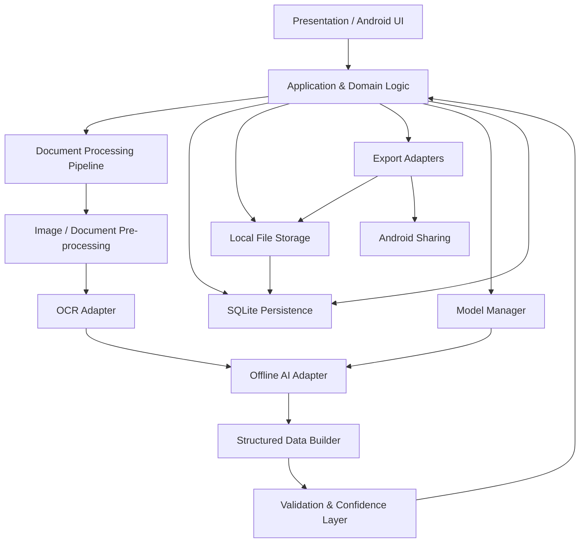
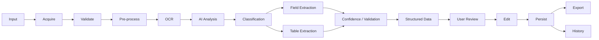
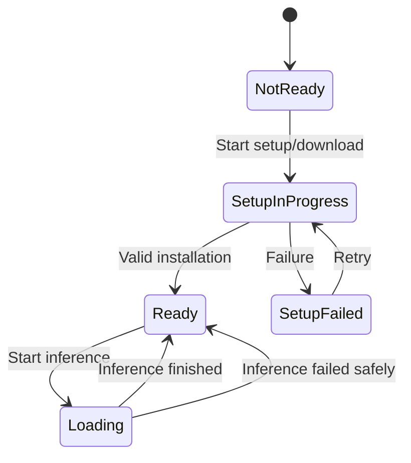
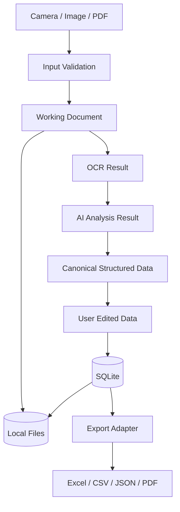
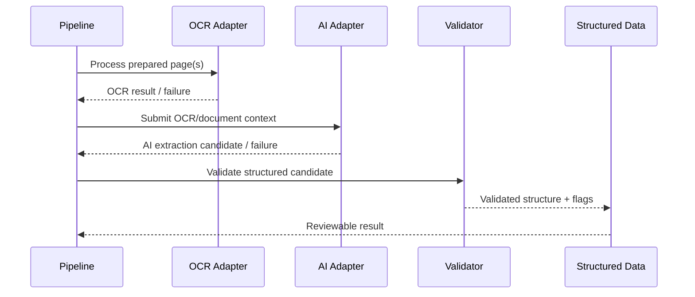
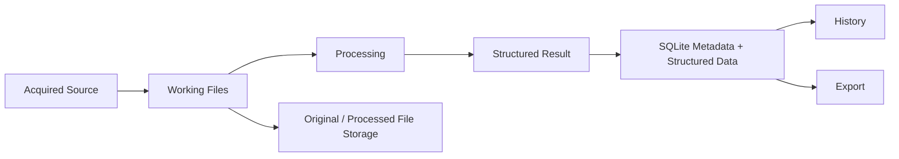
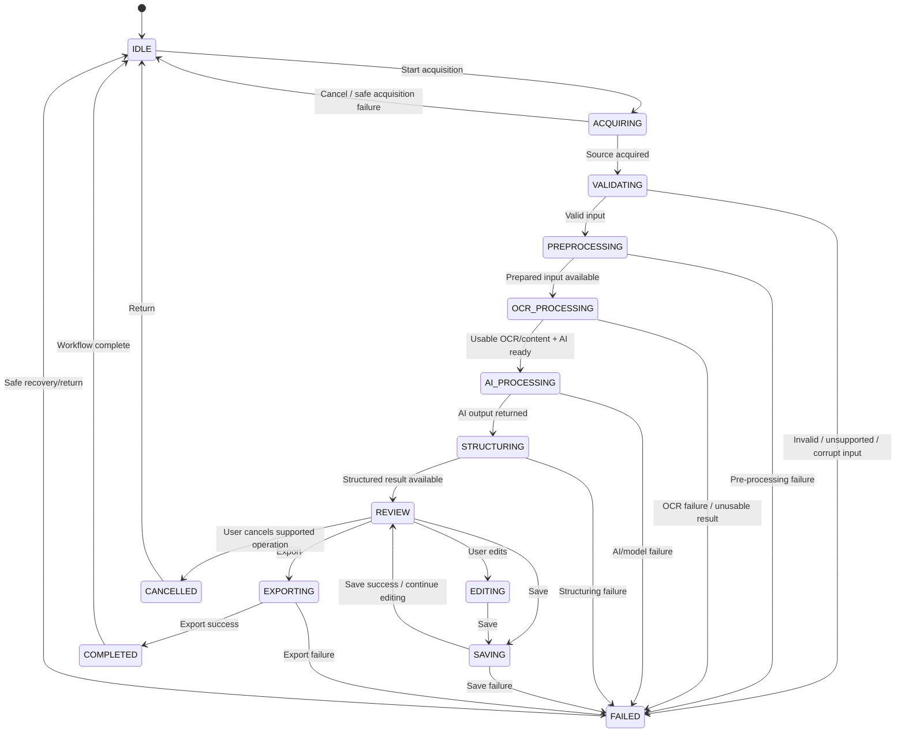
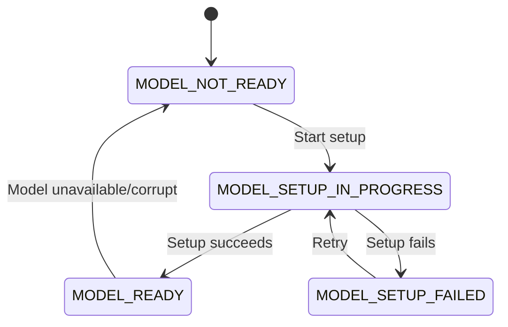
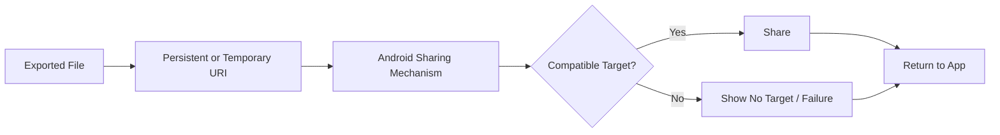

# SnapData: AI-Powered Intelligent Document Processing & Data Extraction System
## Technical Requirements Document (TRD)

**Project:** SnapData  
**Document:** Technical Requirements Document  
**Version:** 1.0  
**Status:** Draft / Technical Baseline  
**Date:** 30 August 2026  
**Implementation Target:** Android application built using Google AI Studio's **"Build an Android app"** workflow

---

## Document Control

| Item | Value |
|---|---|
| Project | SnapData |
| Document | Technical Requirements Document |
| Version | 1.0 |
| Status | Draft / Technical Baseline |
| Date | 30 August 2026 |
| Primary Sources | `SnapData_PRD_v1.0.md`, `SnapData_SRS_v1.0.md` |
| Supporting Sources | Original SnapData project specification; SnapData workflow diagram |
| Implementation Target | Android application via Google AI Studio — "Build an Android app" |
| Technical Baseline Rule | No unverified implementation choice is treated as confirmed |
| Detailed DB Schema | Out of scope; defined in `DATABASE.md` / equivalent data-schema artifact |
| Detailed UI/UX | Out of scope; defined in `UI_UX.md` and `FRONTEND.md` |
| Detailed AI/OCR implementation | Out of scope; defined in `AI_OCR.md` |
| Detailed test cases | Out of scope; defined in `TESTING.md` |

### Decision-status vocabulary

- **CONFIRMED** — Established by the source material or directly verified in the actual implementation.
- **PROPOSED** — Recommended technical direction, not yet baselined as implemented.
- **TBD** — Decision has not yet been made.
- **REQUIRES TECHNICAL VALIDATION** — Intent is established, but feasibility, compatibility or performance must be verified.
- **REJECTED** — Considered but intentionally not selected for the current baseline.

> **Implementation verification note:** The available project sources establish the product/software contract, but no Android source repository/build artifact was available in the source set used for this TRD. Therefore Google AI Studio's generated Android project's exact language, UI toolkit, module structure, build plugins, dependency versions, and runtime integrations are **REQUIRES TECHNICAL VALIDATION** until inspected from the actual project.

---

# 1. Technical Scope

SnapData is an **Android/mobile, offline-first document-processing application** that converts supported camera captures, images and PDF documents into structured, editable information using OCR and AI. The technical scope follows the SRS end-to-end workflow:

```text
Document Acquisition
        ↓
Input Validation
        ↓
Image / Document Pre-processing
        ↓
OCR Processing
        ↓
Offline AI Processing
        ↓
Document Type / Field / Table Detection
        ↓
Structured Data Generation
        ↓
Validation + Confidence Handling
        ↓
User Review & Editing
        ↓
Local Persistence
        ↓
Export
        ↓
Document History
```

The architecture must preserve the product-level promise that, after required AI model setup, the core document workflow can operate locally without requiring document upload to a cloud service. The PRD explicitly identifies this as the core baseline and keeps exact model/device/performance decisions open.

The supplied SRS further establishes the core software sequence, local storage, export, history, readiness/setup states, error handling and offline behavior.

---

# 2. Technical Objectives

The technical architecture shall:

1. Support Android as the deployment platform.
2. Keep the core processing path local/offline after model setup.
3. Separate UI, application logic, processing, OCR/AI, persistence and export responsibilities.
4. Permit each pipeline stage to be tested independently where practical.
5. Prevent a failed or cancelled operation from being represented as completed.
6. Preserve source documents and valid intermediate data where safe.
7. Keep the AI model/runtime replaceable so the product contract is not tied to one unvalidated model.
8. Avoid unnecessary backend/cloud infrastructure in the current MVP.
9. Keep the structured-data contract stable while allowing storage implementation to evolve.
10. Provide clear state/progress reporting for long-running operations.
11. Minimize memory duplication when processing images/PDF pages.
12. Make future document types and extraction capabilities extensible without redesigning the core workflow.

These objectives directly reflect the PRD/SRS separation-of-concerns and maintainability requirements.

---

# 3. Technical Principles

| Principle | Technical Interpretation | Status |
|---|---|---|
| Offline-first | Core OCR/AI workflow should run locally after required model setup | **CONFIRMED** |
| Local processing | Document content should not require cloud upload for core processing | **CONFIRMED** |
| Privacy by design | Avoid collecting/logging user document content unnecessarily | **CONFIRMED / PROPOSED implementation controls** |
| Modular architecture | Processing stages exposed behind stable interfaces | **PROPOSED** |
| Testability | Stage-level contracts and deterministic fixtures where possible | **PROPOSED** |
| Maintainability | Product contract separated from implementation-specific technology | **CONFIRMED** |
| Failure-safe behavior | Never report false completion; preserve valid prior data | **CONFIRMED** |
| User-controlled data | User can review/edit/save/delete local records | **CONFIRMED** |
| Extensibility | Additional document types must reuse acquisition → process → review → save/export pattern | **CONFIRMED / PROPOSED implementation structure** |
| Minimal dependencies | Add libraries only when they solve a validated requirement | **PROPOSED** |
| Android-native reliability | Prefer platform mechanisms where appropriate and validated | **PROPOSED** |

---

# 4. Platform & Target Environment

## 4.1 Platform

| Requirement | Current Value | Status | Source / Validation Method |
|---|---|---|---|
| Primary platform | Android | **CONFIRMED** | User-provided implementation target + PRD/SRS |
| App type | Mobile application | **CONFIRMED** | PRD/SRS |
| Build approach | Google AI Studio — "Build an Android app" | **CONFIRMED** as current development target | Project instruction; verify generated project structure |
| Minimum Android version | TBD | **TBD** | Actual generated project + compatibility matrix |
| Target Android SDK | TBD | **REQUIRES TECHNICAL VALIDATION** | Actual Gradle/project configuration |
| CPU architecture | TBD | **REQUIRES TECHNICAL VALIDATION** | AI runtime/model requirements + device tests |
| Minimum RAM | TBD | **REQUIRES TECHNICAL VALIDATION** | Benchmark suite |
| Recommended RAM | TBD | **REQUIRES TECHNICAL VALIDATION** | Benchmark suite |
| Free storage | TBD | **REQUIRES TECHNICAL VALIDATION** | Model + document + temp/export storage benchmark |
| GPU/NPU requirement | TBD | **REQUIRES TECHNICAL VALIDATION** | AI runtime capability/performance tests |
| Camera | Required for camera acquisition path | **CONFIRMED** | PRD/SRS |
| Multi-page PDF limits | TBD | **REQUIRES TECHNICAL VALIDATION** | PRD/SRS TBD-003/TBD-008 |

The PRD/SRS explicitly leave minimum Android version, device matrix, RAM/storage, document-size/page limits, and performance thresholds unresolved.

## 4.2 Supported Device Strategy

No numeric device baseline is invented in this TRD. The release process shall define a compatibility matrix after the AI/OCR stack is selected and benchmarked.

The matrix should record at minimum:

- Android version.
- SoC/CPU family.
- RAM.
- Available storage.
- ABI/architecture.
- Camera capability relevant to scanning.
- GPU/NPU acceleration availability, if used.
- AI model load success.
- OCR performance.
- AI inference performance.
- Stability under repeated processing.

**Status: REQUIRES TECHNICAL VALIDATION.**

---

# 5. Google AI Studio Implementation Baseline

The project is being developed using Google AI Studio's **"Build an Android app"** workflow. That product/tool choice is a confirmed project constraint, but it does not by itself establish the generated Android stack.

The following must be inspected from the actual generated project before they are labelled confirmed:

| Item | Status | Verification Evidence Required |
|---|---|---|
| Programming language | **REQUIRES TECHNICAL VALIDATION** | Source files/build configuration |
| UI framework | **REQUIRES TECHNICAL VALIDATION** | UI source/build dependencies |
| Navigation framework | **REQUIRES TECHNICAL VALIDATION** | Navigation code/dependencies |
| State-management approach | **REQUIRES TECHNICAL VALIDATION** | State holders/repositories/view models/etc. |
| Build system | **REQUIRES TECHNICAL VALIDATION** | Gradle/project files |
| Database integration | **REQUIRES TECHNICAL VALIDATION** | DB initialization/access code |
| OCR integration | **REQUIRES TECHNICAL VALIDATION** | Actual OCR dependency/native bridge |
| AI runtime integration | **REQUIRES TECHNICAL VALIDATION** | Model/runtime code and assets |
| Export libraries | **REQUIRES TECHNICAL VALIDATION** | Build dependencies + generated files |
| Test framework | **REQUIRES TECHNICAL VALIDATION** | Test source/configuration |

### Explicit non-assumptions

The project shall **not** be documented as using Kotlin, Java, Jetpack Compose, XML layouts, MVVM, MVI, Clean Architecture, Room, Retrofit, Ktor, Hilt, or any other named implementation technology unless that technology is verified in the actual Android project or explicitly approved as a proposed design.

---

# 6. Technology Decision Register

The supplied workflow diagram visually identifies React Native, TypeScript, Node.js, Express.js, SQLite, Tesseract OCR, Offline AI and Excel/CSV/JSON/PDF export. The SRS explicitly treats those technologies as source-backed context rather than automatically finalized implementation choices.

| Layer | Technology / Direction | Status | Reason | Alternative | Decision Owner |
|---|---|---|---|---|---|
| Android platform | Android | **CONFIRMED** | Product is Android/mobile | None for current target | Project/Technical |
| Development workflow | Google AI Studio Android build workflow | **CONFIRMED** | Current implementation target | Standard Android IDE/toolchain if needed | Project Team |
| Programming language | Actual generated project language | **REQUIRES TECHNICAL VALIDATION** | Must match generated implementation | TBD | Technical |
| UI framework | Actual generated project UI framework | **REQUIRES TECHNICAL VALIDATION** | Must match generated implementation | TBD | Technical |
| Architecture pattern | Layered/modular architecture | **PROPOSED** | Simple separation without over-engineering | MVVM/MVI/Clean variants | Technical |
| State management | Explicit processing-state model | **PROPOSED** | Needed for pipeline reliability | Framework-specific state system | Technical |
| Local database | SQLite | **CONFIRMED source-backed**; integration TBD | Workflow/source specifies SQLite | Other local DB only after approval | Technical |
| OCR | Tesseract OCR | **CONFIRMED source-backed**; Android integration validation required | Explicitly identified in workflow/SRS | Other OCR engine only as evaluation candidate | AI/OCR |
| Image preprocessing | Auto crop, perspective correction, noise reduction, brightness enhancement, auto rotation | **CONFIRMED requirements**; algorithm TBD | Required source behavior | Algorithm-specific CV approach | AI/OCR |
| AI model | On-device/offline AI | **CONFIRMED capability**; model TBD | Core product requirement | Multiple local runtimes/models for benchmark | AI/Technical |
| AI runtime | TBD | **TBD / REQUIRES TECHNICAL VALIDATION** | SRS leaves it open | Runtime candidates after benchmark | AI/Technical |
| Backend | None for core MVP | **CONFIRMED architectural baseline** | Core workflow is local/offline-first; server scalability not a requirement | Approved optional cloud service later | Project/Technical |
| REST API | None for core MVP | **CONFIRMED architectural baseline** | No server-dependent core workflow | Future optional API after approved scope | Project/Technical |
| File storage | Android app-local/file storage mechanism | **REQUIRES TECHNICAL VALIDATION** | Exact mechanism not specified | Platform-supported alternatives | Technical |
| Export | Excel/CSV/JSON/PDF | **CONFIRMED output requirement** | Core export requirement | Format libraries TBD | Technical |
| Testing | Framework in generated project | **REQUIRES TECHNICAL VALIDATION** | Must follow actual project | Standard Android test stack if approved | QA/Technical |
| Build | Generated Android build configuration | **REQUIRES TECHNICAL VALIDATION** | Must match project | None until inspection | Technical |

### Technology decisions intentionally not carried forward as final architecture

**Node.js + Express.js:** **REJECTED for the current core MVP architecture** as a required backend/server because the product does not require server-side processing, cloud synchronization, authentication, or REST APIs in the current baseline. A future approved cloud feature could introduce a backend through formal change control.

**React Native + TypeScript:** **SOURCE-BACKED CONTEXT, NOT CONFIRMED IMPLEMENTATION.** Because the current implementation target is a Google AI Studio Android application, the generated project's actual technology stack must take precedence over the older workflow diagram until validated.

---

# 7. System Architecture

## 7.1 Recommended Logical Architecture



### Architectural layers

#### 7.1.1 Presentation Layer
Owns screens, user actions, visual state and navigation. It must not implement OCR algorithms, AI inference, SQL details or export mappings.

**Status: PROPOSED architectural boundary.**

#### 7.1.2 Application / Domain Layer
Coordinates use cases such as acquire document, process document, review extraction, save changes, export result and reopen history. It translates lower-level failures into stable application states.

**Status: PROPOSED.**

#### 7.1.3 Processing Pipeline Layer
Owns ordered stage execution, progress, cancellation and transition control. Stages should communicate through explicit input/output contracts rather than UI-specific objects.

**Status: PROPOSED.**

#### 7.1.4 OCR Layer
Wraps the selected OCR implementation behind an adapter so the rest of the application is not tightly coupled to a particular engine.

Tesseract is source-backed; exact Android integration remains validation work.

#### 7.1.5 AI Extraction Layer
Wraps local AI inference. It receives OCR/document context and returns validated structured extraction candidates. The model/runtime remains TBD.

#### 7.1.6 Data Layer
Owns SQLite persistence and file references. Exact schema is delegated to the database artifact.

#### 7.1.7 Export Layer
Each output format is implemented through an independent adapter over the canonical structured-data contract.

#### 7.1.8 Model Management Layer
Tracks model readiness/setup status, local availability and lifecycle. Update/delete are not mandatory MVP functions and remain TBD.

---

# 8. Android Application Architecture

## 8.1 Architecture Pattern Evaluation

| Candidate | Assessment | Status |
|---|---|---|
| Simple layered architecture | Good fit for mini-project scope; clear boundaries without excessive framework complexity | **PROPOSED** |
| MVVM | Appropriate if the generated Android project is compatible and team prefers it | **PROPOSED alternative** |
| MVI | Useful for strict unidirectional state, but may add complexity | **PROPOSED alternative** |
| Full Clean Architecture | Strong separation but potentially excessive for current mini-project scope | **PROPOSED alternative / not required** |

### Baseline recommendation

Use a **simple layered, modular architecture** and adopt the actual Google AI Studio-generated project's idiomatic Android pattern where it is technically sound. Avoid imposing an architecture framework solely for documentation value.

**Decision: PROPOSED — requires confirmation after project inspection.**

## 8.2 Recommended module boundaries

```text
app / presentation
application / use-cases
domain / contracts
processing / pipeline
ocr / adapter
ai / adapter + model manager
data / sqlite + repository
storage / local files
export / excel-csv-json-pdf adapters
```

The physical Android module/package names are **REQUIRES TECHNICAL VALIDATION**.

---

# 9. Application Modules

| Module | Responsibility | Inputs | Outputs | Dependencies | Main Failure Conditions |
|---|---|---|---|---|---|
| App/UI | Present screens and state | App/application state | User actions | Presentation framework | Rendering/state update failure |
| Document Acquisition | Obtain camera/file input | Camera/image/PDF selection | Acquired source reference | Android camera/document picker | Permission, capture, unsupported file |
| Validation | Validate source | File/image metadata/content | Valid/invalid result | Storage/parser | Corrupt/unsupported source |
| Image Processing | Prepare pages for OCR | Image/page | Processed image | Image-processing capability | Decode/processing/memory failure |
| OCR | Convert visual content to text | Processed page(s) | OCR text and available metadata | OCR engine | OCR failure/empty output |
| AI Processing | Understand document | OCR/document context | Extraction candidates | Local AI runtime/model | Model unavailable/inference failure |
| Structured Data | Normalize extraction | AI/OCR outputs | Canonical structured result | Domain contract | Unsupported structure |
| Validation/Confidence | Check result quality signals | Structured result | Validated/flagged result | Domain rules | Ambiguous/low-confidence data |
| Editor | User correction | Structured result | Edited result | UI/application layer | Invalid edit/save failure |
| Persistence | Save records | Document + structured data | Durable local record | SQLite + file storage | Storage failure/insufficient space |
| History | Reopen/delete records | Stored records | History view/result | Persistence | Missing/orphaned file |
| Export | Generate files | Current saved/edited structured data | Output file | Format adapter | Mapping/generation failure |
| Sharing | Share generated output | Output URI/file | Android share action | Platform sharing | No target/cancel/failure |
| Model Manager | Manage model readiness/setup | Network/setup input | Ready/not-ready state | Local model storage | Download/storage/corruption |
| Settings | Manage supported settings | User changes | Updated preferences | Local configuration | Invalid/unsupported setting |

---

# 10. Document Processing Pipeline

## 10.1 Pipeline Contract



## 10.2 Stage contract

| Stage | Required behavior | Failure result | Retry/Cancellation |
|---|---|---|---|
| Acquisition | Obtain a valid source reference | Acquisition failure | Safe retry/cancel |
| Validation | Reject unsupported/corrupt inputs | Validation failure | Select another source |
| Pre-processing | Apply validated baseline enhancements | Pre-processing failure | Retry/return where safe |
| OCR | Produce usable text when possible | OCR failure/empty result | Retry with improved source where practical |
| AI | Analyze with ready local capability | AI failure/model unavailable | Retry/setup/exit |
| Classification | Detect supported type where applicable | Unknown/unsupported type | Continue only when downstream supports generic handling; otherwise clear limitation |
| Field extraction | Produce structured key/value candidates | Extraction failure | Preserve raw/source data where safe |
| Table extraction | Produce rows/columns when supported | Partial/incomplete table | Preserve valid non-table data |
| Confidence | Attach confidence where produced | Missing confidence | Continue without inventing confidence |
| Structured data | Normalize result to canonical contract | Structuring failure | Keep source/OCR where safe |
| Review/edit | Permit user correction | UI/save failure | Preserve in-memory edits where safe |
| Persistence | Save durable current result | Storage failure | Retry; do not claim success |
| Export | Generate selected file | Format-specific failure | Retry/export another format |
| History | Reopen/delete saved records | Retrieval/orphan error | Repair/report safely |

The SRS explicitly requires failure-safe behavior, preservation of valid intermediate data and clear error states across these categories.

## 10.3 Progress reporting

The UI/application layer shall receive stage-level progress events rather than polling implementation internals. The SRS requires visible status for long-running OCR/AI operations.

Recommended progress event shape (**PROPOSED**):

```text
stage
status
progress (optional)
message (optional)
page/current item (optional)
canCancel (boolean)
error (optional)
```

Exact event type/language implementation is **REQUIRES TECHNICAL VALIDATION**.

---

# 11. Document Input & Acquisition

## 11.1 Supported input paths

- Camera capture.
- Image file import.
- PDF file import.
- Multi-page PDF, subject to the existing P1/TBD technical decision.

This matches the SRS input baseline.

## 11.2 Validation requirements

Before processing begins, the acquisition layer shall validate:

1. File type/recognized content category.
2. Readability/decodability.
3. Access permission/availability.
4. Basic size/resource feasibility.
5. Page extraction feasibility for PDF content.

Exact supported MIME types, size limits and page limits remain TBD.

## 11.3 Temporary-file handling

Temporary processing artifacts may be created as needed, but they shall have:

- Clearly owned lifecycle.
- Cleanup after successful completion or safe failure.
- Protection against collision with user-managed files.
- No dependency on temporary files remaining after the operation unless explicitly promoted to durable storage.

Directory naming and Android storage API are **REQUIRES TECHNICAL VALIDATION**.

## 11.4 Large-document behavior

Because exact limits are not baselined, the pipeline should process pages incrementally rather than requiring the full document to remain decoded in memory when technically practical.

**Status: PROPOSED / REQUIRES TECHNICAL VALIDATION.**

---

# 12. Image Pre-processing

The supplied workflow identifies:

- Auto crop.
- Perspective correction.
- Noise removal/reduction.
- Brightness/image enhancement.
- Auto rotation.

The SRS confirms these as baseline preprocessing behavior while intentionally leaving algorithm choice open.

| Operation | Input | Output | Failure behavior | Resource impact | Algorithm Status |
|---|---|---|---|---|---|
| Auto crop | Captured/imported image | Cropped document region | Keep original if safe or report limitation | CPU/memory | **TBD / validation** |
| Perspective correction | Document image | Rectified image | Keep previous image or fail stage safely | CPU/memory | **TBD / validation** |
| Noise reduction | Image | Cleaner image | Continue with prior image when safe | CPU/memory | **TBD / validation** |
| Brightness enhancement | Image | OCR-friendly image | Continue without enhancement if operation fails | CPU | **TBD / validation** |
| Auto rotation | Image | Correctly oriented image | Preserve original orientation and report limitation | CPU | **TBD / validation** |

### Processing strategy

The preprocessing layer should preserve an immutable reference to the source image/file and create derived working representations rather than destroying the original.

**Status: PROPOSED.**

---

# 13. OCR Architecture

## 13.1 OCR responsibility

OCR converts processable visual content into text that can be consumed by downstream AI/structuring logic.

The workflow and SRS identify **Tesseract OCR** as the source-backed OCR engine context.

## 13.2 OCR contract

```text
OCR Input
- processed image/page
- language configuration (where supported)

OCR Output
- text
- page association
- block/line/token metadata where the selected integration exposes it
- confidence information where available
```

Exact metadata richness must not be assumed until the Android Tesseract integration is verified.

## 13.3 OCR language support

The SRS leaves the exact MVP OCR language list **TBD**. No language list is hard-coded by this TRD.

## 13.4 OCR failure rules

- OCR engine failure → processing failure state.
- Empty/unusable OCR → explicit empty OCR state.
- No fabricated OCR values.
- Preserve source content where safe.

## 13.5 OCR alternatives

No second OCR engine is introduced as a baseline. Any alternative engine shall be evaluated only after defining benchmark documents, accuracy metrics and device/resource criteria.

**Alternative engine status: TBD / REQUIRES TECHNICAL VALIDATION.**

---

# 14. AI Architecture

## 14.1 AI responsibility

The AI layer is responsible for interpreting OCR/document context and supporting:

- Document type detection.
- Key-value / field extraction.
- Table detection/structuring.
- Confidence information where provided.
- Summary only if the approved MVP scope includes it.

The exact AI model and runtime are **TBD / REQUIRES TECHNICAL VALIDATION**. The SRS explicitly does not finalize model identity, runtime, format or quantization.

## 14.2 AI adapter boundary

The application shall interact with an abstract AI capability rather than with model-specific code directly.

Conceptual interface:

```text
initialize()
readiness()
process(documentContext)
cancel()        [if supported]
release()
```

The exact programming-language interface is **REQUIRES TECHNICAL VALIDATION**.

## 14.3 Input preparation

The AI input contract may contain:

- OCR text.
- Document/page identifiers.
- Available layout/location context.
- Document metadata that is safe and useful for interpretation.

The AI layer must not assume that every OCR integration provides bounding boxes or word-level confidence.

## 14.4 Structured output

AI results must be transformed into the application's canonical structured-data contract before persistence/export. Free-form model output shall not be treated as final structured data without parsing and validation.

**Status: PROPOSED architectural control.**

## 14.5 Validation

The AI layer shall detect and surface:

- Missing required structural elements where rules exist.
- Malformed output.
- Unsupported table structures.
- Low-confidence/uncertain values where confidence is actually supplied.

It shall not invent values to repair missing output.

This follows SRS data-validation rules.

---

# 15. Offline AI Architecture

## 15.1 Offline lifecycle



The SRS explicitly defines model readiness/setup states and requires the core workflow to work offline after the required model setup.

## 15.2 Model loading

The implementation should prefer lazy or controlled model loading to avoid consuming large resources when the AI capability is not needed.

**Status: PROPOSED / REQUIRES TECHNICAL VALIDATION.**

## 15.3 Network policy

The network may be used for initial model setup/download if required. Core document processing shall not depend on cloud upload.

No network call should be introduced into the processing path merely for telemetry or remote inference without a separately approved privacy/product decision.

**Status: CONFIRMED product constraint; implementation enforcement REQUIRES TECHNICAL VALIDATION.**

## 15.4 Missing/corrupt model

If the model is missing, unavailable or unusable:

1. Processing shall not continue as though AI succeeded.
2. The application shall show model readiness failure.
3. The user shall have access to the setup/readiness flow.
4. Existing saved records shall remain intact.

## 15.5 Model update/delete

Model update/delete is not a mandatory MVP capability in the SRS. It remains **TBD** pending technical/product approval.

---

# 16. AI Model Management

| Capability | Status | Technical requirement |
|---|---|---|
| Readiness status | **CONFIRMED** | Must expose ready/not-ready state |
| Initial setup/download | **CONFIRMED** | Setup may require network |
| Download progress | **CONFIRMED behavior** | Clear progress/completion/failure states |
| Local installation | **CONFIRMED concept** | Exact storage location TBD |
| Integrity verification | **PROPOSED / REQUIRES TECHNICAL VALIDATION** | Verify model package before use |
| Model version metadata | **PROPOSED / TBD** | Needed if multiple versions exist |
| Model update | **TBD** | Do not make mandatory before approval |
| Model deletion | **TBD** | Must not accidentally remove required capability if enabled |
| Rollback | **TBD** | Required only if update capability is approved |
| Multiple models | **TBD** | Not required for current baseline |

The project must not claim universal model lifecycle support until the final model/runtime is selected.

---

# 17. Canonical Structured Data Architecture

The structured-data contract is the boundary between extraction and storage/export. It shall support the concepts required by the SRS:

```text
Document
 ├─ metadata
 ├─ document type
 ├─ source/reference
 ├─ processing metadata
 ├─ fields[]
 │    ├─ key
 │    ├─ value
 │    ├─ confidence (optional)
 │    └─ source reference (optional)
 ├─ tables[]
 │    ├─ columns[]
 │    └─ rows[]
 └─ revision/edit information
```

### Required architectural characteristics

- Fields must be addressable individually.
- Tables must preserve row/column relationships.
- Missing values must remain missing/empty rather than being fabricated.
- User edits become the current authoritative working result.
- Exporters consume the latest saved/edited representation.
- Optional confidence/source references must not block processing when unavailable.

The SRS defines these concepts while explicitly delegating the final schema to database/data artifacts.

**Database schema detail is intentionally excluded from this TRD.**

---

# 18. Data Flow Architecture

## 18.1 End-to-end data flow



## 18.2 AI/OCR interaction



## 18.3 Local storage flow



---

# 19. Local Storage Architecture

SQLite is source-backed as the intended local database. The TRD defines responsibilities, not final table schema.

## 19.1 SQLite responsibilities

SQLite should own, subject to final `DATABASE.md` design:

- Document identity/reference metadata.
- Processing state/status.
- Document type.
- Structured extracted fields.
- Table data.
- User-edited values.
- Processing metadata necessary for history/recovery.
- References to stored files.
- Export/history metadata where approved.

**Schema details: TBD in `DATABASE.md`.**

## 19.2 File storage responsibilities

File storage should hold binary artifacts such as:

- Original camera images.
- Imported PDFs/images.
- Derived/processed page images when retention is required.
- Export files.
- Local AI model files, if packaged/downloaded separately.
- Temporary working artifacts.

The exact directory/API strategy is **REQUIRES TECHNICAL VALIDATION**.

## 19.3 Consistency rules

The database and file system shall not be treated as automatically atomic. The application must account for cases such as:

- DB record exists but file is missing.
- File exists but DB record is absent.
- Save succeeds partially.
- Application terminates between file write and metadata commit.

The exact recovery protocol is **TBD** and must align with SRS TBD-012.

---

# 20. File Storage Architecture

## 20.1 Logical storage categories

| Category | Example contents | Durability | Cleanup |
|---|---|---|---|
| Original | Captured/imported source | Persistent when saved | User deletion / retention policy |
| Processed working | Preprocessed images/pages | Temporary unless required for reopen | Automatic cleanup |
| Structured | Stored in SQLite | Persistent | Linked to document lifecycle |
| Export | XLSX/CSV/JSON/PDF | Persistent when user saves/keeps it | User-controlled / policy TBD |
| Model | AI model package/files | Persistent | Model manager / policy TBD |
| Temporary | Conversion buffers/intermediate output | Temporary | Cleanup after operation |

## 20.2 Orphan prevention

The implementation should use ownership metadata and cleanup checks so that a failed operation does not create uncontrolled permanent temporary files.

**Status: PROPOSED.**

## 20.3 Storage pressure

The application shall detect or respond clearly when insufficient storage prevents processing or saving, consistent with SRS NFR-020 and ERR-014.

---

# 21. Backend Decision

## 21.1 Decision

**Backend: Not required for the current MVP architecture.**

**Status: CONFIRMED architectural baseline.**

### Rationale

The PRD/SRS establish:

- Offline-first core processing.
- Local document processing.
- Local persistence/history.
- No cloud-processing prerequisite.
- No mandatory authentication.
- No current server-side processing requirement.
- No server scalability requirement.

The SRS specifically states that cloud scale, multi-user scale and server-side scalability are not current product requirements and that future cloud/server functionality would require an approved change.

## 21.2 Consequence

The MVP should not introduce Node.js, Express.js or another server solely because those tools appear in the source workflow diagram. Doing so would add infrastructure without a source-supported requirement.

**Node.js/Express.js required backend: REJECTED for current MVP architecture.**

A backend may be reconsidered only for an approved future capability such as optional cloud synchronization, team collaboration or another server-dependent feature, all of which are outside the current baseline.

---

# 22. API Architecture

## 22.1 MVP decision

**REST API: Not required for the core offline MVP.**

**Status: CONFIRMED architectural baseline.**

No REST endpoint, authentication token, server contract or network synchronization protocol is defined in this TRD because none is required by the current product baseline.

## 22.2 Future API boundary

Any future server API shall be introduced only after:

1. Product approval.
2. Updated PRD/SRS scope.
3. Security/privacy review.
4. Explicit backend architecture.
5. API contract in `API.md`.

---

# 23. Frontend Technical Architecture

## 23.1 Screen responsibilities

The product screen contract is already defined at SRS level and includes AI Model Manager, Home, Camera Scanner, Processing, AI Results, Data Editor, Export, History, Settings and About.

Technical responsibilities are:

| Screen | Technical responsibility |
|---|---|
| Splash/Onboarding | Establish app readiness and first-run entry |
| AI Model Manager | Readiness/setup state and model lifecycle controls approved by scope |
| Home | Start acquisition flows and expose current readiness |
| Camera | Capture and hand off source references |
| Processing | Subscribe to pipeline state/progress |
| AI Results | Present canonical structured result without owning extraction logic |
| Data Editor | Modify working structured data and request save |
| Export | Invoke selected exporter and share flow where supported |
| History | Query stored records and reopen/delete |
| Settings | Manage approved local preferences |
| About | Present app/project information |

## 23.2 UI state handling

The UI should render from application state, not infer state from visual timing. For example, an export spinner must not imply success until the export layer returns a successful result.

**Status: PROPOSED.**

## 23.3 Navigation

The exact Android navigation component/mechanism is **REQUIRES TECHNICAL VALIDATION** from the generated project.

Detailed visual design belongs in `UI_UX.md`; detailed component implementation belongs in `FRONTEND.md`.

---

# 24. Processing State Machine



The state model follows the SRS major state sequence and its explicit failure/cancellation branches.

### Model readiness state



## Transition rules

- Invalid state transitions must be rejected by the application layer.
- Cancellation must not produce a completed record.
- Save success must be acknowledged before state is reported as persisted.
- Export success must be acknowledged before state is reported as completed.
- On application interruption, previously committed records remain authoritative; exact resume semantics remain TBD.

---

# 25. Error Architecture

The SRS defines 18 error identifiers and specifies detection, user-visible behavior and data-preservation expectations.

| Technical Layer | Error classes | Detection | Propagation | User-facing result | Recovery |
|---|---|---|---|---|---|
| Acquisition | Camera permission/capture | Platform/API return | Acquisition result | Clear camera error | Retry/return |
| Validation | Unsupported/corrupt/invalid | Parser/type checks | Validation result | Unsupported/corrupt message | Re-select |
| Pre-processing | Processing failure | Stage result | Pipeline failure | Pre-processing failure state | Retry/return |
| OCR | OCR failure/empty result | Engine result | Pipeline failure | OCR failure/empty state | Retry/improve source |
| AI | Model unavailable/inference failure | Model/runtime result | Pipeline failure | AI unavailable/failure | Setup/retry |
| Structuring | Malformed/unsupported result | Validator | Pipeline failure/partial result | Extraction limitation | Preserve valid data |
| Storage | DB/file failure/insufficient space | Storage operation | Application failure | Save/storage message | Retry/manage storage |
| Export | Generation failure | Adapter result | Export result | Format-specific failure | Retry/other format |
| Sharing | No target/cancel/failure | Android share result | Share result | Preserve file + explain outcome | Return/use other action |
| Lifecycle | Interruption/crash | Startup recovery check | State recovery | Safe recovery state | Reopen/retry |

### Logging rule

No internal stack trace, model prompt, OCR content, extracted sensitive data or private document content shall be shown to the user.

---

# 26. Performance Requirements

The SRS explicitly leaves quantitative performance thresholds TBD. The TRD therefore defines **measurement requirements**, not invented targets.

| Metric | Target | Current Status | Measurement Method |
|---|---|---|---|
| Cold app startup | TBD | **TBD / validation** | Automated/device timing |
| Camera launch | TBD | **TBD / validation** | Device measurement |
| Input validation | TBD | **TBD** | Per-file timing |
| Pre-processing/page | TBD | **TBD** | Representative image set |
| OCR/page | TBD | **TBD** | Fixed validation corpus |
| AI inference/document | TBD | **TBD** | Fixed extraction corpus |
| End-to-end processing | TBD | **TBD** | Camera/image/PDF scenarios |
| Memory peak | TBD | **TBD** | Android profiler |
| CPU utilization | TBD | **TBD** | Device profiler |
| GPU/NPU utilization | TBD | **TBD** | Runtime/device tools where available |
| Large PDF processing | TBD | **TBD** | Multi-page benchmark |
| Export generation | TBD | **TBD** | Format-specific measurement |
| Battery impact | TBD | **TBD** | Repeated-process benchmark |
| Storage footprint | TBD | **TBD** | Installed/model/temp/export measurement |

### Performance engineering rules

- Avoid unnecessary full-document memory duplication.
- Prefer incremental page processing when supported.
- Release large intermediate buffers promptly.
- Prevent background processing from falsely appearing completed.
- Keep cancellation safe and deterministic where the runtime allows.

**Status: PROPOSED engineering guidance; numeric targets REQUIRES TECHNICAL VALIDATION.**

---

# 27. Resource Requirements

| Resource | Minimum | Recommended | Status |
|---|---|---|---|
| RAM | TBD | TBD | **REQUIRES TECHNICAL VALIDATION** |
| Free storage | TBD | TBD | **REQUIRES TECHNICAL VALIDATION** |
| CPU architecture | TBD | TBD | **REQUIRES TECHNICAL VALIDATION** |
| GPU/NPU | TBD | TBD | **REQUIRES TECHNICAL VALIDATION** |
| AI model size | TBD | TBD | **REQUIRES TECHNICAL VALIDATION** |
| Temporary workspace | TBD | TBD | **REQUIRES TECHNICAL VALIDATION** |
| Concurrent processing | TBD | TBD | **REQUIRES TECHNICAL VALIDATION** |

No numerical resource requirements are invented because the SRS explicitly keeps them open.

---

# 28. Security & Privacy Architecture

The baseline security objective is privacy through local processing/storage. The PRD requires local processing and states that the core product must not require cloud upload as a prerequisite. Specific encryption/authentication/secure-delete implementation remains TBD.

## 28.1 Technical controls

| Control | Baseline | Status |
|---|---|---|
| Core local OCR/AI | Required | **CONFIRMED** |
| Cloud upload for core processing | Not required | **CONFIRMED constraint** |
| Local data access | Android/platform access controls | **CONFIRMED** |
| Private logging | Do not log document/extracted content | **PROPOSED control** |
| Export file privacy | Treat as user-generated private output | **PROPOSED control** |
| Temporary file cleanup | Required for privacy/resource hygiene | **PROPOSED** |
| Encryption at rest | Exact algorithm/architecture TBD | **TBD** |
| Key management | TBD | **TBD** |
| App lock/PIN | TBD | **TBD** |
| Biometrics | TBD | **TBD** |
| Secure delete | TBD | **TBD** |
| Authentication | Not a current product requirement | **REJECTED for MVP** |

## 28.2 Privacy boundary

Document content must not be sent to a remote service merely to perform core OCR/AI extraction. Any future remote capability must undergo separate product, privacy and security approval.

---

# 29. Android Permissions

Only permissions required for approved functionality should be requested.

| Permission / Access Category | Purpose | When requested | Why required | Fallback |
|---|---|---|---|---|
| Camera access | Capture document | When user starts camera scan | Required for camera acquisition | Allow image/PDF import; explain denial |
| User-selected document/file access | Import PDFs/images | When user chooses import | Required for file acquisition | Return to home/acquisition |
| Notifications | Not currently specified as a core requirement | Only if a later approved feature requires it | TBD | No notification capability |
| Broad storage permissions | Avoid unless actually required by target Android behavior | TBD | Modern Android storage behavior may make them unnecessary | Use platform-supported user-selected file access |

Exact Android permission declarations and APIs are **REQUIRES TECHNICAL VALIDATION** from the generated project and target API level.

---

# 30. Export Architecture

The canonical flow is:

```text
Current Saved/Edited Structured Data
              ↓
       Export Adapter
              ↓
     Format-specific file
```

## 30.1 Export adapters

| Format | Responsibility | Status |
|---|---|---|
| Excel (.xlsx) | Represent structured fields/tables in spreadsheet form | **CONFIRMED requirement; library TBD** |
| CSV | Represent tabular data in CSV form | **CONFIRMED requirement; library TBD** |
| JSON | Serialize canonical structured data | **CONFIRMED requirement; serializer TBD** |
| PDF | Generate human-readable document output | **CONFIRMED requirement; library TBD** |

Each exporter must be independently testable and must use the **current saved/edited values**, not silently revert to raw OCR/AI output.

## 30.2 Complex table fidelity

Exact export fidelity for complex tables is **REQUIRES TECHNICAL VALIDATION** under PRD/SRS TBD-011.

---

# 31. Sharing Architecture

The sharing flow is:



Requirements:

- Generated file must remain preserved when sharing is cancelled or fails.
- MIME type must match the selected export format.
- The implementation should use a platform-safe URI mechanism.
- The exact Android sharing APIs and authority/provider configuration are **REQUIRES TECHNICAL VALIDATION**.

---

# 32. Testability Architecture

## 32.1 Test boundaries

| Test layer | Scope | Example |
|---|---|---|
| Unit | Pure transformations/rules | Structured-data validation |
| Adapter/unit | OCR/AI/export adapter contracts | Mocked engine result parsing |
| Integration | Module handoffs | OCR → AI → structuring |
| Pipeline | Complete processing stages | Image → OCR → AI → result |
| Database | Persistence contract | Save/edit/reopen/delete |
| Export | Format correctness | Structured data → XLSX/CSV/JSON/PDF |
| Offline | No network core flow | Model ready + airplane mode |
| Compatibility | Device/Android matrix | Supported device combinations |
| Performance | Latency/resource behavior | OCR/AI/memory benchmarks |
| Recovery | Interruption/failure | App interruption during processing |

## 32.2 Determinism

Where model inference or OCR is inherently variable, tests should validate structural correctness and approved acceptance metrics rather than expecting byte-identical outputs unless the implementation can guarantee determinism.

**Status: PROPOSED.**

---

# 33. Observability & Logging

## 33.1 Log categories

- Application lifecycle events.
- Pipeline stage transitions.
- Non-sensitive timing/performance metrics.
- Adapter failures.
- Storage failures.
- Export failures.
- Model readiness/load status.

## 33.2 Data-minimization rules

The application shall not log:

- Full document images.
- Full OCR text.
- Extracted sensitive values.
- AI prompt/input containing private document content.
- Export contents.

A redacted document identifier or internal operation identifier may be used for correlation.

**Status: PROPOSED technical privacy control derived from the product's privacy requirement.**

## 33.3 Log levels

| Level | Purpose | Retention |
|---|---|---|
| Error | Actionable failures | TBD |
| Warn | Recoverable/partial issues | TBD |
| Info | High-level lifecycle/state | TBD |
| Debug | Development diagnostics | TBD / release disabled as appropriate |

Log retention and release-build policy are **TBD**.

---

# 34. Dependency Management

The actual dependency register must be populated from the generated Android project.

| Dependency | Purpose | Version | Status | Risk | Alternative |
|---|---|---|---|---|---|
| Android platform dependencies | Core runtime | TBD | **REQUIRES TECHNICAL VALIDATION** | API compatibility | N/A |
| UI framework dependencies | Rendering/UI | TBD | **REQUIRES TECHNICAL VALIDATION** | Generated-project coupling | TBD |
| SQLite integration | Local persistence | TBD | **CONFIRMED requirement / version TBD** | Migration/compatibility | Other local DB only after approval |
| Tesseract integration | OCR | TBD | **CONFIRMED source context / integration TBD** | Native/Android compatibility | Alternative OCR TBD |
| AI runtime | Offline inference | TBD | **TBD / validation** | Model/resource compatibility | Other local runtime |
| PDF processing | Read/render PDF | TBD | **TBD / validation** | Large-file/memory behavior | Alternative PDF mechanism |
| XLSX exporter | Excel output | TBD | **TBD / validation** | File fidelity | Alternative exporter |
| CSV exporter | CSV output | TBD | **TBD** | Encoding/escaping | Built-in implementation |
| JSON serializer | JSON output | TBD | **TBD** | Schema fidelity | Platform serializer |
| PDF exporter | PDF output | TBD | **TBD** | Layout fidelity | Alternative library |
| Test dependencies | Automated validation | TBD | **REQUIRES TECHNICAL VALIDATION** | CI/device support | Project-native test framework |

No exact versions are fabricated in this TRD.

---

# 35. Build & Release Architecture

## 35.1 Build variants

The project should distinguish at least:

- Development/debug build.
- Release build.

A staging variant is only needed if approved by the actual workflow.

**Status: PROPOSED.**

## 35.2 Release validation gates

A release candidate should not be accepted until:

1. Core camera/PDF/image acquisition passes.
2. Preprocessing passes the validation set.
3. OCR passes the approved validation set.
4. Offline AI is ready and works on the supported device matrix.
5. Review/edit/save works.
6. History/reopen/delete works.
7. Excel/CSV/JSON/PDF exports validate correctly.
8. Offline mode succeeds after model setup.
9. P0 failure paths do not falsely report success.
10. No known P0 defect blocks the core document-to-export path.

These gates follow the PRD MVP release criteria and SRS end-to-end acceptance criteria.

## 35.3 AI model packaging/download

The final release must document whether the model is:

- Bundled with the application, or
- Downloaded during first-run setup, or
- Installed through another approved mechanism.

The sources establish that initial model setup may require network access but do not establish the final packaging mechanism. **Status: TBD / REQUIRES TECHNICAL VALIDATION.**

## 35.4 Versioning

Application versioning is required for releases; exact versioning scheme is **TBD**.

Model versioning, if multiple versions are supported, must be documented separately in AI/OCR documentation.

## 35.5 CI/CD

No CI/CD platform is assumed. Automated builds may be introduced later if the project workflow requires them.

**Status: TBD.**

---

# 36. Technical Failure & Recovery Strategy

The implementation must preserve the SRS rule that failures are visible and successful completion is never falsely reported.

### Recovery hierarchy

1. **Stage-local retry** — Retry transient failures without restarting the whole app when safe.
2. **Safe return** — Return to the last stable user-visible state.
3. **Intermediate preservation** — Preserve source/OCR/valid extracted data where safe.
4. **No false commit** — Do not create a completed/saved record until the persistence operation succeeds.
5. **Restart recovery** — On next launch, detect interrupted operations and avoid marking them complete.

Exact resume/replay behavior remains **TBD** under PRD/SRS TBD-012.

---

# 37. Technical Security/Privacy Decision Boundaries

The following are intentionally not finalized in the TRD:

| Decision | Status |
|---|---|
| Encryption algorithm | **TBD** |
| Key storage/rotation | **TBD** |
| Biometric architecture | **TBD** |
| PIN/app-lock implementation | **TBD** |
| Secure-delete algorithm | **TBD** |
| Model package encryption | **TBD / REQUIRES TECHNICAL VALIDATION** |
| Network certificate/pinning strategy | **TBD**; not required for current offline core |
| Analytics/telemetry involving document content | **REJECTED** for core privacy-sensitive path |

---

# 38. Technical Risks & Mitigation

| Risk | Impact | Status / Mitigation |
|---|---|---|
| AI model too large for target devices | High | Benchmark candidate models and runtimes before final selection |
| OCR quality varies by image quality | High | Preprocess, validate corpus, show review/confidence |
| Complex table extraction is unreliable | High | Dedicated table validation set and editable results |
| Memory pressure during PDF processing | High | Incremental processing and profiling |
| Android compatibility differences | High | Define device matrix from actual testing |
| Model setup/download failure | High | Retry, integrity/readiness status, clear setup state |
| Storage fills during processing | Medium/High | Preflight checks and cleanup strategy |
| Source file/DB inconsistency | Medium/High | Transaction-like application sequencing + recovery checks |
| Export fidelity differs across structures | Medium | Format-specific test corpus |
| Generated Google AI Studio architecture changes assumptions | High | Inspect actual project before locking technical stack |
| Backend added unnecessarily | Medium | Architecture decision explicitly keeps MVP local/no backend |
| Over-engineering for mini project | Medium | Prefer modular but simple architecture; keep advanced capabilities out of P0 |

---

# 39. Technical Validation Plan

The following validation sequence should be completed before implementation choices are marked **CONFIRMED**:

### Phase 1 — Inspect actual Android project

- Identify language.
- Identify UI framework.
- Identify navigation/state pattern.
- Identify build configuration.
- Identify current dependencies.
- Identify package/module structure.

### Phase 2 — Validate OCR

- Integrate/test Tesseract Android path.
- Establish supported languages.
- Measure OCR accuracy and latency.
- Measure memory use.
- Test representative document types.

### Phase 3 — Validate offline AI

- Benchmark candidate model/runtime combinations.
- Measure load time.
- Measure inference time.
- Measure memory/storage footprint.
- Test offline-only operation after setup.
- Establish minimum device requirements.

### Phase 4 — Validate document processing

- Camera capture.
- Single-page images.
- PDF import.
- Multi-page PDFs.
- Preprocessing stages.
- Cancellation/interruption.

### Phase 5 — Validate exports

- Excel.
- CSV.
- JSON.
- PDF.
- Complex tables.
- Unicode/language handling where approved.

### Phase 6 — Establish release baseline

- Supported Android version range.
- Supported device matrix.
- Resource minimums/recommendations.
- Performance targets.
- Model lifecycle.
- Final dependency versions.

---

# 40. Technical Traceability

| Product/SRS requirement area | TRD section |
|---|---|
| Android/mobile platform | §4 |
| Offline-first | §1, §3, §15, §21 |
| Camera/PDF/image input | §11 |
| Pre-processing | §12 |
| Tesseract OCR | §13 |
| Offline AI | §14–§16 |
| Structured data | §17 |
| Local SQLite | §19 |
| File storage | §20 |
| Review/edit | §23 |
| Processing state | §24 |
| Error handling | §25, §36 |
| Performance | §26 |
| Security/privacy | §28, §37 |
| Permissions | §29 |
| Export | §30 |
| Sharing | §31 |
| Testability | §32 |
| Logging | §33 |
| Dependencies | §34 |
| Build/release | §35 |
| Open technical decisions | §41 |

---

# 41. Open Technical Decision Register

| ID | Decision | Status | Owner | Resolution artifact |
|---|---|---|---|---|
| TRD-001 | Exact Android minimum/target versions | **TBD** | Technical | Compatibility Plan |
| TRD-002 | Actual Google AI Studio generated language/UI stack | **REQUIRES TECHNICAL VALIDATION** | Technical | Implementation inspection |
| TRD-003 | Final application architecture pattern | **PROPOSED** | Technical | Architecture review |
| TRD-004 | Exact SQLite integration | **REQUIRES TECHNICAL VALIDATION** | Technical | DATABASE.md |
| TRD-005 | Exact Tesseract Android integration | **REQUIRES TECHNICAL VALIDATION** | AI/OCR | AI_OCR.md |
| TRD-006 | Exact OCR language list | **TBD** | Product + AI/OCR | AI_OCR.md |
| TRD-007 | Exact AI model | **TBD / REQUIRES TECHNICAL VALIDATION** | AI/Technical | AI_OCR.md |
| TRD-008 | Exact AI runtime | **TBD / REQUIRES TECHNICAL VALIDATION** | AI/Technical | AI_OCR.md |
| TRD-009 | Model packaging/download mechanism | **TBD / REQUIRES TECHNICAL VALIDATION** | AI/Technical | AI_OCR.md / Release plan |
| TRD-010 | Supported device/RAM/storage baseline | **TBD / REQUIRES TECHNICAL VALIDATION** | Technical | Compatibility Plan |
| TRD-011 | Maximum document size/page count | **REQUIRES TECHNICAL VALIDATION** | Technical | Performance/Test Plan |
| TRD-012 | Multi-page PDF MVP priority | **TBD** | Product + Technical | PRD/Release scope |
| TRD-013 | Exact preprocessing algorithms | **TBD / REQUIRES TECHNICAL VALIDATION** | AI/OCR | AI_OCR.md |
| TRD-014 | Export library selection | **TBD / REQUIRES TECHNICAL VALIDATION** | Technical | FRONTEND/Export docs |
| TRD-015 | Complex-table export fidelity target | **REQUIRES TECHNICAL VALIDATION** | Export/QA | Export spec/Test plan |
| TRD-016 | Application interruption resume semantics | **TBD** | Technical | State/Test plan |
| TRD-017 | Encryption at rest strategy | **TBD** | Security/Technical | Security spec |
| TRD-018 | App lock/PIN/biometrics | **TBD** | Product/Security | PRD + Security spec |
| TRD-019 | Model update/delete support in MVP | **TBD** | Product + Technical | PRD/AI_OCR |
| TRD-020 | CI/CD implementation | **TBD** | Technical | Build/Release plan |

The open decisions align with the inherited PRD/SRS TBD register rather than inventing new mandatory capabilities.

---

# 42. Confirmed / Proposed / TBD Summary

## CONFIRMED

- Android application target.
- Google AI Studio "Build an Android app" is the current implementation target.
- Offline-first product direction.
- Local core document processing.
- Camera, image and PDF acquisition.
- Preprocessing capability requirements.
- OCR capability; Tesseract is source-backed.
- AI-based document analysis/extraction capability.
- Structured data, review/editing, local storage, history and export.
- SQLite as intended source-backed local database.
- Excel/CSV/JSON/PDF export requirements.
- No backend/server requirement for the current MVP architecture.
- No REST API requirement for the current offline MVP.

## PROPOSED

- Simple layered/modular application architecture.
- Adapter boundaries for OCR, AI and export.
- Stage-level pipeline contracts and progress events.
- Incremental large-document processing where practical.
- Private/minimal logging controls.
- Explicit state-driven UI rendering.
- Release gates aligned to P0 acceptance criteria.

## TBD / REQUIRES TECHNICAL VALIDATION

- Actual generated Android language and UI framework.
- Exact Android versions and device matrix.
- AI model and runtime.
- Model packaging, versioning and lifecycle.
- OCR language list and exact Android integration.
- Preprocessing algorithms.
- Document/page/size limits.
- Minimum RAM/storage/CPU/GPU/NPU requirements.
- Performance targets.
- Export libraries and complex-table fidelity.
- Exact file-storage APIs/directories.
- Encryption, key management, secure delete and biometric/PIN.
- Application interruption resume semantics.
- CI/CD platform.

## REJECTED for current MVP

- Required Node.js/Express.js backend.
- Required REST API.
- Cloud/server-side document processing.
- Mandatory authentication.
- Any unverified claim that React Native/TypeScript is the final Android implementation.

---

# 43. Alignment with Source Documents

## PRD alignment

The PRD establishes the product as an AI-powered mobile document-processing application and defines the core transformation from document through OCR, AI understanding, structured data, review/edit and local save/export. It explicitly directs later TRD work to decide model/runtime, application architecture, local persistence, device requirements and technical interfaces.

## SRS alignment

The SRS establishes the software boundary from acquisition through preprocessing, OCR, offline AI, structured data, review/editing, local storage, export and history; it also explicitly states that detailed implementation, backend architecture, API contracts, database schemas, AI model internals and preprocessing algorithms are outside the SRS and belong in technical artifacts.

## Original specification alignment

The original project specification describes SnapData as an AI-powered mobile application that converts PDFs/images into structured editable data, uses OCR and AI, supports camera/file acquisition, exports Excel/CSV/JSON/PDF, operates offline after initial AI model setup, and uses SQLite for local storage.

## Workflow diagram alignment

The workflow diagram shows the operational sequence through launch, document input, acquisition, preprocessing, OCR, offline AI, structured data, review/editing, local storage, export and document history. It visually lists React Native, TypeScript, Node.js, Express.js, SQLite, Tesseract OCR, Offline AI and export technologies. In this TRD, these are treated as source-backed context, while the Android implementation is governed by what is actually generated and validated in the Google AI Studio project.

---

# 44. Architecture Acceptance Criteria

The TRD architecture should be considered technically baselined only when the following are demonstrated:

1. The actual Android project stack has been inspected and recorded.
2. OCR integration can process the approved validation documents.
3. The offline AI model/runtime has passed device/resource validation.
4. Core processing can run with network connectivity disabled after required setup.
5. Camera/image/PDF inputs reach a modular processing pipeline.
6. Processing stages expose clear success/failure/cancel outcomes.
7. Structured output is separated from UI and persistence implementations.
8. User-edited data is the authoritative source for save/export.
9. SQLite/local storage can persist and reopen saved records.
10. Exporters independently generate Excel/CSV/JSON/PDF.
11. Backend/API infrastructure is not required for the MVP flow.
12. P0 error states do not falsely present successful completion.
13. Performance and device requirements are measured rather than guessed.
14. Security/privacy decisions that remain TBD are not falsely represented as implemented controls.

These criteria are consistent with the SRS end-to-end acceptance baseline.

---

# 45. Boundary with Other Project Documents

| Document | Responsibility | TRD relationship |
|---|---|---|
| `PRD.md` | Product goals/requirements | Source of WHAT/WHY |
| `SRS.md` | Software behavior/testable requirements | Source of required behavior |
| `TRD.md` | Technical architecture and implementation decisions | Current document |
| `FRONTEND.md` | Android UI implementation details | Derived from TRD/SRS |
| `BACKEND.md` | Backend design if approved | Current MVP: no backend |
| `API.md` | API contracts if approved | Current MVP: no core REST API |
| `DATABASE.md` | SQLite schema, indexes, migrations | Derived from TRD structured-data/storage boundary |
| `AI_OCR.md` | Model/runtime/OCR/preprocessing details | Resolves major TRD TBDs |
| `UI_UX.md` | Visual design and interaction design | Separate concern |
| `TESTING.md` | Full test plan and cases | Implements TRD validation strategy |
| `BUILD_RELEASE.md` | Build/sign/release process | Resolves release implementation details |

The SRS explicitly establishes these document boundaries.

---

# 46. Final Technical Baseline

**SnapData should be built as a local Android application with a modular document-processing pipeline.** The current MVP architecture does **not** require a backend or REST API. The core flow is designed around document acquisition → preprocessing → Tesseract-backed OCR context → on-device/offline AI analysis → structured data → review/edit → SQLite/local file persistence → export/history.

The only part that must **not** be guessed is the concrete Android implementation stack and offline AI implementation. Those must be determined from the actual Google AI Studio-generated project and validated through OCR/model/device benchmarking before being promoted from **PROPOSED/TBD/REQUIRES TECHNICAL VALIDATION** to **CONFIRMED**.

This preserves the PRD/SRS contract while avoiding a common architecture failure: carrying an old React Native + Node/Express diagram into an Android offline application even when the implementation no longer needs those technologies.

---

## Appendix A — Source-backed Technical Facts

1. SQLite is identified as the intended local database.
2. Tesseract OCR is identified in the supplied workflow/technical context.
3. The core product is offline-first after required AI model setup.
4. Exact AI model/runtime are not finalized.
5. Exact Android versions/device requirements are not finalized.
6. Exact document/page limits are not finalized.
7. Exact performance targets are not finalized.
8. Backend/server processing is not a current requirement.
9. REST APIs are not a current core-MVP requirement.
10. Excel/CSV/JSON/PDF remain core export formats.

---

## Appendix B — Source References

- `SnapData_PRD_v1.0.md` — primary product baseline.
- `SnapData_SRS_v1.0.md` — primary software-behavior baseline.
- `SnapData _ Ai-Powered Intelligent Document Processing & Data Extraction System.pdf` — original project specification and workflow support.
- SnapData workflow diagram — supporting sequence and technology-stack context.
- Supplementary feature/roadmap material — only where PRD/SRS retain the capability with explicit priority/TBD status.

**Document status:** **Draft / Technical Baseline — ready for actual Android project inspection and technical validation.**
